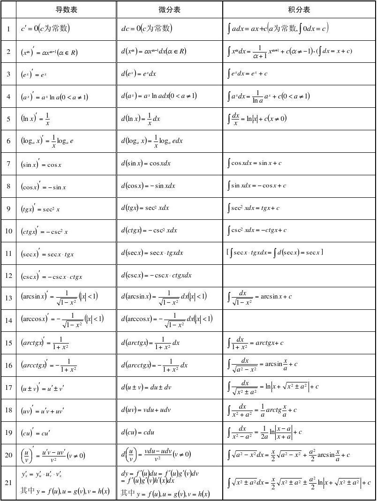

不定积分
=================

不定积分定义
---------------

原函数
    设 :math:`f(x), F(x)` :math:`(x \in I)`

    若 :math:`\forall x \in I`, 都有 :math:`F'(x) = f(x)`, 则称 :math:`F(x)` 为 :math:`f(x)` 的原函数

    1. 连续函数一定有原函数
    2. 一个函数若有原函数, 则一定有无数个原函数; 任易两个原函数之间相差常数

不定积分
    :math:`\int f(x)dx = F(x) + c` (找到所有原函数)

    1. :math:`\frac{d}{dx} \int f(x) dx = f(x)`
    2. :math:`\int \frac{d}{dx} f(x) dx = \int f'(x) dx = f(x) + c`

基本性质
~~~~~~~~~~~~~~~

1. :math:`\int [f(x) + \pm g(x)]dx = \int f(x) dx \pm \int g(x) dx`
2. :math:`\int k f(x) dx = k \int f(x) dx`

积分基本公式
~~~~~~~~~~~~~~~~

换元积分法
--------------------

第一类换元积分法
~~~~~~~~~~~~~~~~~~~

:math:`\int f[g(x)]g'(x) dx = \int f[g(x)] d(g(x)) \\ \quad \stackrel{g(x) = t}{=\mathrel{\mkern-3mu}=\mathrel{\mkern-3mu}=} \int f(t)dt = F(t) + c \\ \quad = F[g(x)] + c`

第二类换元积分法
~~~~~~~~~~~~~~~~~~~

:math:`\int f(x) dx \stackrel{x = g(t)}{=\mathrel{\mkern-3mu}=\mathrel{\mkern-3mu}=} \int f[g(t)]g'(t) dt \\ \quad = \int g(t) dt = G(t) + c = G[g^{-1}(x)] + c`

使用情况:

1. 无理 → 有理
2. 平方和, 平方差

    - :math:`a^2 - x^2 \stackrel{x = a\sin{t}}{=\mathrel{\mkern-3mu}=\mathrel{\mkern-3mu}=} a^2\cos^2{t}`
    - :math:`a^2 + x^2 \stackrel{x = a\tan{t}}{=\mathrel{\mkern-3mu}=\mathrel{\mkern-3mu}=} a^2\sec^2{t}`
    - :math:`x^2 - a^2 \stackrel{x = a\sec{t}}{=\mathrel{\mkern-3mu}=\mathrel{\mkern-3mu}=} a^2\tan^2{t}`

分部积分法
-----------------

:math:`\int u dv` 与 :math:`\int v du` 通常难易度不同

:math:`(uv)' = u'v + uv' \Rightarrow \int (uv)' dx = \int u'v dx + \int uv' dx \\ \Rightarrow uv = \int v du + \int u dv \\ \Rightarrow \int u dv = uv - \int v du`

使用场合:

1. :math:`\int x^n \ln{x} dx`

    .. admonition:: 例

        :math:`\int x^2 \ln{x} dx = \int \ln{x} d(\frac{1}{3}x^3) \\ = \frac{1}{3}x^3\ln{x} - \int \frac{1}{3}x^3d(\ln{x}) \\ = \frac{1}{3}x^3\ln{x} - \frac{1}{3}\int x^2 dx \\ = \frac{1}{3}x^3\ln{x} - \frac{1}{9}x^3 + c`

2. :math:`\int x^n a^x dx`

    .. admonition:: 例

        :math:`\int x^2e^x dx = \int x^2 d(e^x) \\ = x^2e^x - \int e^x d(x^2) = x^2e^x - 2\int xe^x d(x) \\ = x^2e^x - 2\int x d(e^x) \\ = x^2e^x - 2[xe^x - \int e^x dx] = x^2e^x - 2[xe^x - e^x] + c`

3. :math:`\int x^n \text{三角函数} dx`

    .. admonition:: 例

        :math:`\int x^n \sin{x} dx = -\int x^2 d(\cos{x}) = - x^2cosx + \int \cos{x} d(x^2) \\ = - x^2cosx + 2\int x \cos{x} dx = - x^2cosx + 2\int x d(\sin{x}) \\ = - x^2cosx + 2x\sin{x} + 2\cos{x} + c`

4. :math:`\int x^n \text{反三角函数} dx`

5. :math:`\int e^{ax} \text{三角函数(sin 或 cos)} dx`

6. :math:`\int \sec^n{x} (\text{或}\csc^n{x}) dx` (:math:`n` 是奇数)

重要类型 - 有理函数
--------------------------

:math:`\int R(x) dx`

其中 :math:`R(x) = \frac{P(x)}{Q(x)} = \frac{a_nx^n + ... + a_1x + a_0}{b_mx^m + ... + b_1x + b_0}`

- 若 :math:`n < m`, 则 :math:`R(x)` 称为 **真分式**
- 若 :math:`n >= m`, 则 :math:`R(x)` 称为 **假分式**

不定积分的步骤
~~~~~~~~~~~~~~~~

1. 判断 :math:`R(x)` 的类型

    1. 若是假分式, 则将假分式写成 :math:`R(x) = \text{多项式} + \text{真分式}`

    2. 若是真分式, 则将真分式写成 :math:`R(x) = 部分的和`

2. 求真分式的不定积分

    真分式只看分母

    1. 分母可以因式分解

        .. admonition:: 例

            :math:`\frac{x+4}{(2x-1)(x+2)} = \frac{A}{2x-1} + \frac{B}{x+2}`

            :math:`A(x+2) + B(2x-1) = x + 4 \Rightarrow \begin{cases} A+2B=1 \\ 2A-B=4\end{cases}`

            由此解出 :math:`A, B`

        一般, 若分母中存在 :math:`(ax+b)^n`, 则求解时的部分中应有 :math:`\frac{A_1}{ax+b} + \frac{A_2}{(ax+b)^2} + ... + \frac{A_n}{(ax+b)^n}`

    2. 分母无法完全因式分解

        1. 分子是常数则分母配方

        2. 分子是多项式, 则将分子转换成分母的导数形式

            .. admonition:: 例

                :math:`\int \frac{x + 2}{x^2 + x + 1} dx = \frac{1}{2}\int \frac{(2x+1)+3}{x^2+x+1} dx \\ = \frac{1}{2}\int \frac{1}{x^2+x+1} d(x^2+x+1) + \frac{3}{2} \int \frac{1}{ (\frac{\sqrt{3}}{2})^2 + (x + \frac{1}{2})^2 } d(x+\frac{1}{2})`

重要类型 - 三角有理函数
--------------------------

**万能公式**

令 :math:`\tan{\frac{x}{2}} = u`, 则

:math:`\begin{cases} \sin{x} = \frac{2u}{1+u^2} \\ \cos{x} = \frac{1-u^2}{1+u^2} \\ dx = \frac{2}{1+u^2} du \end{cases}`

`积分表 <https://zh.wikipedia.org/wiki/%E7%A7%AF%E5%88%86%E8%A1%A8>`_