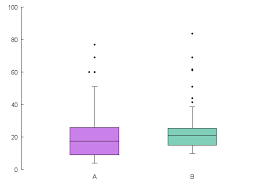
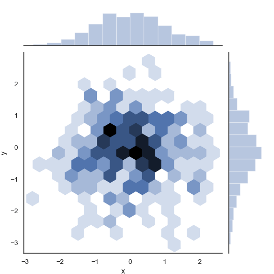

Data Pre-Processing
====================

数据清理
-------------

处理数据丢失
~~~~~~~~~~~~~~~~~~

为什么会发生数据丢失
^^^^^^^^^^^^^^^^^^^^^^^

- MCAR

    Missing Completely At Random

    数据是否丢失与数据本身完全没有关系

    - 删除发生数据丢失的记录也不会引起数据整体分布的歪斜

- MAR

    Missing At Random

    某项数据在观测时发生丢失的概率, 可以从别的数据上进行推测 (如从性别推测年龄丢失的概率)

    - 删除发生数据丢失的记录会引起数据整体分布的歪斜 (比如整体的数据中男性占比变多)

- NMAR

    Not Missing At Random

    某项数据发生丢失的概率与数据本身直接关联, 并且从别的数据上无法进行推测

    - 删除发生数据丢失的记录会引起数据整体分布的歪斜, 并且由于是数据本身引起的丢失, 删除后无法从别的数据项来推测丢失的数据

如何处理
^^^^^^^^^^^^^^

1. 删除数据

    1. 去除对应行
    2. 去除整个属性列

2. 填充数据 Imputation

    1. Single Imputation

        最终结果只需要考虑平均数时, 可以填充平均数等;

        随着填充值增多, 数据整体的方差和误差等会减小, 需要考虑方差时, 可以使用 regression;

        如果定性的数据较多, 难以使用 regression 时, 可以使用 hot-deck

        - 以 0 / mean / median 等填充

            .. code-block:: python

                from sklearn.preprocessing import Imputer
                imputer = Imputer(strategy='median')
                # remove non-numerical attributes, and then

                imputer.fit(X)
                X_new = imputer.transform(X) # fill with medians

                # or using fit_transform()
                X_new = imputer.fit_transform(X)

        - regression
        - hot-deck

            一度很流行的方法, 名字来源于穿孔卡片

            使用同组的其他记录 (如将数据按一定顺序排列后最近的记录) 的同列数据来填充

            .. code-block:: python

                DataFrame.fillna(value, method=None)

                # method 取值:
                # "pad" / "ffill": 使用上一个有效值填充
                # "backfill" / "bfill": 使用下一个有效值填充

        - cold-deck

            使用别的数据组的记录来进行填充

    2. Multiple Imputation

        为了减少丢失值填充带来的噪音增加, 可以使用 multiple imputation (Rubin, 1987)

        所有的 multiple imputation 都有 3 个步骤:

        1. Imputation, 类似于 single imputation, 不过不是只填充一次, 而是从特定分布中选取 m 个值填充 m 次, 最终得到 m 个数据组
        2. Analysis, 所有 m 个数据组都被单独分析, 得到 m 个结果
        3. Pooling, 所有结果通过计算平均, 方差和值得关注的变量的置信区间被整合到一起

        **MICE**
            Multiple Imputation by Chained Equations, multiple imputation 的一个主要方法

处理离群值
~~~~~~~~~~~~~

Outlier, 与其他数据有明显区别的数据, 会影响到数据的分析和建模

- 一元的数据可以使用箱型图 (box plot) 可以很好地展现出离群值
- 二元的数据可以使用 joint plot

找出离群值
^^^^^^^^^^^^^

- LOF (Local Outlier Factor)

    - 附近数据点较少的点应该为离群值
    - 使用 k 个邻近点推测数据点的 **密度**
    - 密度比周围低的点为离群值

    .. code-block:: python

        from sklearn.neighbors import LocalOutlierFactor

        clf = LocalOutlierFactor(n_neighbors=20)
        predictions = clf.fit_predict(data)
        # predictions:
        # array([1,1,1,-1,1,-1,1,1,1])
        # 1 表示正常数据行
        # -1 表示离群数据行

- Isolation Forest

    - 不需要计算距离, 密度之类的指标
    - 计算简单, 节省内存
    - 计算易于扩展

    计算方法:

    1. 每次使用不同的使用特定数据项 (列) 随机分割数据
    2. 对于无法分割的点记录其 **深度** 为分割所用数据项数
    3. 深度低的数据点即为离群值 (很容易就和其他数据分割了)

    .. code-block:: python

        from sklearn.ensemble import IsolationForest

        clf = IsolationForest()
        clf.fit(data)
        predictions = clf.predict(data)
        # predictions:
        # array([1,1,1,-1,1,-1,1,1,1])
        # 1 表示正常数据行
        # -1 表示离群数据行

处理不均衡数据
~~~~~~~~~~~~~~~~

Imbalanced data: 名义数据, 0 和 1 的二进制数据等非数字类型的数据中, 某个特定的数据值过多或过少

处理方法 (可参考 `imbalanced-learn <https://github.com/scikit-learn-contrib/imbalanced-learn>`_):

1. 更改评价指标

    处理不均衡数据时, 使用精确度 (accuracy) 可能无法正确评价模型

    可以使用 precision, recall, F1-score 等

2. 更改算法

    通常决策树 (decision tree) 在不均衡数据上表现得很好

3. Oversampling

    通过复制过少的数据值所在数据行来增加其比例

4. Undersampling

    通过删除部分过多的数据值所在数据行来减少其比例

5. 生成合成数据

    通过 KNN 等方法来生成数据

数据预处理 Feature Engineering
------------------------------------

Selecting the **right** features to track
> more data == better results
> more features != better results

**Curse of dimensionality**: more features need more data

处理 Categorical Attributes
~~~~~~~~~~~~~~~~~~~~~~~~~~~~~~~~~

大部分机器学习算法更倾向于处理数字, 因此需要将文字标签转换为数字

使用 `Scikit-Learn`:

.. code-block:: python

    from sklearn.preprocessing import LabelEncoder, OneHotEncoder, LabelBinarizer

    encoder = LabelEncoder()
    encoded = encoder.fit_transform(X)
    # 当有多个标签时, 可以使用 OrdinalEncoder

    binary_encoder = LabelBinarizer(sparse_output=True)
    encoded_1hot2 = binary_encoder(X)
    # returns a dense array if `sparse_output` is `False`
    # [1,2,4,6,2] => classes: [1,2,4,6]
    # transform to [
    #     [1,0,0,0],
    #     [0,1,0,0],
    #     [0,0,1,0],
    #     [0,0,0,1],
    #     [0,1,0,0]
    # ]
    # 当有多个标签时, 可以使用 MultiLabelBinarizer

    one_hot_encoder = OneHotEncoder()
    encoded_1hot = one_hot_encoder.fit_transform(encoded)
    # returns a Scipy sparse matrix
    # 只接受数字型数据

    # OneHotEncoder 更适合用于数据中的自变量 (X), 而 LabelBinarizer 更适合用于因变量 (y)
    # 并且 OneHotEncoder 可用于多标签

**自定义 transformers**
    在 `Scikit-Learn` 中, 自定义 transformer 需要实现 3 个方法: `fit()`, `transform()`, `fit_transform()`:

    .. code-block:: python

        from sklearn.base import BaseEstimator, TransformerMixin

        class CustomTransformer(BaseEstimator, TransformerMixin):
            def __init__(self): # no *args or **kwargs
                # some operations
                pass
            def fit(self, X, y=None):
                # some operations
                return self
            def transform(self, X, y=None):
                # some operations
                return # something

将连续的数字值分段
~~~~~~~~~~~~~~~~~~~~

通过将连续的数据值分段, 可以使得数据更加具有表现力, 同时保留了可解释性

1. 分成 k 段 (k-bins)

    .. code-block:: python

        from sklearn.preprocessing import KBinsDiscretizer

        X = [
            [-2, 1, -4,   -1],
            [-1, 2, -3, -0.5],
            [ 0, 3, -2,  0.5],
            [ 1, 4, -1,    2]
        ]
        dsc = KBinsDiscretizer(n_bins=3, encode='ordinal', strategy='uniform')
        dsc.fit(X)
        # KBinsDiscretizer(encode='ordinal', n_bins=3, strategy='uniform')
        Xt = dsc.transform(X)
        # Xt: 对每一列进行了分段
        # array([[0., 0., 0., 0.],
        #        [1., 1., 1., 0.],
        #        [2., 2., 2., 1.],
        #        [2., 2., 2., 2.]])

        # encode: 用于编码变形后的结果
        # - onehot (default)
        #    使用 one-hot 编码并返回一个 sparse matrix
        # - onehot-dense
        #    使用 one-hot 编码并返回一个 dense array
        # - ordinal
        #    按顺序使用整数编码
        # #########
        # strategy: 定义 bin 宽度的方法
        # - uniform
        #    所有 bins 宽度相同
        # - quantile (default)
        #    所有 bins 都包含相同数量的点
        # - kmeans
        #    Values in each bin have the same nearest center of a 1D k-means cluster.

2. 以阈值分为两段

    .. code-block:: python

        from sklearn.preprocessing import Binarizer

        X = [
            [ 1., -1.,  2.],
            [ 2.,  0.,  0.],
            [ 0.,  1., -1.]
        ]
        binarizer = Binarizer(threshold=0.0)
        binarizer.fit(X)
        binarizer.transform(X)
        # array([[1., 0., 1.],
        #        [1., 0., 0.],
        #        [0., 1., 0.]])

Feature Scaling
~~~~~~~~~~~~~~~~~~~

当输入的数字 attributes 有不同的 scales 时, 机器学习算法往往表现很差; 此时需要对各个特性的尺度进行缩放:

1. 归一化 normalization (min-max scaling)

    :math:`(x - min) / max`

    把数据变成 (0, 1) 或者 (-1, 1) 之间的小数

    - 主要是为了数据处理方便; 把数据映射到 (0, 1) 范围之内处理更加便捷快速
    - 把有量纲表达式变成无量纲表达式, 成为纯量, 便于不同单位或量级的指标能够进行比较和加权 (量纲, 又叫作因次 Fundamental unit, 是表示一个物理量由基本量组成的情况; 确定若干个基本量后, 每个导出量都可以表示为基本量的幂的乘积的形式)

    数据转换由原数据的极值决定

2. 标准化 standardization

    :math:`(x - mean) / variance`; 结果的分布 (distribution) 为单位方差 (unit variance)

    不同种类的每个特征中的数值平均变为 0 (将每个特征的值都减掉原始数据中该特征的平均), 标准差变为 1

    通过求z-score的方法, 将原数据转换为标准正态分布; 转换后的数据和原数据整体样本分布相关, 每个样本点都能对标准化产生影响

3. 正态转换 Power Transform

    使得数据分布更加接近正态分布

4. 中心化 Zero-centered

    :math:`(x - min)`

    平均值为0; 对标准差无要求

`Comparision of all sklearn scalers <https://scikit-learn.org/stable/auto_examples/preprocessing/plot_all_scaling.html#sphx-glr-auto-examples-preprocessing-plot-all-scaling-py>`_

Transformation Pipelines
~~~~~~~~~~~~~~~~~~~~~~~~~~

许多数据转换需要按正确的顺序执行

在 `Scikit-Learn` 中可通过 `Pipeline` 类实现:

.. code-block:: python

    from sklearn.pipeline import Pipeline

    pipeline = Pipeline([
        ('imputer', Imputer(strategy='median')),
        ('a_name', ATransformer()),
        ('std_scaler', StandardScaler())
    ])

    pipeline.fit_transform(X)

构建 `Pipeline` 时需要传递按顺序排列的 name / estimator 的列表; 除了最后一个, 所有 estimator 都必须是 transformers (即都必须有 `fit_transform()` 方法)

展示数据的方法
~~~~~~~~~~~~~~~~~~

- Vectors
- Matrix
- Graphs

数据分割
----------

一般需要将一部分的数据分割, 用于测试 (testing) 和验证 (validation):

- 60% for training
- 20% for testing
- 20% for *validation*

用于分割数据的函数
~~~~~~~~~~~~~~~~~~~~~~~~~~

- 使用 `Scikit-Learn`:

    .. code-block:: python

        from sklearn.model_selection import train_test_split

        X_train, X_test = train_test_split(X, test_size=0.2, random_state=42)
        X_train, X_test, y_train, y_test = train_test_split(X, y, test_size=0.33, random_state=42)

- 使用唯一标识符 unique identifiers:

    1. 计算每个数据实例的标识符的 hash
    2. 只保留 hash 的最后一个 byte
    3. 若其值 :math:`\leq 51` (20% of 256), 则将实例划为测试数据

    这样保证了测试数据保持一致

    .. note::

        若数据的行序号被用作标识符, 则所有新的数据都必须被添加至最后, 并且不能删除任何行

    .. code-block:: python

        import hashlib

        def test_set_check(identifier, test_ratio, hash):
            return hash(np.int64(identifier)).digest()[-1] < 256 * test_ratio

        def split_train_test_by_id(data, test_ratio, id_column, hash=hashlib.md5):
            ids = data[id_column]
            in_test_set = ids.apply(lambda id_: test_set_check(id_, test_ratio, hash))
            return data.loc[~in_test_set], data.lon[in_test_set]

        # If the data set has no unique identifier, use row index instead
        data_with_id = data.reset_index()

- 分层抽样 Stratified sampling

    为了避免某个特性的某个值在测试数据中过多或过少, 可以使用分层抽样:

    .. code-block:: python

        from sklearn.model_selection import StratifiedShuffleSplit

        sssplit = StratifiedShuffleSplit(n_splits=1, test_size=0.2, random_state=42)
        for train_index, test_index in sssplit.split(X, X['label_for_stratify']):
            strat_train_set = X[train_index]
            strat_test_set = X[test_index]

交叉验证 Cross-validation
~~~~~~~~~~~~~~~~~~~~~~~~~~~

数据验证 (validation) 有两种方法:

1. 将训练数据再次分割获得验证数据
2. 交叉验证

交叉验证将训练数据随机分成 k 份, 其中一份用作验证, 其余的 k-1 份用作训练; 总共训练 k 个相同类型的 models, 每次训练都使用不同的数据分割; 最后对 k 个 models 进行评价, 选出最安定表现最好的 model

使用 `Scikit-Learn`:

.. code-block:: python

    from sklearn.model_selection import cross_val_score

    scores = cross_val_score(
        model, data, labels,
        scoring='neg_mean_squared_error', cv=10
    )
    # This will randomly splits the data into 10 distinct subsets called folds,
    # and train the model 10 times,
    # picking a different fold for evaluation every time and training on the other 9 folds.
    # The result is an array containing the 10 evaluation scores

或者也可以手动实现:

.. code-block:: python

    from sklearn.model_selection import StratifiedKFold
    from sklearn.base import clone

    skfolds = StratifiedKFold(n_splits=3, random_state=42)

    for train_index, test_index in skfolds.split(X_train, y_train):
        clone_clf = clone(classifier)
        X_train_folds = X_train[train_index]
        y_train_folds = y_train[train_index]
        X_test_fold = X_train[test_index]
        y_test_fold = y_train[test_index]

        clone_clf.fit(X_train_folds, y_train_folds)
        y_pred = clone_clf.predict(X_test_fold)

        n_correct = sum(y_pred == y_test_fold) # or whatever measure
        print(n_correct / len(y_pred))

Leave-One-Out (LOO)
^^^^^^^^^^^^^^^^^^^^

交叉验证的一种特殊形式

当数据量很少时 (50~100 左右), 可以对总共 n 个的数据进行 n 次训练, 每次留下一个数据用作验证

