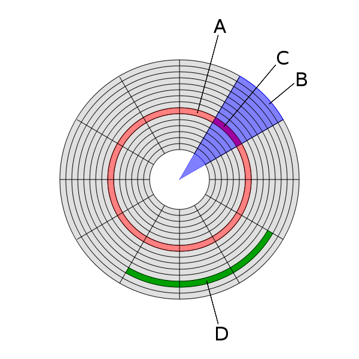

Computer Memory 计算机存储器
=====================================

一种利用半导体, 磁性介质等技术制成的存储数据的电子设备

其电子电路中的数据以二进制方式存储, 不同存储器产品中基本单元的名称也不一样

根据存储能力与电源的关系可以分为:

1. 易失性存储器
2. 非易失性存储器

存储器层次结构
-------------------

存储器层次结构是在计算机体系结构下存储系统层次结构的排列顺序

每一层于下一层相比都拥有较高的速度和较低延迟性, 以及较小的容量

由于高速缓存的效率和存储器传输位于层次结构中的不同等级, 所以实际上会限制处理的速度, 导致中央处理器花费大量的时间等待存储器I/O完成工作

大部分计算机中的存储层次如下四层:

.. list-table::
    :widths: auto
    :header-rows: 1
    :stub-columns: 1

    * - Name
      - Description
    * - 寄存器 (Register)
      - 访问速度最快
    
        在32位处理器中, 每个寄存器就是32位
    
        x86处理器共有16个寄存器
    * - 高速缓存 (cache) (L1-L3: SRAM)
      - 第一级高速缓存(L1)– 通常访问只需要几个周期, 通常是几十个KB

        第二级高速缓存(L2)– 比L1约有2到10倍较高延迟性, 通常是几百个KB或更多
        
        第三级高速缓存(L3)(不一定有) – 比L2更高的延迟性, 通常有数MB之大

        第四级高速缓存(L4)(不普遍) – CPU外部的DRAM, 但速度较主存高
    * - 主存(DRAM)
      - 访问需要几百个周期, 可以大到数十GB
    * - 磁盘存储
      - 需要成千上百个周期, 容量非常大

Register 寄存器
-------------------------

cache 高速缓存
-------------------------

RAM 主存
-------------------------

Random Access Memory (RAM) 随机存取存储器 (主存)

Hard Disk Drive (HDD) 硬盘
---------------------------------

|  非易失性存储器
|  使用坚硬的旋转盘片制成

.. figure:: imgs/HDD_WD_Elements_Portable_WDBU6Y0020BBK-WESN.png
    :scale: 70%

    WD Elements Portable WDBU6Y0020BBK-WESN

.. image:: imgs/HardDiskAnatomy.jpg
    :scale: 70%

物理结构
~~~~~~~~~~~

硬盘内部的碟片在通电后开始高速转动：

.. raw:: html

        <object width="500" height="400">
          <param name="movie" value=""></param>
          <param name="allowFullScreen" value="true"></param>
          <param name="allowscriptaccess" value="always"></param>
          <embed src="" 
            type="application/x-shockwave-flash" allowscriptaccess="always"
            allowfullscreen="true" width="500" height="400"></embed>
        </object>

.. image:: imgs/Hard_drive-en.svg.png
    :scale: 50%

盘体 - Platters
    .. figure:: imgs/hard_drive_under_microscope.jpg
        :scale: 60%
        :align: right    

    盘体由单个或多个盘片组成, 各个盘片之间由垫圈隔开

    多由陶瓷, 铝合金和玻璃等非磁性材料 (non-magnetic material) 制成, 表面涂有用于记录数据的磁性介质

    一张盘片有上下两个盘面, 当主电动机带动碟片旋转时, 副电动机带动一组磁头到相对应的碟片上并确定读取哪一面
    
    磁头悬浮在碟面上画出一个与碟片同心的圆形轨道 (磁轨或称柱面), 这时由磁头的磁感线圈感应碟面上的磁性, 并使用硬盘厂商指定的读取时间或数据间隔定位扇区, 从而得到该扇区的数据内容

磁头 - Heads
    .. image:: imgs/accurator_arm.PNG
        :scale: 80%

    .. image:: imgs/Hard_disk_head.jpg
        :scale: 30%

    由传动手臂和传动轴驱动

    所有的磁头连在一个磁头控制器上, 由磁头控制器负责各个磁头的运动

    硬盘不工作时, 磁头停留在启停区 (Landing Zone, 离盘心最近的区域, 不存放任何数据; 现多在盘片外面), 当需要从硬盘读写数据时, 磁盘开始旋转; 旋转速度达到额定的高速时, 磁头就会因盘片旋转产生的气流而抬起

    磁头在高速旋转的磁盘表面移动, 与盘片之间的间隙只有 3nm 左右
    
    磁头与旋转的硬盘片接触时 (磁头划碰 head crash), 会对磁盘表面的介质产生永久不可恢复的损害    

主轴 - Spindle (下方是轴承和马达)
    包括轴承和驱动电机等

    随着硬盘容量的扩大和速度的提高, 主轴电机马达的速度也在不断提升, 轴承也从滚珠轴承进化到油浸轴承再到液态轴承, 处于不断的改良当中
    
    目前液态轴承已经成为绝对的主流市场

数据编码
~~~~~~~~~~~

FM & MFM

RLL

读写数据
~~~~~~~~~~~

磁盘表面的磁性介质含有许多微小的磁性粒子, 一定量的粒子形成一个区域, 用于表示一个 bit

磁场方向的变化表示 1, 磁场方向不变表示 0

在未受到外部磁场影响的情况下磁盘表面的磁性粒子的磁极方向不会改变; 一般从未受到外部干扰的磁性粒子磁极方向是随机的, 于是出现互相抵消的情况, 这时磁盘的表现出无磁极显现

写数据时, 磁头移到到磁盘要写入的位置, 磁头线圈通电产生感应磁场, 磁头下磁性粒子的磁极方向变为与磁场同向; 通过给磁头不同的电流方向, 使得磁盘局部产生不同的磁极

读取时, 不通电的磁头在写入数据的位置上移动, 磁头线圈切割磁场线产生感应电流, 磁性材料的磁场方向不同, 所以产生的感应电流方向也不同

.. image:: imgs/DiskRead.jpg

逻辑结构
~~~~~~~~~~~

    A：磁道
    B：扇面
    C：扇区
    D：簇 (扇区组)

- 磁道 - Track
    当磁盘旋转, 磁头保持在一个位置上时, 每个磁头在磁盘表面划出的圆形轨迹

    磁道由外向内从 0 开始顺序编号
- 柱面 - Cylinder
    在由多个盘片构成的盘组中, 处于不同盘片但同一半径圆的多个磁道组成的一个圆柱面

    .. image:: imgs/cylinder.jpg
    
    每个圆柱上的磁头由上而下从 0 开始编号
    
    数据的读/写按柱面进行, 即磁头读/写数据时首先在同一柱面内从 0 磁头开始进行操作, 依次向下在同一柱面的不同盘面上进行操作
    
    只在同一柱面所有的磁头全部读/写完毕后, 磁头才会由外向内转移到下一柱面
    
    因为选取磁头只需通过电子切换, 而选取柱面则必须通过机械切换; 电子切换比机械上磁头向邻近磁道移动快得多, 所以数据的读/写按柱面进行, 而不按盘面进行
- 扇区 - Sector
    磁盘上的每个磁道被等分为若干个弧段, 称为扇区

    扇区从 1 开始编号; 硬盘的第一个扇区叫做 **引导扇区** (扇区按照一定间隔跳跃编号, 这个间隔称作 *交叉因子*, 为避免磁盘转动过快来不及读取下一个扇区的数据)

    扇区是硬盘上存储的物理单位, 每个扇区可存储 :math:`128×2^N` :math:`(N＝0,1,2,3)` 字节的数据 (默认 512 字节; 现在已有 4KB 的设计)
    
    也就是说即使计算机只需要硬盘上存储的某个字节, 也须一次把这个字节所在的扇区中的全部 512 字节读入内存, 再选择所需的那个字节

    而硬盘上的总扇区数为: :math:`N_{\text{Cylinders}} \times N_{\text{Heads}} \times N_{\text{Sectors}}`; 这三个参数即是硬盘的物理参数

- 簇 - Cluster
    物理相邻的若干个扇区

    操作系统读写磁盘的基本单位是扇区, 而文件系统的基本单位是簇 (Cluster)

    簇越大存储性能越好, 但空间浪费严重; 簇越小性能相对越低, 但空间利用率高

.. note:: 

    因为硬盘容量的不断扩大, 上述分区方式使得外围磁道数据密度太小, 造成浪费

    因此现在将外围磁道分为更多扇区, 使用扇区号码而不是柱面来分区

磁盘地址管理方式
~~~~~~~~~~~~~~~~~~~~~~

- CHS (Cylinder, Head, Sector)
    早期在 IBM PC 架构上面用来进行磁盘寻址的办法

    通过柱面, 磁头, 扇区来寻址

    CHS模式支持的硬盘容量有限, 柱面地址 10bit, 磁头地址 8bit, 扇区地址6bit; 而一个扇区共有512B
    
    则使用CHS寻址一块硬盘容量理论上限为 :math:`\text{硬盘容量} = \text{柱面数} \times \text{磁头数} \times \text{扇区数}  \times \text{扇区大小} = 1024 \text{cylinders} \times 255 \text{tracks/cylinder} \times 63 \text{sectors/track} \times 512 \text{Bytes/sector} = 8064 MB`
- LBA (Logical Block Address)
    逻辑区块地址

    内外磁道上的扇区数量不同时, CHS很难寻址

    LBA为每个扇区分配逻辑地址, 从 0 开始编号, 以扇区为单位进行寻址

    LBA与CHS可以相互转换; 在访问硬盘时, 由硬盘控制器将LBA地址转换为实际硬盘的CHS物理地址

    :math:`\text{LBA} = (\text{磁头数} \times \text{当前所在柱面号} + \text{当前所在磁头号}) \times \text{每磁道扇区数} + \text{当前所在扇区号} - 1` 

磁盘分区信息存储方式
~~~~~~~~~~~~~~~~~~~~~~

|  磁盘分区指使用分区编辑器 (partition editor) 将一个硬盘划分成几个独立的逻辑部分
|  *引导扇区* 是每个分区的第一扇区, 而 *主引导扇区* 则是整个硬盘的第一扇区 (主分区的第一个扇区)

分区信息包含了分区从哪里开始的信息, 这样操作系统才知道哪个扇区是属于哪个分区的, 以及哪个分区是可以启动的

MBR (Master Boot Record)
^^^^^^^^^^^^^^^^^^^^^^^^^^^^^

主引导记录, 又叫主引导扇区, 是计算机开机后访问硬盘时所必须要读取的首个扇区, 大小为 512 字节

它在硬盘上的三维地址为 (柱面, 磁头, 扇区) = (0, 0, 1)

有时也将其开头的446字节内容特指为"主引导记录", 其后是4个16字节的"磁盘分区表", 以及2字节的结束标志 (55AA)

MBR支持最大2TB磁盘, 最多4个主分区

.. figure:: imgs/MBR.png

- MBR (466 B; 0000H - 01BDH)
    保存了第一阶段引导代码, 其中的硬盘引导程序的主要作用是检查分区表是否正确, 并且在系统硬件完成自检以后将控制权交给硬盘上的引导程序, 如NTLDR、BOOTMGR和GNU GRUB等

    引导代码不依赖任何操作系统, 而且启动代码也是可以改变的, 从而能够实现多系统引导

- DPT (Disk Partition Table 磁盘分区表; 64 B - 01BEH - 01FDH)
    .. admonition:: 分区表例

        以下四个分区分别表示:

        +----------+------------+-----------------------+--------------+------------+------------------------+--------------------+-------------+
        | 可以引导 | 开始磁头号 | 开始扇区号 开始柱面号 | 文件系统类型 | 结束磁头号 | 结束扇区号  结束柱面号 | 首扇区的相对扇区号 |  扇区总数   |
        +==========+============+=======================+==============+============+========================+====================+=============+
        | 80       | 01         | 01         00         | 06           | 3F         | 3F          C4         | 3F 00-00 00        | 81 1E 0C 00 |
        +----------+------------+-----------------------+--------------+------------+------------------------+--------------------+-------------+
        | 00       | 00         | 01         C5         | 05           | 3F         | 7F          47         | C0 1E-0C 00        | 40 0F 08 00 |
        +----------+------------+-----------------------+--------------+------------+------------------------+--------------------+-------------+
        | 00       | 00         | 41         48         | 82           | 3F         | 7F          53         | 00 2E-14 00        | 00 BD 00 00 |
        +----------+------------+-----------------------+--------------+------------+------------------------+--------------------+-------------+
        | 00       | 00         | 41         54         | 83           | 3F         | BF          0F         | 00 EB-14 00        | 00 91 0B 00 |
        +----------+------------+-----------------------+--------------+------------+------------------------+--------------------+-------------+

        .. list-table::
            :widths: auto
            :header-rows: 1
            :stub-columns: 0

            * - Active 
                Boot
              - Starting Loc

                Head
              - Starting Loc
              
                Sector Cylinder
              - Partition Type
              - Ending Loc

                Head
              - Ending Loc

                Sector Cylinder
              - Relative sectors
              - Number of sectors
            * - Yes
              - 1
              - 1 0
              - DOS FAT-16
              - 63
              - 63 196
              - 63
              - 794241
            * - No
              - 0
              - 1 197
              - Extended
              - 63
              - 63 327
              - 794304
              - 528192
            * - No
              - 0
              - 1 328
              - LINUX Swap
              - 63
              - 63 339
              - 1322496
              - 48384
            * - No
              - 0
              - 1 340
              - LINUX Ext2FS
              - 63
              - 63 527
              - 1370880
              - 758016
    
    更多文件系统类型编码见 `List of partition identifiers <https://www.win.tue.nl/~aeb/partitions/partition_types-1.html>`_

- 结束标志字 (Magic Number; 2 B; 01FEH – 01FFH)
    检验主引导记录是否有效的标志

扩展分区
    如果想要更多分区, 就要创建"扩展分区", 并在其中创建逻辑分区

    扩展分区中的每个逻辑分区的分区信息都存在一个类似MBR的扩展引导记录 (简称EBR) 中
    
    扩展引导记录包括分区表和结束标志"55 AA", 没有引导代码部分

    .. image:: imgs/EBR.png

GPT (GUID partition table)
^^^^^^^^^^^^^^^^^^^^^^^^^^^^

Globally Unique Identifier Partition Table 全局唯一标识分区表

GPT 是可扩展固件接口 (UEFI) 标准的一部分, 被用于替代 MBR 分区表

PMBR
    Protective MBR, 存储于 LBA 0
    
    由磁盘签名, MBR 磁盘分区表和结束标志组成; 没有引导代码

    分区表内只有一个分区表项, 这个表项GPT根本不用, 只是为了让系统认为这个磁盘是合法的

GPT头
    存储于LBA 1

    LBA 1在创建GPT磁盘时生成
    
    GPT头会定义分区表的起始位置, 分区表的结束位置, 每个分区表项的大小, 分区表项的个数及分区表的校验和等信息

    分区表头的格式:

    +----------+--------+----------------------------------------------------------------------------------------------------------------+
    | 起始字节 |  长度  |                                                      内容                                                      |
    +==========+========+================================================================================================================+
    | 0        | 8字节  | 签名 ("EFI PART", 45 46 49 20 50 41 52 54)                                                                     |
    +----------+--------+----------------------------------------------------------------------------------------------------------------+
    | 8        | 4字节  | 修订 (在1.0版中, 值是00 00 01 00)                                                                              |
    +----------+--------+----------------------------------------------------------------------------------------------------------------+
    | 12       | 4字节  | 分区表头的大小 (单位是字节, 通常是92字节, 即5C 00 00 00)                                                       |
    +----------+--------+----------------------------------------------------------------------------------------------------------------+
    | 16       | 4字节  | 分区表头 (第0－91字节) 的CRC32校验, 在计算时, 把这个字段作为0处理, 需要计算出分区序列的CRC32校验后再计算本字段 |
    +----------+--------+----------------------------------------------------------------------------------------------------------------+
    | 20       | 4字节  | 保留, 必须是0                                                                                                  |
    +----------+--------+----------------------------------------------------------------------------------------------------------------+
    | 24       | 8字节  | 当前LBA (这个分区表头的位置)                                                                                   |
    +----------+--------+----------------------------------------------------------------------------------------------------------------+
    | 32       | 8字节  | 备份LBA (另一个分区表头的位置; 硬盘的最后一个扇区)                                                             |
    +----------+--------+----------------------------------------------------------------------------------------------------------------+
    | 40       | 8字节  | 第一个可用于分区的LBA (主分区表的最后一个LBA + 1)                                                              |
    +----------+--------+----------------------------------------------------------------------------------------------------------------+
    | 48       | 8字节  | 最后一个可用于分区的LBA (备份分区表的第一个LBA − 1)                                                            |
    +----------+--------+----------------------------------------------------------------------------------------------------------------+
    | 56       | 16字节 | 硬盘GUID (在类UNIX系统中也叫UUID)                                                                              |
    +----------+--------+----------------------------------------------------------------------------------------------------------------+
    | 72       | 8字节  | 分区表项的起始LBA (在主分区表中是2)                                                                            |
    +----------+--------+----------------------------------------------------------------------------------------------------------------+
    | 80       | 4字节  | 分区表项的数量                                                                                                 |
    +----------+--------+----------------------------------------------------------------------------------------------------------------+
    | 84       | 4字节  | 一个分区表项的大小 (通常是128)                                                                                 |
    +----------+--------+----------------------------------------------------------------------------------------------------------------+
    | 88       | 4字节  | 分区序列的CRC32校验                                                                                            |
    +----------+--------+----------------------------------------------------------------------------------------------------------------+
    | 92       | *      | 保留, 剩余的字节必须是0 (对于512字节LBA的硬盘即是420个字节)                                                    |
    +----------+--------+----------------------------------------------------------------------------------------------------------------+

分区表
    存储于 LBA 2 - 33

    能够容纳 128 个分区表项, 每个分区表项大小为 128 字节

    +----------+--------+--------------------------------------------------------------------------------------------------------------------------------------------+
    | 起始字节 |  长度  |                                                                    内容                                                                    |
    +==========+========+============================================================================================================================================+
    | 0        | 16字节 | `分区类型GUID <https://zh.wikipedia.org/wiki/GUID%E7%A3%81%E7%A2%9F%E5%88%86%E5%89%B2%E8%A1%A8#%E5%88%86%E5%8C%BA%E7%B1%BB%E5%9E%8BGUID>`_ |
    +----------+--------+--------------------------------------------------------------------------------------------------------------------------------------------+
    | 16       | 16字节 | 分区GUID                                                                                                                                   |
    +----------+--------+--------------------------------------------------------------------------------------------------------------------------------------------+
    | 32       | 8字节  | 起始LBA (小端序)                                                                                                                           |
    +----------+--------+--------------------------------------------------------------------------------------------------------------------------------------------+
    | 40       | 8字节  | 末尾LBA                                                                                                                                    |
    +----------+--------+--------------------------------------------------------------------------------------------------------------------------------------------+
    | 48       | 8字节  | 属性标签 (如 60 表示"只读")                                                                                                                |
    +----------+--------+--------------------------------------------------------------------------------------------------------------------------------------------+
    | 56       | 72字节 | 分区名 (可以包括36个UTF-16 (小端序) 字符)                                                                                                  |
    +----------+--------+--------------------------------------------------------------------------------------------------------------------------------------------+

    .. note:: 

        GPT中操作系统引导文件有单独的分区, EFI系统分区 (EFI system partition, ESP), 由分区类型GUID指定

        UEFI固件可从ESP加载EFI启动程式或者EFI应用程式

分区区域
    即磁盘的分区

    起始地址和结束地址由GPT头定义

分区表备份
    对分区表32个扇区的完整备份

    如果分区表被破坏, 系统会自动读取分区表备份, 也能够保证正常识别分区

GPT头备份
    存储与最后一个扇区 LBA -1

数据接口
~~~~~~~~~~

.. list-table::
    :widths: auto
    :header-rows: 0
    :stub-columns: 1

    * - IDE
      - Integrated Drive Electronics 电子集成驱动器

        也叫ATA (Advanced Technology Attachment) 接口
      - 本意是指把"硬盘控制器"与"盘体"集成在一起的硬盘驱动器

        这样的做法减少了硬盘接口的电缆数目与长度, 数据传输的可靠性得到了增强
        
        硬盘制造起来变得更容易, 因为硬盘生产厂商不需要再担心自己的硬盘是否与其它厂商生产的控制器兼容; 硬盘安装起来也更为方便

        但并口线的抗干扰性太差, 且排线占用空间较大, 不利电脑内部散热, 已逐渐被SATA所取代
      - .. image:: imgs/WD-IDE.jpg

        .. image:: imgs/IDE-SATA.png
    * - SATA
      - Serial ATA
        
        使用SATA接口的硬盘又叫串口硬盘
      - 采用串行连接方式, 串行ATA总线使用嵌入式时钟信号, 具备了更强的纠错能力
      
        与以往相比其最大的区别在于能对传输指令 (不仅仅是数据) 进行检查, 如果发现错误会自动矫正, 很大程度上提高了数据传输的可靠性

        结构简单, 支持热插拔

        以连续串行的方式传送数据, 一次只会传送1位数据; 这样能减少SATA接口的针脚数目, 使连接电缆数目变少, 效率也会更高
      - .. image:: imgs/disk-SATA.jpg

        .. image:: imgs/disk-SATA-cable.jpg              
    * - SCSI
      - Small Computer System Interface 小型计算机系统接口
      - 是与IDE (ATA) 完全不同的接口
        
        IDE接口是普通PC的标准接口; 而SCSI并不是专门为硬盘设计的接口, 而是一种总线型的系统接口

        SCSI接口具有应用范围广, 多任务, 带宽大, CPU占用率低, 以及热插拔等优点
        
        但较高的价格使得它很难如IDE硬盘般普及, 因此SCSI硬盘主要应用于中, 高端服务器和高档工作站中
      - .. image:: imgs/SCSI.jpg
      
    * - SAS
      - Serial Attached SCSI 串行连接SCSI
      - 新一代的SCSI技术
        
        采用串行技术以获得更高传输速度

        此接口的设计是为了改善存储系统的效能, 可用性和扩充性
        
        SATA可以看作是SAS的一个子协议, SAS接口完全兼容SATA, SATA接口却不能支持SAS
      -
    * - mSATA
      - mini-SATA
      - 由SATA协会(Serial ATA International Organization; SATA-IO)开发, 新的控制器可以让SATA技术整合在小尺寸的装置上
        
        多用于笔记本, 上网本等
      -
    * - M.2
      - 
      - Intel推出的一种替代MSATA新的接口规范, 是为超极本 (Ultrabook) 量身定做的新一代接口标准
        
        与mSATA相比, 更小巧的规格尺寸, 更高的传输性能
      -
    * - ESATA
      - External Serial ATA 外部串行ATA
      - SATA接口的外部扩展规范
        
        用来连接外部而非内部SATA设备
      - .. image:: imgs/Esatap_port.jpg
    * - USB
      - Universal Serial Bus 通用串行总线
      - 通用串行总线是连接计算机系统与外部设备的一种串口总线标准, 也是一种输入输出接口的技术规范, 被广泛地应用于个人电脑和移动设备等信息通讯产品
      - .. image:: imgs/USB-Connector-Types.jpg

分类
--------

根据存储能力与电源的关系可以分为

1. 易失性存储器 (Volatile memory)

    断电后存储器所存储的数据便会消失

    主要有RAM (DRAM, SRAM)
2. 非易失性存储器 (Non-volatile memory)

    断电后数据不会消失

    主要有ROM, 闪存, 硬盘等
