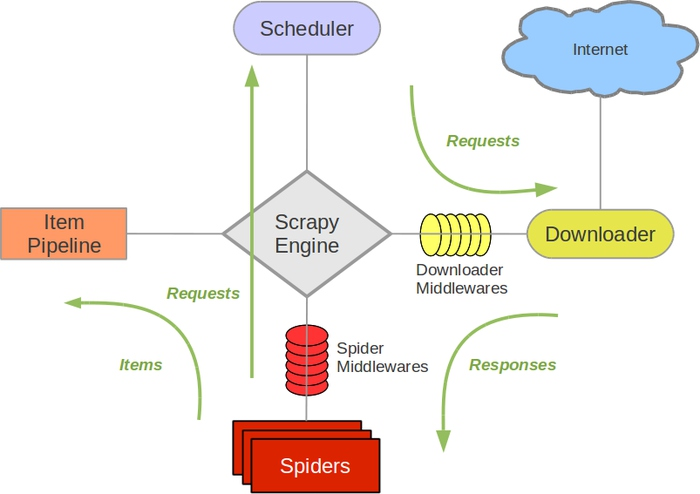

Scrapy
==========

Scrapy 是一个基于 Twisted 的异步处理框架, 是纯 Python 实现的爬虫框架

其架构清晰, 模块之间的耦合程度低, 可扩展性极强, 可以灵活完成各种需求

只需要定制开发几个模块就可以轻松实现一个爬虫

Intro
----------

架构
~~~~~~~~~~~~

- **Engine**: 引擎, 用来处理整个系统的数据流处理, 触发事务, 是整个框架的核心
- **Item**: 项目, 它定义了爬取结果的数据结构, 爬取的数据会被赋值成该对象
- **Scheduler**: 调度器, 用来接受引擎发过来的请求并加入队列中, 并在引擎再次请求的时候提供给引擎
- **Downloader**: 下载器, 用于下载网页内容, 并将网页内容返回给蜘蛛
- **Spiders**: 蜘蛛, 其内定义了爬取的逻辑和网页的解析规则, 它主要负责解析响应并生成提取结果和新的请求
- **Item Pipeline**: 项目管道, 负责处理由蜘蛛从网页中抽取的项目, 它的主要任务是清洗, 验证和存储数据
- **Downloader Middlewares**: 下载器中间件, 位于引擎和下载器之间的钩子框架, 主要是处理引擎与下载器之间的请求及响应
- **Spider Middlewares**: 蜘蛛中间件, 位于引擎和蜘蛛之间的钩子框架, 主要工作是处理蜘蛛输入的响应和输出的结果及新的请求

数据流
~~~~~~~~~~~~~

Scrapy 中的数据流由引擎控制, 其过程如下:

1. Engine 首先打开一个网站, 找到处理该网站的 Spider 并向该 Spider 请求第一个要爬取的 URL
2. Engine 从 Spider 中获取到第一个要爬取的 URL 并通过 Scheduler 以 Request 的形式调度
3. Engine 向 Scheduler 请求下一个要爬取的 URL
4. Scheduler 返回下一个要爬取的 URL 给 Engine, Engine 将 URL 通过 Downloader Middlewares 转发给 Downloader 下载
5. 一旦页面下载完毕,  Downloader 生成一个该页面的 Response, 并将其通过 Downloader Middlewares 发送给 Engine
6. Engine 从下载器中接收到 Response 并通过 Spider Middlewares 发送给 Spider 处理
7. Spider 处理 Response 并返回爬取到的 Item 及新的 Request 给 Engine
8. Engine 将 Spider 返回的 Item 给 Item Pipeline, 将新的 Request 给 Scheduler
9. 重复第二步到最后一步, 直到  Scheduler 中没有更多的 Request, Engine 关闭该网站, 爬取结束

通过多个组件的相互协作, 不同组件完成工作的不同, 组件对异步处理的支持, Scrapy 最大限度地利用了网络带宽, 大大提高了数据爬取和处理的效率

项目结构
~~~~~~~~~~~~~

Scrapy 通过命令行来创建项目, 项目创建之后文件结构如下:

.. code-block:: console

    scrapy.cfg
    project/
        __init__.py
        items.py
        pipelines.py
        settings.py
        middlewares.py
        spiders/
            __init__.py
            spider1.py
            spider2.py
            ...

- **scrapy.cfg**: Scrapy 项目的配置文件, 其内定义了项目的配置文件路径, 部署相关信息等内容
- **items.py**: 定义 Item 数据结构, 所有的 Item 的定义都可以放这里
- **pipelines.py**: 定义 Item Pipeline 的实现, 所有的 Item Pipeline 的实现都可以放这里
- **settings.py**: 定义项目的全局配置
- **middlewares.py**: 定义 Spider Middlewares 和 Downloader Middlewares 的实现
- **spiders**: 其内包含一个个 Spider 的实现, 每个 Spider 都有一个文件

Scrapy 使用
-------------

创建项目
~~~~~~~~~~~~~~~

.. code-block:: console

    $ scrapy startproject projectname

生成项目文件夹

.. code-block:: console

    scrapy.cfg          # Scrapy 部署时的配置文件
    projectname         # 项目的模块, 引入的时候需要从这里引入
        __init__.py
        items.py        # Items 的定义, 定义爬取的数据结构
        middlewares.py  # Middlewares 的定义, 定义爬取时的中间件
        pipelines.py    # Pipelines 的定义, 定义数据管道
        settings.py     # 配置文件
        spiders         # 放置 Spiders 的文件夹
            __init__.py

创建 spider
~~~~~~~~~~~~~~~~~~

子类化 `scrapy.Spider`, 定义 Spider 的名称和起始请求, 以及处理爬取结果的方法

或者在命令行创建:

.. code-block:: console

    $ scrapy genspider spider1

以上命令会在 spiders 文件夹中创建 `spider1.py`:

.. code-block:: python

    # spider1.py

    import scrapy

    class Spider1Spider(scrapy.Spider):
        name = "spider1"
        allowed_domains = ["spider1.toscrape.com"]
        start_urls = ['http://spider1.toscrape.com/']

        def parse(self, response):
            pass

- **name**: 每个项目唯一的名字, 用来区分不同的 Spider
- **allowed_domains**: 允许爬取的域名, 如果初始或后续的请求链接不是这个域名下的, 则请求链接会被过滤掉
- **start_urls**: 包含了 Spider 在启动时爬取的 url 列表, 初始请求是由它来定义的
- **parse(response)**: Spider 的一个方法; 默认情况下, 被调用时 start_urls 里面的链接构成的请求完成下载执行后, 返回的响应就会作为唯一的参数传递给这个函数; 该方法负责解析返回的响应, 提取数据或者进一步生成要处理的请求

创建 Item
~~~~~~~~~~~~~~

子类化 `scrapy.Item`, 定义类型为 `scrapy.Field` 的字段来创建保存爬取数据的容器; 和字典类似

.. code-block:: python

    import scrapy

    class Spider1Item(scrapy.Item):

        text = scrapy.Field()
        author = scrapy.Field()
        tags = scrapy.Field()
        # ...

在 `parse()` 中解析 Response
~~~~~~~~~~~~~~~~~~~~~~~~~~~~~~~~~~

在 `parse()` 中实例化自定义 Item 类
~~~~~~~~~~~~~~~~~~~~~~~~~~~~~~~~~~~~~~~~~

在 `parse()` 中创建下一个请求
~~~~~~~~~~~~~~~~~~~~~~~~~~~~~~~~

实例化 `scrapy.Request(url, callback)` 并 `yield`

- url：请求链接
- callback：回调函数; 当指定了该回调函数的请求完成之后, 获取到响应, 引擎会将该响应作为参数传递给这个回调函数; 回调函数进行解析或生成下一个请求

在命令行运行定义的 spider
~~~~~~~~~~~~~~~~~~~~~~~~~~~~~~~

.. code-block:: console

    $ scrapy crawl spider1

保存抓取结果到文件
~~~~~~~~~~~~~~~~~~~~~~~~~

.. code-block:: console

    $ scrapy crawl quotes -o results.json

支持 json, jsonline, csv, xml, pickle, marshal 等格式, 还支持 ftp, s3 等远程输出, 也可自定义 `ItemExporter` 来实现其他输出

使用 Item Pipeline 进行更复杂的操作
~~~~~~~~~~~~~~~~~~~~~~~~~~~~~~~~~~~~~~~~~~

定义实现了 `process_item(item, spider)` 方法的类即可; 启用 Item Pipeline 后, Item Pipeline 会自动调用这个方法; `process_item()` 方法必须返回包含数据的字典或 Item 对象, 或者抛出 `DropItem` 异常

其他可定义的方法:

- **from_crawler(cls, crawler)**: `@classmethod`, 通过 crawler 可以获取 settings.py 中的设置, 如数据库连接地址和名称等
- **open_spider(self, spider)**: 当 Spider 被开启时调用, 主要进行一些初始化操作
- **close_spider(self, spider)**: 当 Spider 被关闭时调用, 进行清理工作

能够实现如

- 清洗 HTML 数据
- 验证爬取数据, 检查爬取字段
- 查重并丢弃重复内容
- 将爬取结果储存到数据库

等操作

Selector
-----------

基于 lxml, 支持 XPath 选择器, CSS 选择器以及正则表达式

.. code-block:: python

    from scrapy import Selector

selector 对象可以使用 `xpath()` 或 `css()` 获取元素

创建 selector
~~~~~~~~~~~~~~~~~~~~~

- `response` 对象的 `selector` 属性是一个 `Selector` 的实例

    .. code-block:: python

        response.selector.xpath('//span/text()').get()

- 也可以通过传入 HTML 或 response 实例化 `Selector`

    .. code-block:: python

        from scrapy.selector import Selector

        body = '<html><body>good</body></html>'

        Selector(text=body).xpath('//span/text()').get()

`response.selector.xpath()` 或 `response.selector.css()` 可简写为 `response.xpath()` 或 `response.css()`

Selector
^^^^^^^^^^^

`scrapy.selector.Selector(response=None, text=None, type=None, root=None, **kwargs)`
    Selector 的实例是 response 的一个 wrapper, 用于选择其内容的一部分

    - `response`: `HtmlResponse` 或 `XmlResponse` 对象

    - `text`: unicode 字符串或 utf-8 编码的文本; 不能与 response 一起使用

    - `type`: selector 类型; 可以是"html", "xml" 或 None (default)
        `type` 为 None 时, 传入 `text` 则默认为 "html"; 传入 `response` 则根据 `response` 类型决定

        - `HtmlResponse` -> "html"
        - `XmlResponse` -> "xml"
        - 其他 -> "html"

        当 `type` 被设置时, 指定的类型会被强制使用

    - `xpath(query, namespaces=None, **kwargs)`
        寻找符合 xpath query 的 nodes 并返回含有所有元素的 `SelectorList` 实例

        - query: 包含 XPATH query 的字符串
        - namespaces: 可选的 `prefix: namespace-uri`

    - `css(query)`
        寻找符合 CSS query 的 nodes 并返回含有所有元素的 `SelectorList` 实例

        - query: 包含 CSS query 的字符串

            CSS queries 会被转换成 XPath queries (使用 cssselect 库) 并调用 `.xpath()` 方法

    - `get()`
        序列化并返回匹配的 nodes 为 unicode 字符串; 百分号编码 (Percent encoded) 的内容会被解码

    - attrib
        返回元素的属性字典

    - `re(regex, replace_entities=True)`
        返回匹配正则表达式的 unicode 字符串的列表

        - regex: 已编译的正则表达式或能够被 `re.compile(regex)` 编译的字符串

        默认情况下, 除了 `&amp;` 和 `&lt;` 以外的字符实体引用会被替换为对应的字符; 设置 `replace_entities=False` 可以关闭替换

    - `re_first(regex, default=None, replace_entities=True)`
        返回匹配正则表达式的 unicode 字符串的而列表的第一个字符串; 如果没有匹配则返回默认值

        默认情况下, 除了 `&amp;` 和 `&lt;` 以外的字符实体引用会被替换为对应的字符; 设置 `replace_entities=False` 可以关闭替换

    - `register_namespace(prefix, uri)`
        Register the given namespace to be used in this Selector. Without registering namespaces you can’t select or extract data from non-standard namespaces

    - `remove_namespaces()`
        Remove all namespaces, allowing to traverse the document using namespace-less xpaths

    - `__bool__()`
        Return True if there is any real content selected or False otherwise. In other words, the boolean value of a Selector is given by the contents it selects.

    - `getall()`
        返回只含有 `get()` 的返回值的列表

使用 selector 获取结果
~~~~~~~~~~~~~~~~~~~~~~~~~~~~~

`xpath()` 和 `css()` 返回 `SelectorList` 实例, 它是由新的 selectors 组成的列表

SelectorList
^^^^^^^^^^^^^

`scrapy.selector.SelectorList`
    内置 `list` 类的子类

    - `xpath(xpath, namespaces=None, **kwargs)`
        调用列表中每个元素的 `.xpath()` 方法并返回结果为新的 `SelectorList`

        - xpath: 包含 XPATH query 的字符串
        - namespaces: 可选的 `prefix: namespace-uri`

    - `css(query)`
        调用列表中每个元素的 `.css()` 方法并返回结果为新的 `SelectorList`

        - query: 包含 CSS query 的字符串

    - `getall()`
        调用列表中每个元素的 `.css()` 方法并返回结果为 unicode 字符串的列表

    - `get(default=None)`
        返回列表中第一个元素的 `.get()` 方法的结果

        若列表为空则返回默认值

    - `re(regex, replace_entities=True)`
        调用列表中每个元素的 `.re()` 方法并返回结果为 unicode 字符串的列表

        默认情况下, 除了 `&amp;` 和 `&lt;` 以外的字符实体引用会被替换为对应的字符; 设置 `replace_entities=False` 可以关闭替换

    - `re_first(regex, default=None, replace_entities=True)`
        返回列表中第一个元素的 `.re()` 方法的结果

        若列表为空或没有匹配则返回默认值

        默认情况下, 除了 `&amp;` 和 `&lt;` 以外的字符实体引用会被替换为对应的字符; 设置 `replace_entities=False` 可以关闭替换

    - attrib
        返回列表中第一个元素的属性字典

        若列表为空或没有匹配则返回空字典

CSS 选择器扩展
~~~~~~~~~~~~~~~~~

原生 CSS 选择器无法选择 text nodes 或属性值

- `::text`: 选择文本
- `::attr(name)`: 选择指定属性名

Spider
----------

- 定义爬取网站的动作
- 分析爬取下来的网页

Spider 的工作流程:

1. 以初始的 URL 初始化 Request, 并设置回调函数; 当该 Request 成功请求并返回时, 将生成 Response, 并作为参数传给该回调函数

2. 在回调函数内分析返回的网页内容; 回调函数的返回值为包含数据的 dicts, Item 对象, Request 对象, 或包含了这些对象的可迭代对象; 如果返回的是 Reqeust, 那么 Request 执行成功得到 Response 之后会再次传递给 Request 中定义的回调函数, 可以再次使用选择器来分析新得到的网页

3. 在回调函数中解析网页内容并用解析的数据生成 items

4. 最后如果返回的是字典或 Item 对象, 可通过 Feed Exports 等形式存入到文件, 如果设置了 Pipeline 的话, 可以经由 Pipeline 处理（如过滤, 修正等) 并保存

Spider
~~~~~~~~~~

`scrapy.spiders.Spider`
    这个类是最简单最基本的 Spider 类, 每个其他的 Spider 必须继承这个类

    这个类里提供了 start_requests() 方法的默认实现, 读取并请求 start_urls 属性, 并根据返回的结果调用 parse() 方法解析结果

    - name
        爬虫名称, 定义 Spider 名字的字符串; Spider 的名字定义了 Scrapy 如何定位并初始化 Spider, 所以其必须是唯一的

        name 是 Spider 最重要的属性, 而且是必须的

        如果该 Spider 爬取单个网站, 通常以该网站的域名名称来命名 Spider

    - allowed_domains
        允许爬取的域名列表, 可选; 不在此范围的链接不会被跟进爬取

    - start_urls
        起始 URL 列表, 当没有实现 start_requests() 方法时, 默认会从这个列表开始抓取

        随后的 `Request` 会由 start_urls 中的 data 生成

    - custom_settings
        这是一个字典, 是专属于本 Spider 的配置, 此设置会覆盖项目全局的设置; 且此设置必须在初始化前被更新, 所以它必须定义成类变量

    - crawler
        此属性在类初始化后由 `from_crawler()` 方法设置, 代表的是本 Spider 类对应的 `Crawler` 对象; `Crawler` 对象中包含了很多项目组件, 利用它可以获取项目的一些配置信息, 如最常见的就是获取项目的设置信息, 即 Settings

    - settings
        `Settings` 对象, 可以直接获取项目的全局设置变量

    - logger
        用 Spider 名创建的 `logger`

    - `from_crawler(crawler, *args, **kwargs)`
        Scrapy 用于创建 spiders 的类方法

        You probably won’t need to override this directly because the default implementation acts as a proxy to the __init__() method, calling it with the given arguments args and named arguments kwargs.

        Nonetheless, this method sets the crawler and settings attributes in the new instance so they can be accessed later inside the spider’s code.

        - crawler (Crawler instance): crawler to which the spider will be bound

    - start_requests()
        用于生成初始请求, 必须返回一个可迭代对象, 当开始爬取时由 Scrapy 调用, 且只被调用一次; 默认使用 start_urls 里面的 URL 来构造 GET 请求的 Request(url, dont_filter=True); 如果要在启动时以改变访问方式, 可以重写这个方法

    - parse(response)
        当 requests 没有指定回调函数时, 该方法会默认被调用, 它负责处理 Response, 处理返回结果, 并从中提取出想要的数据和下一步的请求, 然后返回; 该方法需要返回一个包含 Request 或 Item 的可迭代对象

    - log(message[, level, component])
        发送 log 信息到 Spider 的 logger

    - closed(reason)
        当 Spider 关闭时, 该方法会被调用, 在这里一般会定义释放资源的一些操作或其他收尾操作

通用 Spiders
~~~~~~~~~~~~~~~~~

CrawlSpider
^^^^^^^^^^^^^^^^^^

XMLFeedSpider
^^^^^^^^^^^^^^^^^^

CSVFeedSpider
^^^^^^^^^^^^^^^^^^

SitemapSpider
^^^^^^^^^^^^^^^^^^

Downloader Middleware
----------------------------

下载器中间件, 处于 Request 和 Response 之间的处理模块

- 在 Scheduler 调度出队列的 Request 发送给 Downloader 下载之前, 处理 requests
- 在下载后生成的 Response 发送给 Spider 之前, 处理 responses

Scrapy 预置了许多 Downloader Middleware, 定义于 `DOWNLOADER_MIDDLEWARES_BASE` 变量中:

.. code-block:: python

    # key 为 Downloader Middleware 名
    # value 为调用的优先级, 也代表靠近 Scrapy 引擎的程度

    {
        'scrapy.downloadermiddlewares.robotstxt.RobotsTxtMiddleware': 100,
        'scrapy.downloadermiddlewares.httpauth.HttpAuthMiddleware': 300,
        'scrapy.downloadermiddlewares.downloadtimeout.DownloadTimeoutMiddleware': 350,
        'scrapy.downloadermiddlewares.defaultheaders.DefaultHeadersMiddleware': 400,
        'scrapy.downloadermiddlewares.useragent.UserAgentMiddleware': 500,
        'scrapy.downloadermiddlewares.retry.RetryMiddleware': 550,
        'scrapy.downloadermiddlewares.ajaxcrawl.AjaxCrawlMiddleware': 560,
        'scrapy.downloadermiddlewares.redirect.MetaRefreshMiddleware': 580,
        'scrapy.downloadermiddlewares.httpcompression.HttpCompressionMiddleware': 590,
        'scrapy.downloadermiddlewares.redirect.RedirectMiddleware': 600,
        'scrapy.downloadermiddlewares.cookies.CookiesMiddleware': 700,
        'scrapy.downloadermiddlewares.httpproxy.HttpProxyMiddleware': 750,
        'scrapy.downloadermiddlewares.stats.DownloaderStats': 850,
        'scrapy.downloadermiddlewares.httpcache.HttpCacheMiddleware': 900,
    }

每个 Downloader Middleware 都可以定义 `process_request()` 和 `process_response()` 方法来分别处理请求和响应:

- 对于 process_request(), 优先级数字越小越先被调用
- 对于 process_response(), 优先级数字越大越先被调用

自定义 Downloader Middleware 时, 不能直接修改 `DOWNLOADER_MIDDLEWARES_BASE`; 可以通过修改 `DOWNLOADER_MIDDLEWARES` 变量添加自定义 Downloader Middleware, 或禁用 `DOWNLOADER_MIDDLEWARES_BASE` 中的 Downloader Middlewares

自定义 Downloader Middleware
~~~~~~~~~~~~~~~~~~~~~~~~~~~~~~~~~

只需定义以下 3 个核心方法中的 1 个即可:

- `process_request(request, spider)`
    Request 被 Scrapy 引擎调度给 Downloader 之前, process_request() 方法就会被调用, 也就是在 Request 从队列里调度出来到 Downloader 下载执行之前都可以用 process_request() 方法对 Request 进行处

    方法的返回值必须为 None, Response 对象, Request 对象之一, 或者抛出 `IgnoreRequest` 异常

    - request: Request 对象, 即被处理的 Request
    - spider: Spdier 对象, 即此 Request 对应的 Spider

    **返回类型**:

    - None

        Scrapy 将继续处理该 Request, 接着执行其他 Downloader Middleware 的 process_request() 方法,

        直到 Downloader 把 Request 执行后得到 Response 才结束

        这个过程其实就是修改 Request 的过程; 不同的 Downloader Middleware 按照设置的优先级顺序依次对 Request 进行修改, 最后送至 Downloader 执行

    - Response 对象

        更低优先级的 Downloader Middleware 的 process_request() 和 process_exception() 方法不会被继续调用; 每个 Downloader Middleware 的 process_response() 方法转而被依次调用

        调用完毕之后, 直接将 Response 对象发送给 Spider 来处理

    - Request 对象

        更低优先级的 Downloader Middleware 的 process_request() 方法会停止执行; 这个 Request 会重新放到调度队列里, 其实它就是一个全新的 Request, 等待被调度

        如果被 Scheduler 调度了, 那么所有的 Downloader Middleware 的 process_request() 方法会被重新按照顺序执行

    - IgnoreRequest 异常

        所有的 Downloader Middleware 的 process_exception() 方法会依次执行

        如果没有一个方法处理这个异常, 那么 Request 的 errorback() 方法就会回调

        如果该异常还没有被处理, 那么它便会被忽略

- `process_response(request, response, spider)`
    Downloader 执行 Request 下载之后, 会得到对应的 Response; Scrapy 引擎便会将 Response 发送给 Spider 进行解析

    在发送之前, 可以用 process_response() 方法来对 Response 进行处理

    方法的返回值必须为 Request 对象, Response 对象之一, 或者抛出 IgnoreRequest 异常

    - request: Request 对象, 即此 Response 对应的 Request
    - response: Response 对象, 即被处理的 Response
    - spider: Spider 对象, 即此 Response 对应的 Spider

    **返回类型**:

    - Request 对象

        更低优先级的 Downloader Middleware 的 process_response() 方法不会继续调用

        该 Request 对象会重新放到调度队列里等待被调度, 它相当于一个全新的 Request

        然后该 Request 会被 process_request() 方法顺次处理

    - Response 对象

        更低优先级的 Downloader Middleware 的 process_response() 方法会继续调用, 继续对该 Response 对象进行处理

    - IgnoreRequest 异常

        Request 的 errorback() 方法会回调

        如果该异常还没有被处理, 那么便会被忽略

- `process_exception(request, exception, spider)`
    当 Downloader 或 process_request() 方法抛出异常时, process_exception() 方法就会被调用

    方法的返回值必须为 None, Response 对象, Request 对象之一

    - request: Request 对象, 即产生异常的 Request
    - exception: Exception 对象, 即抛出的异常
    - spdier: Spider 对象, 即 Request 对应的 Spider

    **返回类型**:

    - None

        更低优先级的 Downloader Middleware 的 process_exception() 会被继续顺次调用, 直到所有的方法都被调度完毕

    - Response 对象

        更低优先级的 Downloader Middleware 的 process_exception() 方法不再被继续调用, 每个 Downloader Middleware 的 process_response() 方法转而被依次调用

    - Request 对象

        更低优先级的 Downloader Middleware 的 process_exception() 不再被继续调用, 该 Request 对象会重新放到调度队列里面等待被调度, 它相当于一个全新的 Request; 然后该 Request 又会被 process_request() 方法顺次处理

