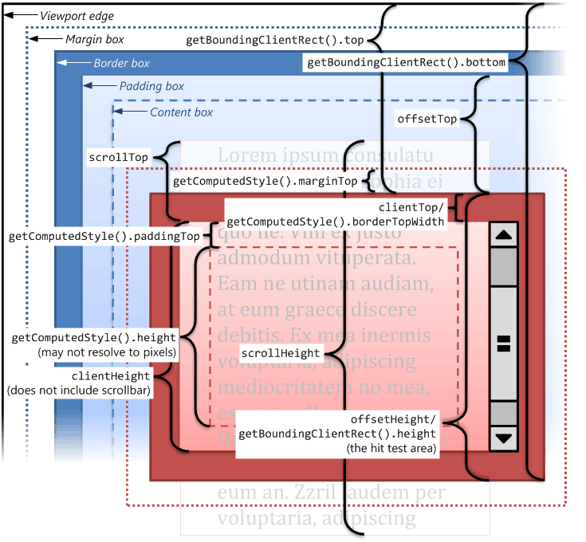

Javascript Basics
====================

Introduction
----------------

运行在客户端的脚本语言; 基于 Node.js 也可进行服务端编程

脚本语言
    不需要编译, 运行过程中由 js 解释器 (引擎) 将源码逐行转换为机器语言, 然后由计算机执行

嵌入式语言 (embedded)
    核心语法很少, 只能做一些数学和逻辑运算; 需要靠宿主环境 (如浏览器) 提供底层 API (包括 I/O)

Javascript 的核心语法只有 "基本的语法构造" 和 "标准库", 其他都是宿主环境提供的 API

Javascript 的优势
~~~~~~~~~~~~~~~~~~~~~~~

1. 操纵浏览器
2. 使用领域广泛

    - 浏览器平台化, 使得 Javascript 能够调用的功能越来越多
    - Node 项目使得 Javascript 在服务器端也可以使用
    - 数据库操作; 大部分 NoSQL 数据库允许 Javascript 直接操作; PostgreSQL 部分支持 Javascript
    - 移动端开发
    - 被用作内嵌脚本语言
    - 跨平台桌面应用 (Open Web Apps, Chrome App, Electron, TideSDK)
3. 易学
4. 性能强大

    - 语法灵活
    - 支持编译运行
    - 采用事件驱动 (event-driven) 和非阻塞式 (non-blocking) 设计可以满足高并发应用

Javascript 与 ECMAScript 的关系
~~~~~~~~~~~~~~~~~~~~~~~~~~~~~~~~~~~~~~~

ECMAScript 是 Javascript 的标准, 后者是前者的一种实现

ECMAScript 只规定了 Javascript 的基本语法结构, 与部署环境相关的标准另行规定 (如 DOM 标准由 W3C 制定)

Javascript 基本语法
-----------------------

> reference: https://wangdoc.com/javascript/basic/grammar.html

语句
~~~~~~~

JavaScript 程序的执行单位为行 (line) , 也就是一行一行地执行.一般情况下, 每一行就是一个语句.

语句 (statement) 是为了完成某种任务而进行的操作, 比如下面就是一行赋值语句.

.. code-block:: javascript

    var a = 1 + 3;

这条语句先用 `var` 命令, 声明了变量 `a`, 然后将 `1 + 3` 的运算结果赋值给变量a.

`1 + 3` 叫做表达式 (expression) , 指一个为了得到返回值的计算式.语句和表达式的区别在于, 前者主要为了进行某种操作, 一般情况下不需要返回值; 后者则是为了得到返回值, 一定会返回一个值.凡是 JavaScript 语言中预期为值的地方, 都可以使用表达式.比如, 赋值语句的等号右边, 预期是一个值, 因此可以放置各种表达式.

语句以分号结尾, 一个分号就表示一个语句结束.多个语句可以写在一行内.

.. code-block:: javascript

    var a = 1 + 3 ; var b = 'abc';

分号前面可以没有任何内容, JavaScript 引擎将其视为空语句.

.. code-block:: javascript

    ;;;

上面的代码就表示 3 个空语句.

表达式不需要分号结尾.一旦在表达式后面添加分号, 则 JavaScript 引擎就将表达式视为语句, 这样会产生一些没有任何意义的语句.

.. code-block:: javascript

    1 + 3;
    'abc';

上面两行语句只是单纯地产生一个值, 并没有任何实际的意义.

变量
~~~~~~~~

.. code-block:: javascript

    // 使用步骤
    // 1. 声明变量
    var test;

    // 2. 赋值
    test = 10;

    // 变量的初始化: 声明的同时赋值
    var test = 10;

    // 变量名声明后, 未赋值时其值为 "undefined"
    // 变量名不声明, 只赋值时会成为全局变量
    // 变量名不声明, 不赋值会报错

更新变量
^^^^^^^^^^^^

.. code-block:: javascript

    var test = 10;
    // 对变量名重新赋值
    test = 11;

声明多个变量
^^^^^^^^^^^^^^^

.. code-block:: javascript

    // 只写一个 var, 变量名之间用 "," 隔开
    var test1 = 1, test2 = 2, test3 = 3;

变量提升 hoisting
^^^^^^^^^^^^^^^^^^^^

JavaScript 引擎的工作方式是, 先解析代码, 获取所有被声明的变量, 然后再一行一行地运行.这造成的结果, 就是所有的变量的声明语句, 都会被提升到代码的头部, 这就叫做变量提升 (hoisting) .

.. code-block:: javascript

    console.log(a);
    var a = 1;

上面代码首先使用 `console.log` 方法, 在控制台 (console) 显示变量 `a` 的值.这时变量 `a` 还没有声明和赋值, 所以这是一种错误的做法, 但是实际上不会报错.因为存在变量提升, 真正运行的是下面的代码.

.. code-block:: javascript

    var a;
    console.log(a);
    a = 1;

最后的结果是显示 `undefined`, 表示变量 `a` 已声明, 但还未赋值.

标识符 identifier
~~~~~~~~~~~~~~~~~~~~~~~~

标识符指的是用来识别各种值的合法名称.最常见的标识符就是变量名, 以及后面要提到的函数名.JavaScript 语言的标识符对大小写敏感, 所以 `a` 和 `A` 是两个不同的标识符.

标识符有一套命名规则, 不符合规则的就是非法标识符.JavaScript 引擎遇到非法标识符, 就会报错.

简单说, 标识符命名规则如下.

第一个字符, 可以是任意 Unicode 字母 (包括英文字母和其他语言的字母) , 以及美元符号 (`$`) 和下划线 (`_`) .
第二个字符及后面的字符, 除了 Unicode 字母, 美元符号和下划线, 还可以用数字 `0-9`.
下面这些都是合法的标识符.

.. code-block:: javascript

    arg0
    _tmp
    $elem
    π

下面这些则是不合法的标识符.

.. code-block:: javascript

    1a  // 第一个字符不能是数字
    23  // 同上
    ***  // 标识符不能包含星号
    a+b  // 标识符不能包含加号
    -d  // 标识符不能包含减号或连词线

中文是合法的标识符, 可以用作变量名.

.. code-block:: javascript

    var 临时变量 = 1;

> JavaScript 有一些保留字, 不能用作标识符: arguments, break, case, catch, class, const, continue, debugger, default, delete, do, else, enum, eval, export, extends, false, finally, for, function, if, implements, import, in, instanceof, interface, let, new, null, package, private, protected, public, return, static, super, switch, this, throw, true, try, typeof, var, void, while, with, yield

注释
~~~~~~~~~~~~

源码中被 JavaScript 引擎忽略的部分就叫做注释, 它的作用是对代码进行解释.JavaScript 提供两种注释的写法:

一种是单行注释, 用 `//` 起头; 另一种是多行注释, 放在 `/*` 和 `*/` 之间.

.. code-block:: javascript

    // 这是单行注释

    /*
    这是
    多行
    注释
    */

此外, 由于历史上 JavaScript 可以兼容 HTML 代码的注释, 所以 `<!--` 和 `-->` 也被视为合法的单行注释.

.. code-block:: javascript

    x = 1; <!-- x = 2;
    --> x = 3;

上面代码中, 只有 `x = 1` 会执行, 其他的部分都被注释掉了.

需要注意的是, `-->` 只有在行首, 才会被当成单行注释, 否则会当作正常的运算.

.. code-block:: javascript

    function countdown(n) {
        while (n --> 0) console.log(n);
    }
    countdown(3)
    // 2
    // 1
    // 0

上面代码中, `n --> 0` 实际上会当作 `n-- > 0`, 因此输出2, 1, 0.

区块 block
~~~~~~~~~~~~~

JavaScript 使用大括号, 将多个相关的语句组合在一起, 称为 "区块"  (block) .

对于 `var` 命令来说, JavaScript 的区块不构成单独的作用域 (scope) .

.. code-block:: javascript

    {
    var a = 1;
    }

    a // 1

上面代码在区块内部, 使用 `var` 命令声明并赋值了变量 `a`, 然后在区块外部, 变量 `a` 依然有效, 区块对于 `var` 命令不构成单独的作用域, 与不使用区块的情况没有任何区别.在 JavaScript 语言中, 单独使用区块并不常见, 区块往往用来构成其他更复杂的语法结构, 比如for, if, while, function等.

流程控制
~~~~~~~~~~~~~~~

顺序结构
^^^^^^^^^^^^

从上到下顺序执行

分支流程控制
^^^^^^^^^^^^^^

根据不同的条件, 执行不同的路径代码, 得到不同的结果

- if...else

.. code-block:: javascript

    // 双分支
    if (condition) {
        // condition is true
        ...
    } else {
        // condition is false
        ...
    }

    // 多分支
    if (condition1) {
        // condition1 is true
        ...
    } else if (condition2) {
        // condition2 is false
        ...
    } ...

- ternary

.. code-block:: javascript

    condition ? true_code : false_code

- switch

.. code-block:: javascript

    // 全等判断 ===
    switch(condition) {
        case value1:
            code1;
            break;
        case value2:
            code2;
            break;
        ...
        default:
            last_code;
    }

循环结构
^^^^^^^^^^^^^

- for

.. code-block:: javascript

    for (初始化变量; 条件表达式; 操作表达式) {
        // 循环执行的代码
        ...
    }

- while

.. code-block:: javascript

    while (condition) {
        // run code if condition is true
        ...
    }

- do...while

.. code-block:: javascript

    do {
        // run code once, then determine by condition
        ...
    } while (condition)

- continue

跳出本次循环, 继续下一次循环

- break

跳出整个循环

- label

    JavaScript 语言允许语句的前面有标签, 相当于定位符, 用于跳转到程序的任意位置

.. code-block:: javascript

    label:
        语句

    // 标签可以是任意的标识符, 但不能是保留字, 语句部分可以是任意语句

    // 通常与 break 和 continue 配合使用, 跳出特定的循环

.. code-block:: javascript

    top:
    for (var i = 0; i < 3; i++){
        for (var j = 0; j < 3; j++){
            if (i === 1 && j === 1) break top;
            console.log('i=' + i + ', j=' + j);
        }
    }
    // i=0, j=0
    // i=0, j=1
    // i=0, j=2
    // i=1, j=0

    // 上面代码为一个双重循环区块, `break` 命令后面加上了 `top` 标签 (注意, `top` 不用加引号) , 满足条件时, 直接跳出双层循环. 如果 `break` 语句后面不使用标签, 则只能跳出内层循环, 进入下一次的外层循环.

    // 标签也可以用于跳出代码块
    foo: {
        console.log(1);
        break foo;
        console.log('本行不会输出');
    }
    console.log(2);
    // 1
    // 2

    top:
        for (var i = 0; i < 3; i++){
            for (var j = 0; j < 3; j++){
                if (i === 1 && j === 1) continue top;
                console.log('i=' + i + ', j=' + j);
            }
        }
        // i=0, j=0
        // i=0, j=1
        // i=0, j=2
        // i=1, j=0
        // i=2, j=0
        // i=2, j=1
        // i=2, j=2

    // 上面代码中, continue 后面有一个标签名, 满足条件时, 会跳过当前循环, 直接进入下一轮外层循环. 如果 continue 后面不使用标签, 则只能进入下一轮的内层循环

数据类型
-----------

不同数据所需占用的存储空间不同, 为了充分利用存储空间, 需要定义不同的数据类型

Javascript 是一种弱类型/动态语言, 变量的数据类型不需要提前声明, 在运行过程中根据所赋的值自动确定

数据类型的分类
~~~~~~~~~~~~~~~~~~~~

- 简单数据类型
    - `number`_

        - 默认为十进制 (其他进制在内部会被自动转为十进制)
        - 数字前加 `0b` / `0B` 表示二进制
        - 数字前加 `0o` / `0O` / `0`(已废除) 表示八进制
        - 数字前加 `0x` / `0X` 表示十六进制

        范围:

        - 最大值: `Number.MAX_VALUE` (1.7976931348623157e+308)
        - 最小值: `Number.MIN_VALUE` (5e-324)
        - **正向溢出**, `>=2^1024`, 返回 `Infinity`
        - **负向溢出**, `<=2^-1075`, 返回 0

        特殊值:

        - 正无穷: `Infinity`
        - 负无穷: `-Infinity`
        - 非数字: `NaN` (使用 `isNaN()` 判断是否为 NaN, 返回 boolean)

    - string

        转义符:

        - 引号内使用相同引号需要转义: "\"", '\''
        - 换行: `\n`
        - 换页: `\f`
        - 反斜杠: `\\`
        - 单引号: `\'`
        - 双引号: `\"`
        - tab 缩进: `\t`
        - 垂直制表符: `\v`
        - 空格: `\b`
        - null: `\0`
        - 回车: `\r`

        长度: `str.length`

        拼接: 字符串 + 任何类型 = 新字符串

    - boolean

        - true
        - false; 如果 JavaScript 预期某个位置应该是布尔值, 会将该位置上现有的值自动转为布尔值; `undefined`, `null`, `false`, `0`, `NaN`, 空字符串会被转为 `false`

    - undefined

        加上数字为 NaN

    - null

        返回一个空的对象

        加上数字结果还是原来的数字

- 复杂数据类型

    - `数组`_
    - `函数`_
    - `对象`_

JS中, 从变量的存储来看, 分为 **栈内存** 和 **堆内存**;

从变量的访问方式来看, 分为 **按值访问** 和 **按引用访问**

基本类型是按值访问, 操作的就是实际保存的数值;

引用类型 (复杂类型) 按引用访问, 操作的是指针, 也就是说, 需要访问时, 先从栈中读取指针--指针可以认为是地址, 也就是保存着对象的地址, 顺着这个地址, 就可以找到堆中的对象了

获取数据类型
~~~~~~~~~~~~~~~~

.. code-block:: javascript

    var test = 10;
    console.log(typeof test); // returns "number"

数据类型转换
~~~~~~~~~~~~~~~~~

|  变量的数据类型是不确定的, 但是各种运算符对数据类型是有要求的
|  如果运算符发现, 运算子的类型与预期不符, 就会自动转换类型

.. code-block:: javascript

    '4' - '3' // 1

强制转换
^^^^^^^^^^^^^^^^

使用 `Number()`, `String()` 和 `Boolean()` 三个函数, 可以手动将各种类型的值 分别转换成数字, 字符串或者布尔值

- `Number()`
    - 原始类型值

    .. code-block:: javascript

        // 数值: 转换后还是原来的值
        Number(324) // 324

        // 字符串: 如果可以被解析为数值, 则转换为相应的数值
        Number('324') // 324

        // 字符串: 如果不可以被解析为数值, 返回 NaN
        Number('324abc') // NaN

        // 空字符串转为0
        Number('') // 0

        // 布尔值: true 转成 1, false 转成 0
        Number(true) // 1
        Number(false) // 0

        // undefined: 转成 NaN
        Number(undefined) // NaN

        // null: 转成0
        Number(null) // 0

    - 对象

    转换步骤:

    1. 调用对象自身的 `valueOf` 方法; 如果返回原始类型的值, 则直接对该值使用 `Number` 函数, 返回
    2. 如果 `valueOf` 方法返回的还是对象, 则改为调用对象自身的 `toString` 方法; 如果 `toString` 方法返回原始类型的值, 则对该值使用 `Number` 函数, 返回
    3. 如果 `toString` 方法返回的是对象, 报错

    .. code-block:: javascript

        Number({a: 1}) // NaN
        Number([1, 2, 3]) // NaN
        Number([5]) // 5

        var obj = {x: 1};
        Number(obj) // NaN

        // 等同于
        if (typeof obj.valueOf() === 'object') {
            Number(obj.toString());
        } else {
            Number(obj.valueOf());
        }

- `String()`
    - 原始类型值

    .. code-block:: javascript

        // 数值: 转为相应的字符串
        String(123) // "123"

        // 字符串: 转换后还是原来的值
        String('abc') // "abc"

        // 布尔值: true 转为字符串 "true", false 转为字符串 "false"
        String(true) // "true"

        // undefined: 转为字符串 "undefined"
        String(undefined) // "undefined"

        // null: 转为字符串"null"
        String(null) // "null"

    - 对象

    转换步骤:

    1. 调用对象自身的 `toString` 方法; 如果返回原始类型的值, 则直接对该值使用 `String` 函数, 返回
    2. 如果 `toString` 方法返回的还是对象, 则改为调用对象自身的 `valueOf` 方法; 如果 `valueOf` 方法返回原始类型的值, 则对该值使用 `String` 函数, 返回
    3. 如果 `valueOf` 方法返回的是对象, 报错

    .. code-block:: javascript

        String({a: 1}) // "[object Object]"
        String([1, 2, 3]) // "1,2,3"

        String({a: 1})
        // "[object Object]"

        // 等同于
        String({a: 1}.toString())
        // "[object Object]"

- `Boolean()`
    `undefined`, `null`, `0` (包含-0和+0), `NaN`, `''` (空字符串) 转换结果为 `false`, 其他值全部为 `true`

自动转换
^^^^^^^^^^^^^^^^

自动转换的三种情况:

1. 不同类型的数据互相运算
2. 对非布尔值类型的数据求布尔值
3. 对非数值类型的值使用一元运算符 (`+` 和 `-`)

自动转换的规则: 预期什么类型的值, 就调用该类型的转换函数

.. code-block:: javascript

    // 转换为字符串

    var num = 10;

    // 1. `toString()`
    var str = num.toString();

    // 2. `String()`
    var str = String(num);

    // 3. 字符串拼接; 隐式转换
    '5' + 1 // '51'
    '5' + true // "5true"
    '5' + false // "5false"
    '5' + {} // "5[object Object]"
    '5' + [] // "5"
    '5' + function (){} // "5function (){}"
    '5' + undefined // "5undefined"
    '5' + null // "5null"

    // 转换为数字

    var str = '10.5';
    // 1. parseInt()
    var num = parseInt(str); // 取整, 返回整数 "10"

    // 2. parseFloat()
    var num = parseFloat(str); // 返回浮点数 "10.5"

    // 3. Number()
    var num = Number(str);

    // 4. 使用 -, /, * 实现隐式转换
    '5' - '2' // 3
    '5' * '2' // 10
    true - 1  // 0
    false - 1 // -1
    '1' - 1   // 0
    '5' * []    // 0
    false / '5' // 0
    'abc' - 1   // NaN
    null + 1 // 1
    undefined + 1 // NaN

    // 转换为 Boolean

    // `Boolean()`
    Boolean(''); // false
    Boolean(0); // false
    Boolean(NaN); // false
    Boolean(null); // false
    Boolean(undefined); // false
    // 其余数据均转换为 true

number
~~~~~~~~~~~

JavaScript 内部,  所有数字 (包括整数) 都是以 64 位浮点数形式储存

.. code-block:: javascript

    1 === 1.0 // returns true

    // 由于浮点数不是精确的值, 涉及小数的比较和运算需要特别注意

    0.1 + 0.2 === 0.3
    // false

    0.3 / 0.1
    // 2.9999999999999996

    (0.3 - 0.2) === (0.2 - 0.1)
    // false

数值精度
^^^^^^^^^^^^

根据国际标准 IEEE 754, JavaScript 浮点数的 64 个二进制位, 从最左边开始:

- 第1位: 符号位, 0 表示正数, 1 表示负数
- 第2位到第12位 (共11位): 指数部分
- 第13位到第64位 (共52位): 小数部分 (即有效数字)

符号位决定了一个数的正负, 指数部分决定了数值的大小, 小数部分决定了数值的精度

指数部分一共有 11 个二进制位, 因此大小范围就是 0 到 2047. IEEE 754 规定, 如果指数部分的值在 0 到 2047 之间 (不含两个端点), 那么有效数字的第一位默认总是 1, 不保存在 64 位浮点数之中. 也就是说, 有效数字这时总是 `1.xx...xx` 的形式, 其中 `xx..xx` 的部分保存在 64 位浮点数之中, 最长可能为 52 位. 因此, JavaScript 提供的有效数字最长为53个二进制位.

.. code-block:: javascript

    (-1)^符号位 * 1.xx...xx * 2^指数部分

上面公式是正常情况下 (指数部分在 0 到 2047 之间), 一个数在 JavaScript 内部实际的表示形式.

精度最多只能到 53 个二进制位, 这意味着, 绝对值小于 2 的 53 次方的整数, 即 -253 到 253, 都可以精确表示.

.. code-block:: javascript

    Math.pow(2, 53)
    // 9007199254740992

    Math.pow(2, 53) + 1
    // 9007199254740992

    Math.pow(2, 53) + 2
    // 9007199254740994

    Math.pow(2, 53) + 3
    // 9007199254740996

    Math.pow(2, 53) + 4
    // 9007199254740996

    // 大于 2 的 53 次方以后, 整数运算的结果开始出现错误. 所以, 大于 2 的 53 次方的数值, 都无法保持精度. 由于 2 的 53 次方是一个 16 位的十进制数值, 所以简单的法则就是, JavaScript 对 15 位的十进制数都可以精确处理.

    Math.pow(2, 53)
    // 9007199254740992

    // 多出的三个有效数字, 将无法保存
    9007199254740992111
    // 9007199254740992000

    // 大于2的53次方以后, 多出来的有效数字 (最后三位的111) 都会无法保存, 变成0

数值的表示
^^^^^^^^^^^

科学计数法
    字母 `e` 或 `E` 的后面跟一个整数, 表示这个数值的指数部分

.. code-block:: javascript

    // 以下两种情况 JavaScript 会自动将数值转为科学计数法表示 (其他情况都采用字面形式直接表示):

    // 1. 小数点前的数字多于21位
    1234567890123456789012
    // 1.2345678901234568e+21

    123456789012345678901
    // 123456789012345680000

    // 2. 小数点后的零多于5个
    0.0000003 // 3e-7

    0.000003 // 0.000003

特殊数值
^^^^^^^^^^^

- +0 & -0

    .. code-block:: javascript

        -0 === +0 // true
        0 === -0 // true
        0 === +0 // true
        // 几乎所有场合,  +0 和 -0 都会被当作正常的 0

        +0 // 0
        -0 // 0
        (-0).toString() // '0'
        (+0).toString() // '0'

        // 唯一有区别的场合是 +0 或 -0 当作分母, 返回值是不相等的

        (1 / +0) === (1 / -0) // false
        (1 / +0) // +Infinity
        (1 / -0) // -Infinity

- NaN

    Not a Number; 主要出现在将字符串解析成数字出错的场合

    .. code-block:: javascript

        // NaN不等于任何值, 包括它本身
        NaN === NaN // false

        // 数组的 indexOf 方法内部使用的是严格相等运算符, 所以该方法对NaN不成立
        [NaN].indexOf(NaN) // -1

        // NaN在布尔运算时被当作false
        Boolean(NaN) // false

        // NaN与任何数 (包括它自己) 的运算, 得到的都是NaN
        NaN + 32 // NaN
        NaN - 32 // NaN
        NaN * 32 // NaN
        NaN / 32 // NaN

- Infinity & -Infinity

与数值相关的全局方法
^^^^^^^^^^^^^^^^^^^^^^^

- parseInt

    将字符串转为整数

    .. code-block:: javascript

        parseInt('123') // 123

        // 如果字符串头部有空格, 空格会被自动去除
        parseInt('   81') // 81

        // 如果parseInt的参数不是字符串, 则会先转为字符串再转换
        parseInt(1.23) // 1
        // 等同于
        parseInt('1.23') // 1

        // 依次转换字符; 如果遇到不能转为数字的字符, 就不再进行下去, 返回已经转好的部分
        parseInt('8a') // 8
        parseInt('12**') // 12
        parseInt('12.34') // 12
        parseInt('15e2') // 15
        parseInt('15px') // 15

        // 如果字符串的第一个字符不能转化为数字 (后面跟着数字的正负号除外), 返回 NaN
        parseInt('abc') // NaN
        parseInt('.3') // NaN
        parseInt('') // NaN
        parseInt('+') // NaN
        parseInt('+1') // 1

        // 对于那些会自动转为科学计数法的数字, parseInt 会将科学计数法的表示方法视为字符串, 因此导致一些奇怪的结果
        parseInt(1000000000000000000000.5) // 1
        // 等同于
        parseInt('1e+21') // 1

        parseInt(0.0000008) // 8
        // 等同于
        parseInt('8e-7') // 8

    进制转换; 接受第二个参数 (2到36之间), 表示被解析的值的进制, 返回该值对应的十进制数. 默认为 10

    .. code-block:: javascript

        parseInt('1000', 2) // 8
        parseInt('1000', 6) // 216
        parseInt('1000', 8) // 512

        // 如果字符串包含对于指定进制无意义的字符, 则从最高位开始, 只返回可以转换的数值; 如果最高位无法转换, 则直接返回 NaN
        parseInt('1546', 2) // 1
        parseInt('546', 2) // NaN

        // 如果parseInt的第一个参数不是字符串, 会被先转为字符串
        // 这会导致一些令人意外的结果
        parseInt(0x11, 36) // 43
        parseInt(0x11, 2) // 1
        // 等同于
        parseInt(String(0x11), 36)
        parseInt(String(0x11), 2)
        // 等同于
        parseInt('17', 36)
        parseInt('17', 2)

        parseInt(011, 2) // NaN
        // 等同于
        parseInt(String(011), 2)
        // 等同于
        parseInt(String(9), 2)

- parseFloat

    将字符串转为浮点数

    .. code-block:: javascript

        parseFloat('3.14') // 3.14

        // 如果字符串符合科学计数法, 则会进行相应的转换
        parseFloat('314e-2') // 3.14
        parseFloat('0.0314E+2') // 3.14

        // 如果字符串包含不能转为浮点数的字符, 则不再进行往后转换, 返回已经转好的部分
        parseFloat('3.14more non-digit characters') // 3.14

        // parseFloat方法会自动过滤字符串前导的空格
        parseFloat('\t\v\r12.34\n ') // 12.34

        // 如果参数不是字符串, 或者字符串的第一个字符不能转化为浮点数, 则返回 NaN
        parseFloat([]) // NaN
        parseFloat('FF2') // NaN
        parseFloat('') // NaN

    这些特点使得 `parseFloat` 的转换结果不同于 `Number` 函数

    .. code-block:: javascript

        parseFloat(true)  // NaN
        Number(true) // 1

        parseFloat(null) // NaN
        Number(null) // 0

        parseFloat('') // NaN
        Number('') // 0

        parseFloat('123.45#') // 123.45
        Number('123.45#') // NaN

- isNaN

    判断一个值是否为 `NaN`; 只对数值有效, 如果传入其他值, 会被先转成数值

    .. code-block:: javascript

        isNaN(NaN) // true
        isNaN(123) // false

        isNaN('Hello') // true
        // 相当于
        isNaN(Number('Hello')) // true

        // 同样, 对于对象和数组, 也返回 true
        isNaN({}) // true
        // 等同于
        isNaN(Number({})) // true

        isNaN(['xzy']) // true
        // 等同于
        isNaN(Number(['xzy'])) // true

        // 但是, 对于空数组和只有一个数值成员的数组, isNaN 返回 false
        isNaN([]) // false
        isNaN([123]) // false
        isNaN(['123']) // false

        // 使用 isNaN 之前,  最好判断一下数据类型
        function myIsNaN(value) {
            return typeof value === 'number' && isNaN(value);
        }

    判断NaN更可靠的方法是, 利用 NaN 为唯一不等于自身的值的这个特点进行判断

    .. code-block:: javascript

        function myIsNaN(value) {
            return value !== value;
        }

- isFinite

    返回一个布尔值, 表示某个值是否为正常的数值

    .. code-block:: javascript

        isFinite(Infinity) // false
        isFinite(-Infinity) // false
        isFinite(NaN) // false
        isFinite(undefined) // false
        isFinite(null) // true
        isFinite(-1) // true

对象
~~~~~~~~~~

一组无序的相关 **属性** 和 **方法** 的集合 (特征和行为); 键值对 (key-value) 的集合

对象 (object) 是 JavaScript 语言的核心概念, 也是最重要的数据类型

键名
^^^^^^^^

- 对象的所有键名都是字符串 (ES6 又引入了 Symbol 值也可以作为键名), 所以加不加引号都可以

.. code-block:: javascript

    var obj = {
        foo: 'Hello',
        bar: 'World'
    };
    // 等同于
    var obj = {
        'foo': 'Hello',
        'bar': 'World'
    };

- 如果键名是数值, 会被自动转为字符串

.. code-block:: javascript

    var obj = {
        1: 'a',
        3.2: 'b',
        1e2: true,
        1e-2: true,
        .234: true,
        0xFF: true
    };
    obj['100'] // true

- 如果键名不符合标识名的条件 (比如第一个字符为数字, 或者含有空格或运算符), 且也不是数字, 则必须加上引号, 否则会报错

.. code-block:: javascript

    // 报错
    var obj = {
        1p: 'Hello World'
    };
    // 不报错
    var obj = {
        '1p': 'Hello World',
        'h w': 'Hello World',
        'p+q': 'Hello World'
    };

- 对象的每一个键名又称为 "属性" (property), 它的 "键值" 可以是任何数据类型; 如果一个属性的值为函数, 通常把这个属性称为 "方法", 它可以像函数那样调用

.. code-block:: javascript

    var obj = {
        p: function (x) {
            return 2 * x;
        }
    };
    obj.p(1) // 2

- 如果属性的值还是一个对象,  就形成了链式引用

.. code-block:: javascript

    var o1 = {};
    var o2 = { bar: 'hello' };

    o1.foo = o2;
    o1.foo.bar // "hello"

- 属性之间用逗号分隔, 最后一个属性后面可以加逗号 (trailing comma), 也可以不加

- 属性可以动态创建, 不必在对象声明时就指定

对象的引用
^^^^^^^^^^^^^^

如果不同的变量名指向同一个对象, 那么它们都是这个对象的引用, 也就是说指向同一个内存地址; 修改其中一个变量, 会影响到其他所有变量

.. code-block:: javascript

    var o1 = {};
    var o2 = o1;

    o1.a = 1;
    o2.a // 1

    o2.b = 2;
    o1.b // 2

    // 如果取消某一个变量对于原对象的引用, 不会影响到另一个变量
    var o1 = {};
    var o2 = o1;

    o1 = 1;
    o2 // {}

    // 这种引用只局限于对象, 如果两个变量指向同一个原始类型的值, 那么变量这时都是值的拷贝
    var x = 1;
    var y = x;

    x = 2;
    y // 1

歧义: 表达式还是语句
^^^^^^^^^^^^^^^^^^^^^^^

对象采用大括号表示导致歧义, 因此 JavaScript 引擎在遇到无法确定是对象还是代码块时, 一律解释为代码块

如果要保证解释为对象, 只需在大括号前加上圆括号; 因为圆括号里只能是表达式

创建对象
^^^^^^^^^^^

.. code-block:: javascript

    // 字面量 `{}`
    var obj = {
        attr1: val1,
        attr2: val2,
        fn1: function() {
            code...
        }
    };

    // Object
    var obj = new Object();
    obj.attr1 = val1;
    obj.attr2 = val2;
    obj.fn1 = function() {
        code...
    };

    // 构造函数
    function Constructor(attr1, attr2, ) {
        this.attr1 = attr1;
        this.attr2 = attr2;
        this.fn1 = function() {
            code...
        }
    }

    var obj = new Constructor(val1, val2); // 对象的实例化
    // new 会创建一个空的对象, 并执行构造函数中的代码为对象添加属性和方法
    // 最后返回对象

属性的操作
^^^^^^^^^^^^^^^

- 读取和赋值

.. code-block:: javascript

    // 点运算符
    console.log(obj.attr1);

    // 方括号运算符
    console.log(obj['attr2']);
    // 使用方括号时键名必须放在引号里, 否则会被当作变量处理

    // 点运算符和方括号运算符也可以用来赋值

    // 调用方法
    obj.fn1();

- 查看 `Object.keys`

.. code-block:: javascript

    // 查看一个对象本身的所有属性
    var obj = {
        key1: 1,
        key2: 2
    };

    Object.keys(obj);
    // ['key1', 'key2']

- 删除 `delete`

.. code-block:: javascript

    // 删除成功后返回 true
    var obj = { p: 1 };
    Object.keys(obj) // ["p"]

    delete obj.p // true
    obj.p // undefined
    Object.keys(obj) // []

    // 删除一个不存在的属性也不会报错, 而且返回 true
    var obj = {};
    delete obj.p // true

    // 只有当属性存在且不得删除时, delete 会返回false
    var obj = Object.defineProperty({}, 'p', {
        value: 123,
        configurable: false
    });

    obj.p // 123
    delete obj.p // false

    // 无法删除继承的属性, 且依旧会返回 true
    var obj = {};
    delete obj.toString // true
    obj.toString // function toString() { [native code] }

- 检查属性是否存在 `in`

.. code-block:: javascript

    var obj = { p: 1 };
    'p' in obj // true
    'toString' in obj // true

    // in 不能识别哪些属性是对象自身的, 哪些属性是继承的; 需要另行判断
    var obj = {};
    if ('toString' in obj) {
        console.log(obj.hasOwnProperty('toString')) // false
    }

- 遍历属性和方法 `for...in`

.. code-block:: javascript

    // 遍历所有可遍历 (enumerable) 的属性, 跳过不可遍历的属性
    // 不仅遍历对象自身的属性, 还遍历继承的属性
    for (k in obj) {
        console.log(k);
        console.log(obj[k]);
    }

with 语句
^^^^^^^^^^^^^^

在操作同一个对象的多个属性时提供一些书写的方便 (不推荐使用)

.. code-block:: javascript

    with (对象) {
        语句;
    }

.. code-block:: javascript

    // 例一
    var obj = {
        p1: 1,
        p2: 2,
    };
    with (obj) {
        p1 = 4;
        p2 = 5;
    }
    // 等同于
    obj.p1 = 4;
    obj.p2 = 5;

    // 例二
    with (document.links[0]){
        console.log(href);
        console.log(title);
        console.log(style);
    }
    // 等同于
    console.log(document.links[0].href);
    console.log(document.links[0].title);
    console.log(document.links[0].style);

.. attention::

    如果with区块内部有变量的赋值操作, 必须是当前对象已经存在的属性, 否则会创造一个当前作用域的全局变量

.. code-block:: javascript

    var obj = {};
        with (obj) {
        p1 = 4;
        p2 = 5;
    }

    obj.p1 // undefined
    p1 // 4

函数
~~~~~~~~~

封装了一段可被重复调用执行的代码块

声明函数
^^^^^^^^^^^

.. code-block:: javascript

    // 1. function
    function print(s) {
        console.log(s);
    }

    // 2. 函数表达式
    // 将一个匿名函数赋值给变量
    var print = function(s) {
        console.log(s);
    };

    // 3. Function 构造函数
    // 只有最后一个参数会被当做函数体
    // (几乎无人使用)
    var add = new Function(
        'x',
        'y',
        'return x + y'
    );
    // 等同于
    function add(x, y) {
        return x + y;
    }

    // 调用函数
    test();

如果同一个函数被多次声明, 后面的声明就会覆盖前面的声明

函数名的提升
    类似变量声明, JavaScript 引擎会将 function 声明的函数提升到代码头部

    .. code-block:: javascript

        var f = function () {
            console.log('1');
        }

        function f() {
            console.log('2');
        }

        f() // 1

函数的属性和方法
^^^^^^^^^^^^^^^^^^^^^^^^

- `name` 返回函数的名字
- `length` 返回函数预期传入的参数个数
- `toString()` 返回一个函数的源码的字符串

参数
^^^^^^^^^

- 形式参数
    声明函数时定义的参数, 类似于占位符
- 实际参数
    调用函数时传入的参数

.. note::

    - 实参个数多于形参时, 只取到定义的形参个数
    - 实参个数少于形参时, 没有传递值的形参为 undefined

JavaScript 允许省略参数

.. code-block:: javascript

    function f(a, b) {
        return a;
    }

    f(1, 2, 3) // 1
    f(1) // 1
    f() // undefined

    f.length // 2

参数传递方式:

- 传值 passes by value; 在函数体内修改参数值, 不会影响到函数外部

    .. code-block:: javascript

        var p = 2;

        function f(p) {
            p = 3;
        }
        f(p);

        p // 2

- 传址 passes by reference; 在函数内部修改参数将会影响到原始值

    .. code-block:: javascript

        var obj = { p: 1 };

        function f(o) {
            o.p = 2;
        }
        f(obj);

        obj.p // 2

`arguments` 对象
^^^^^^^^^^^^^^^^^^^^^

所有函数都内置了 `arguments` 对象, 其中存储了被传递的所有实参

`arguments` 对象包含了函数运行时的所有参数, `arguments[0]` 就是第一个参数, `arguments[1]` 就是第二个参数, 以此类推

.. code-block:: javascript

    var f = function (one) {
    console.log(arguments[0]);
    console.log(arguments[1]);
    console.log(arguments[2]);
    }

    f(1, 2, 3)
    // 1
    // 2
    // 3

    // 正常模式下, arguments 对象可以在运行时修改
    var f = function(a, b) {
    arguments[0] = 3;
    arguments[1] = 2;
    return a + b;
    }

    f(1, 1) // 5

    // 严格模式下, arguments 对象与函数参数不具有联动关系; 也就是说, 修改arguments 对象不会影响到实际的函数参数
    var f = function(a, b) {
        'use strict'; // 开启严格模式
        arguments[0] = 3;
        arguments[1] = 2;
        return a + b;
    }

    f(1, 1) // 2

.. attention::

    `arguments` 是一个 **伪数组**, 具有 `length` 属性, 可以被索引, 但没有数组的一些方法

    要让使用数组方法则必须将 `arguments` 转换为数组:

    .. code-block:: javascript

        // 法1
        var args = Array.prototype.slice.call(arguments);

        // 法2
        var args = [];
        for (var i = 0; i < arguments.length; i++) {
            args.push(arguments[i]);
        }

`callee` 属性
    `arguments` 对象带有一个 `callee` 属性, 返回它所对应的原函数

    .. code-block:: javascript

        var f = function () {
            console.log(arguments.callee === f);
        }

        f() // true

    可以通过 `arguments.callee` 达到调用函数自身的目的

    这个属性在严格模式里面是**禁用**的, 因此不建议使用

`return` 返回值
^^^^^^^^^^^^^^^^^^^

.. code-block:: javascript

    function test() {
        return value;
    }

    var val = test(); // 获取返回值

|  `return` 会终止函数的执行
|  没有 `return` 语句时默认返回值为 `undefined`

立即执行函数 IIFE
^^^^^^^^^^^^^^^^^^^^^^

不需要调用, 立即执行

最大的作用在于独立创建了一个作用域, 用以避免命名冲突

.. code-block:: javascript

    // 1
    (function() {
        code...
    })();

    // 2
    (function() {
        code...
    }());

闭包 closure
^^^^^^^^^^^^^^^^

JavaScript 有两种作用域: 全局作用域和函数作用域. 函数内部可以直接读取全局变量.

.. code-block:: javascript

    var n = 999;

    function f1() {
        console.log(n);
    }
    f1() // 999

    // 函数 f1 可以读取全局变量n
    // 但是函数外部无法读取函数内部声明的变量

    function f1() {
        var n = 999;
    }

    console.log(n)
    // Uncaught ReferenceError: n is not defined(

如果出于种种原因, 需要得到函数内的局部变量. 正常情况下是办不到的, 只有通过变通方法才能实现. 那就是在函数的内部, 再定义一个函数.

.. code-block:: javascript

    function f1() {
        var n = 999;
        function f2() {
        　　console.log(n); // 999
        }
    }

上面代码中, 函数 `f2` 就在函数 `f1` 内部, 这时 `f1` 内部的所有局部变量对 `f2` 都是可见的. 但是反过来就不行, `f2` 内部的局部变量, 对 `f1` 就是不可见的. 这就是 JavaScript 语言特有的 **链式作用域** 结构 (chain scope), 子对象会一级一级地向上寻找所有父对象的变量. 所以, 父对象的所有变量, 对子对象都是可见的, 反之则不成立.

既然 `f2` 可以读取f1的局部变量, 那么只要把 `f2` 作为返回值, 就可以在 `f1` 外部读取它的内部变量了

.. code-block:: javascript

    function f1() {
        var n = 999;
        function f2() {
            console.log(n);
        }
        return f2;
    }

    var result = f1();
    result(); // 999

上面代码中, 函数 `f1` 的返回值就是函数 `f2`, 由于 `f2` 可以读取 `f1` 的内部变量, 所以就可以在外部获得 `f1` 的内部变量了.

闭包就是函数 `f2`, 即能够读取其他函数内部变量的函数. 由于在 JavaScript 语言中, 只有函数内部的子函数才能读取内部变量, 因此可以把闭包简单理解成 "定义在一个函数内部的函数".

闭包最大的特点, 就是它可以"记住"诞生的环境, 比如 `f2` 记住了它诞生的环境 `f1`, 所以从 `f2` 可以得到 `f1` 的内部变量. 在本质上, 闭包就是将函数内部和函数外部连接起来的一座桥梁.

闭包的最大用处有两个, 一个是可以读取函数内部的变量, 另一个就是让这些变量始终保持在内存中, 即闭包可以使得它诞生环境一直存在. 请看下面的例子, 闭包使得内部变量记住上一次调用时的运算结果.

.. code-block:: javascript

    function createIncrementor(start) {
        return function () {
            return start++;
        };
    }

    var inc = createIncrementor(5);

    inc() // 5
    inc() // 6
    inc() // 7

    // inc 始终在内存中, 而 inc 的存在依赖于 createIncrementor, 因此也始终在内存中, 不会在调用结束后, 被垃圾回收机制回收.

闭包的另一个用处, 是封装对象的私有属性和私有方法.

.. code-block:: javascript

    function Person(name) {
        var _age;
        function setAge(n) {
            _age = n;
        }
        function getAge() {
            return _age;
        }

        return {
            name: name,
            getAge: getAge,
            setAge: setAge
        };
    }

    var p1 = Person('张三');
    p1.setAge(25);
    p1.getAge() // 25

.. attention::

    外层函数每次运行, 都会生成一个新的闭包, 而这个闭包又会保留外层函数的内部变量, 所以内存消耗很大

    因此不能滥用闭包, 否则会造成网页的性能问题

数组
~~~~~~~~~

|  一组按顺序排列的 **数据的集合**, 其中每个数据被称为 **元素**, 元素用 "," 分隔
|  每个元素都有编号, 编号从 0 开始
|  数组中可以存放任意类型的元素

数组本质上属于一种特殊的对象

.. code-block:: javascript

    // typeof 运算符会返回数组的类型是 object
    typeof [1, 2, 3] // "object"

    // 其键名是按次序排列的一组整数
    Object.keys(['a', 'b', 'c'])
    // ["0", "1", "2"]

    // 但是对于数值的键名不能使用点结构, 只能用方括号 [0] 表示
    var arr = [1, 2, 3];
    arr.0 // SyntaxError

创建数组
^^^^^^^^^^^

- new

.. code-block:: javascript

    var arr = new Array(ele1, ele2, ...);
    // [ele1, ele2, ...]

    // 当只传入一个整数时, 生成整数长度的数组
    var arr = new Array(10);
    // [,,,,,,,,,]

- 数组字面量

.. code-block:: javascript

    var arr = [ele1, ele2, ...];
    // [ele1, ele2]

数组的长度
^^^^^^^^^^^^^^

数组的 `length` 属性返回元素数量 (最大整数键 + 1)

.. code-block:: javascript

    ['a', 'b', 'c'].length // 3

JavaScript 使用一个 32 位整数保存数组的元素个数; 即数组成员最多只有 4294967295 个 (2^32 - 1个), 也就是说 `length` 属性的最大值就是 4294967295

`length` 属性是可写的; 通过修改 `length`, 可以实现元素的增减

设置 `length` 为不合法的值时 JavaScript 会报错

.. code-block:: javascript

    // 设置负值
    [].length = -1
    // RangeError: Invalid array length

    // 数组元素个数大于等于2的32次方
    [].length = Math.pow(2, 32)
    // RangeError: Invalid array length

    // 设置字符串
    [].length = 'abc'
    // RangeError: Invalid array length

获取数组元素
^^^^^^^^^^^^^^^

- 数组索引

索引号从 0 开始, 没有对应元素时返回 `undefined`

.. code-block:: javascript

    var arr = [1,2,3];
    console.log(arr[0]); // 1

    // in 也适用于数组
    2 in arr  // true
    '2' in arr // true
    4 in arr // false

- 遍历数组

利用循环从头到尾访问所有元素

.. code-block:: javascript

    var arr = [1,2,3];

    // for loop / while loop
    for (var i = 0; i < arr.length; i++) {
        console.log(arr[i]); // 1 2 3
    }

    var i = 0;
    while (i < a.length) {
        console.log(a[i]);
        i++;
    }

    var l = a.length;
    while (l--) {
        console.log(a[l]);
    }

    // for...in 也可用于遍历数组
    // 但也会遍历非数字键
    // 所以不推荐使用

    // forEach()
    arr.forEach(function (ele) {
        console.log(ele);
    });

当数组中存在空位时, 使用数组的 `forEach` 方法, `for...in` 结构, 以及 `Object.keys` 方法进行遍历, 都会跳过空位; 而使用 `length` 遍历则不会跳过

空位与 `undefined` 是不同的; 空位就是数组没有这个元素, 所以不会被遍历到, 而 `undefined` 则表示数组有这个元素, 值是 `undefined`, 所以遍历不会跳过

获取元素索引
^^^^^^^^^^^^^^^^

- `indexOf(item[, start])`
- `lastIndexOf()`

添加元素
^^^^^^^^^^^^^

- 修改数组长度 `length`

.. code-block:: javascript

    var arr = [1,2,3];
    console.log(arr.length); // 3

    arr.length = 5;
    console.log(arr); // [1,2,3,empty,empty]
    console.log(arr[3]); // undefined

- 使用索引号来修改或添加数组元素

.. code-block:: javascript

    var arr = [1,2,3];

    arr[0] = -1; // 元素存在时修改

    arr[3] = 4; // 元素不存在时添加
    arr[5] = 6; // 元素不存在时添加
    console.log(arr); // [-1,2,3,4, empty, 6]

    // 数组的键名超出范围时, 该键名会自动转为字符串
    arr[Math.pow(2, 32)] = 'b';
    arr[4294967296] // "b"

- `push(), unshift()`

删除元素
^^^^^^^^^^^^^^^^^^

- 修改数组长度 `length`

.. code-block:: javascript

    var arr = [ 'a', 'b', 'c' ];

    arr.length = 0;
    arr // []

- `pop()`
- `shift()`
- `delete()`

数组排序
^^^^^^^^^^^^^^^^^

- `reverse()`
- `sort()`

类数组对象
^^^^^^^^^^^^^^^^^^^

|  array-like object
|  对象的所有键名都是正整数或零, 并且有 `length` 属性

.. code-block:: javascript

    var obj = {
        0: 'a',
        1: 'b',
        2: 'c',
        length: 3
    };

    obj[0] // 'a'
    obj[1] // 'b'
    obj.length // 3
    obj.push('d') // TypeError: obj.push is not a function

但是, "类数组对象" 并不是数组, 它们不具备数组特有的方法

典型的类数组对象:

- 函数的 `arguments` 对象
- 大多数 DOM 元素集
- 字符串

.. code-block:: javascript

    // arguments 对象
    function args() { return arguments }
    var arrayLike = args('a', 'b');

    arrayLike[0] // 'a'
    arrayLike.length // 2
    arrayLike instanceof Array // false

    // DOM 元素集
    var elts = document.getElementsByTagName('h3');
    elts.length // 3
    elts instanceof Array // false

    // 字符串
    'abc'[1] // 'b'
    'abc'.length // 3
    'abc' instanceof Array // false

类数组对象使用数组的方法:

1. 用数组的 `slice` 方法将类数组对象转为真正的数组

    .. code-block:: javascript

        var arr = Array.prototype.slice.call(arrayLike);

2. 通过 `call()` 把数组的方法放到对象上面

    .. code-block:: javascript

        function print(value, index) {
            console.log(index + ' : ' + value);
        }

        Array.prototype.forEach.call(arrayLike, print);

        // 然而这种方法比直接使用数组原生的 forEach 要慢

运算符 operator
~~~~~~~~~~~~~~~~~~~~~~

.. list-table::
    :widths: auto
    :header-rows: 0
    :stub-columns: 0

    * - 算术运算符
      -
    * - \+
      - 加
    * - \-
      - 减
    * - \*
      - 乘
    * - /
      - 除
    * - \**
      - 指数 (右结合, 先进行最右边的计算)
    * - %
      - 取余
    * - ++
      - 递增 (前置, 后置; 必须配合变量使用)
    * - --
      - 递减 (前置, 后置; 必须配合变量使用)
    * - \+
      - 数值运算符 (前置)
    * - \-
      - 负数值运算符 (前置)
    * - =
      - 赋值
    * - +=, -=
      - 加后赋值, 减后赋值
    * - \*=, /=, %=, \**=
      - 乘后赋值, 除后赋值, 取余后赋值, 求指数后赋值
    * - 比较运算符
      -
    * - <
      - 小于
    * - >
      - 大于
    * - <=
      - 小于等于
    * - >=
      - 大于等于
    * - ==
      - 是否相等 (默认转换数据类型)
    * - !=
      - 是否不等
    * - ===, !==
      - 全等, 不全等 (不转换数据类型)
    * - 布尔运算符
      -
    * - &&
      - 与 (短路运算/逻辑中断)
    * - ||
      - 或 (短路运算/逻辑中断)
    * - !
      - 非
    * - ？:
      - 三元条件运算符
    * - 二进制位运算符
      -
    * - \|
      - 二进制或, 若两个二进制位都为 0, 则结果为 0, 否则为 1
    * - \&
      - 二进制与, 若两个二进制位都为 1, 则结果为 1, 否则为 0
    * - \~
      - 二进制否, 对一个二进制位取反
    * - \^
      - 异或, 若两个二进制位不相同, 则结果为 1, 否则为 0
    * - \<<
      - 左移
    * - \>>
      - 右移
    * - \>>>
      - 头部补零右移
    * - 其他运算符
      -
    * - `void`
      - 执行一个表达式, 不返回任何值 (或者说返回 `undefined`)
    * - 逗号运算符
      - 对两个表达式求值, 并返回后一个表达式的值

优先级
^^^^^^^^^^^

.. list-table::
    :widths: auto
    :header-rows: 1
    :stub-columns: 1

    * - 优先级
      - 运算符
      - 顺序
    * - 1
      - 小括号
      - ()
    * - 2
      - 一元运算符
      - ++, --, !
    * - 3
      - 算术运算符
      - \*, /, %, +, -
    * - 4
      - 关系运算符
      - >, >=, <, <=
    * - 5
      - 相等运算符
      - ==, !=, ===, !==
    * - 6
      - 逻辑运算符
      - &&, ||
    * - 7
      - 赋值运算符
      - =
    * - 8
      - 逗号运算符
      - ,

左结合与右结合
^^^^^^^^^^^^^^^

左结合
    对于优先级别相同的运算符, 大多数情况, 计算顺序总是从左到右
右结合
    少数运算符的计算顺序是从右到左:

    - `=`

        .. code-block:: javascript

            w = x = y = z;
            // 相当于
            w = (x = (y = z));

    - `?:`

        .. code-block:: javascript

            q = a ? b : c ? d : e ? f : g;
            // 相当于
            q = a ? b : (c ? d : (e ? f : g));

    - `\**`

        .. code-block:: javascript

            2 ** 3 ** 2
            // 相当于
            2 ** (3 ** 2)
            // 512

错误处理机制
---------------

Error 实例对象
~~~~~~~~~~~~~~~~

|  JavaScript 解析或运行时, 一旦发生错误, 引擎就会抛出一个错误对象
|  JavaScript 原生提供 `Error` 构造函数, 所有抛出的错误都是这个构造函数的实例
|  JavaScript 语言标准只提到, `Error` 实例对象必须有 `message` 属性, 表示出错时的提示信息; 大多数 JavaScript 引擎对 `Error` 实例还提供 `name` 和 `stack` 属性, 分别表示错误的名称和错误的堆栈

- message: 错误提示信息
- name: 错误名称 (非标准属性)
- stack: 错误的堆栈 (非标准属性)

原生错误类型
~~~~~~~~~~~~~~~

`Error` 的 6 个派生对象:

`SyntaxError`
^^^^^^^^^^^^^^^^

解析代码时发生的语法错误

.. code-block:: javascript

    // 变量名错误
    var 1a;
    // Uncaught SyntaxError: Invalid or unexpected token

    // 缺少括号
    console.log 'hello');
    // Uncaught SyntaxError: Unexpected string

`ReferenceError`
^^^^^^^^^^^^^^^^^

引用一个不存在的变量时发生的错误

.. code-block:: javascript

    // 使用一个不存在的变量
    unknownVariable
    // Uncaught ReferenceError: unknownVariable is not defined

    // 等号左侧不是变量
    console.log() = 1
    // Uncaught ReferenceError: Invalid left-hand side in assignment

`RangeError`
^^^^^^^^^^^^^^^^

值超出有效范围时发生的错误:

- 数组长度为负数
- `Number` 对象的方法参数超出范围
- 函数堆栈超过最大值

.. code-block:: javascript

    // 数组长度不得为负数
    new Array(-1)
    // Uncaught RangeError: Invalid array length

`TypeError`
^^^^^^^^^^^^^

变量或参数不是预期类型时发生的错误

.. code-block:: javascript

    new 123
    // Uncaught TypeError: number is not a func

    var obj = {};
    obj.unknownMethod()
    // Uncaught TypeError: obj.unknownMethod is not a function

`URIError`
^^^^^^^^^^^

URI 相关函数的参数不正确时抛出的错误

主要涉及 `encodeURI()`, `decodeURI()`, `encodeURIComponent()`, `decodeURIComponent()`, `escape()` 和 `unescape()` 六个函数

.. code-block:: javascript

    decodeURI('%2')
    // URIError: URI malformed

`EvalError`
^^^^^^^^^^^^^^

`eval` 函数没有被正确执行时抛出

已不再使用, 只是为了保证与以前代码兼容才继续保留

自定义错误
~~~~~~~~~~~~~

.. code-block:: javascript

    function UserError(message) {
        this.message = message || '默认信息';
        this.name = 'UserError';
    }

    UserError.prototype = new Error();
    UserError.prototype.constructor = UserError;

    new UserError('这是自定义的错误！');

`throw`
~~~~~~~~~~

手动中断程序执行, 抛出一个错误

`throw` 可以抛出任何类型的值

.. code-block:: javascript

    // 抛出一个字符串
    throw 'Error！';
    // Uncaught Error！

    // 抛出一个数值
    throw 42;
    // Uncaught 42

    // 抛出一个布尔值
    throw true;
    // Uncaught true

    // 抛出一个对象
    throw {
    toString: function () {
        return 'Error!';
    }
    };
    // Uncaught {toString: ƒ}

`try...catch` & `finally`
~~~~~~~~~~~~~~~~~~~~~~~~~~~~~

`try...catch` 对错误进行处理, 选择是否往下执行

`finally` 代码块表示不管是否出现错误, 都必需在最后运行

.. code-block:: javascript

    var count = 0;
    function countUp() {
        try {
            return count;
        } finally {
            count++;
        }
    }

    // return 语句里面的 count 在 finally 之前就获取了
    countUp()
    // 0
    count
    // 1

下面的例子充分反映了 `try...catch...finally` 这三者之间的执行顺序:

.. code-block:: javascript

    function f() {
        try {
            console.log(0);
            throw 'bug';
        } catch(e) {
            console.log(1);
            return true; // 这句原本会延迟到 finally 代码块结束再执行
            console.log(2); // 不会运行
        } finally {
            console.log(3);
            return false; // 这句会覆盖掉前面那句 return
            console.log(4); // 不会运行
        }

        console.log(5); // 不会运行
    }

    var result = f();
    // 0
    // 1
    // 3

    result
    // false

    // catch 中触发转入 finally 的标志, 不仅有 return 语句, 还有throw语句

    function f() {
        try {
            throw '出错了！';
        } catch(e) {
            console.log('捕捉到内部错误');
            throw e; // 这句原本会等到finally结束再执行
        } finally {
            return false; // 直接返回
        }
    }

    try {
       f();
    } catch(e) {
        // 此处不会执行
        console.log('caught outer "bogus"');
    }

    //  捕捉到内部错误

Javascript 标准库
-----------------------

`Object` 对象
~~~~~~~~~~~~~~~

JavaScript 的所有其他对象都继承自 `Object` 对象, 即那些对象都是 `Object` 的实例

`Object` 对象的原生方法:

1. `Object` 静态方法, 即直接定义在 `Object` 对象的方法
2. `Object` 的实例方法, 即定义在 `Object` 原型对象 `Object.prototype` 上的方法

`Object()` & `Object` 构造函数
^^^^^^^^^^^^^^^^^^^^^^^^^^^^^^^^^

Object 既可以当作函数使用, 也可以当作构造函数使用

- `Object()` 将任意值转为对象; 通常用于保证某个值一定是对象; 参数为空 (或者为 `undefined` 或 `null`) 时返回一个空对象

    `Object(value)` 表示将 `value` 转成一个对象

- `Object` 构造函数主要用于生成新对象

    `new Object(value)` 表示新生成一个对象, 它的值是 `value`

Object 的静态方法
^^^^^^^^^^^^^^^^^^^^

- `Object.keys()`

    参数是一个对象, 返回一个数组; 该数组的元素都是该对象自身的 (而不是继承的) 所有属性名; 只返回可遍历的属性

- `Object.getOwnPropertyNames()`

    参数是一个对象, 返回一个数组; 该数组的元素都是该对象自身的 (而不是继承的) 所有属性名; 也返回不可遍历的属性名

    .. code-block:: javascript

        var a = ['Hello', 'World'];

        Object.keys(a) // ["0", "1"]
        Object.getOwnPropertyNames(a) // ["0", "1", "length"]

|  JavaScript 提供了一个内部数据结构, 用来描述对象的属性, 控制它的行为
|  这个内部数据结构称为 "属性描述对象" (attributes object)
|  每个属性都有自己对应的属性描述对象, 保存该属性的一些元信息

属性描述对象提供 6 个元属性:

1. `value`
    该属性的属性值, 默认为 `undefined`
2. `writable`
    布尔值, 表示属性值 (value) 是否可写; 默认为 `true`
3. `enumerable`
    布尔值, 表示该属性是否可遍历; 默认为 `true`

    如果设为 `false`, 会使得某些操作 (如 `for...in` 循环, `Object.keys()`) 跳过该属性
4. `configurable`
    布尔值, 表示可配置性; 默认为 `true`

    如果设为 `false`, 将阻止某些操作改写该属性, 比如无法删除该属性, 也不得改变该属性的属性描述对象 (value属性除外); 也就是说, `configurable` 属性控制了属性描述对象的可写性
5. `get`
    函数, 表示该属性的取值函数 (getter), 默认为 `undefined`
6. set
    函数, 表示该属性的存值函数 (setter), 默认为 `undefined`

- 对象属性模型的相关方法

    - Object.getOwnPropertyDescriptor(): 获取某个属性的描述对象

        第一个参数是目标对象, 第二个参数是一个字符串, 对应目标对象的某个属性

        只能用于对象自身的属性, 不能用于继承的属性

        .. code-block:: javascript

            var obj = { p: 'a' };

            Object.getOwnPropertyDescriptor(obj, 'p')
            // Object { value: "a",
            //   writable: true,
            //   enumerable: true,
            //   configurable: true
            // }

    - Object.defineProperty(): 通过描述对象, 定义某个属性, 返回修改后的对象

        .. code-block:: javascript

            Object.defineProperty(object, propertyName, attributesObject)

            var obj = Object.defineProperty({}, 'p', {
                value: 123,
                writable: false,
                enumerable: true,
                configurable: false
            });

            obj.p // 123

            obj.p = 246;
            obj.p // 123

            // 定义了取值函数 get 或存值函数 set, 就不能将 writable 属性设为 true, 或者同时定义 value 属性, 否则会报错

            var obj = {};

            Object.defineProperty(obj, 'p', {
                value: 123,
                get: function() { return 456; }
            });
            // TypeError: Invalid property.
            // A property cannot both have accessors and be writable or have a value

            Object.defineProperty(obj, 'p', {
                writable: true,
                get: function() { return 456; }
            });
            // TypeError: Invalid property descriptor.
            // Cannot both specify accessors and a value or writable attribute

    - Object.defineProperties(): 通过描述对象, 定义多个属性

        .. code-block:: javascript

            var obj = Object.defineProperties({}, {
                p1: { value: 123, enumerable: true },
                p2: { value: 'abc', enumerable: true },
                p3: {
                    get: function () { return this.p1 + this.p2 },
                    enumerable:true,
                    configurable:true
                }
            });

            obj.p1 // 123
            obj.p2 // "abc"
            obj.p3 // "123abc"

- 控制对象状态的方法

    - Object.preventExtensions(): 防止对象添加新的属性
    - Object.isExtensible(): 判断对象是否可以添加新的属性
    - Object.seal(): 使得一个对象既无法添加新属性, 也无法删除旧属性 (实质是把属性描述对象的 configurable 属性设为false)
    - Object.isSealed(): 判断一个对象是否可配置
    - Object.freeze(): 冻结一个对象, 使得一个对象无法添加新属性, 无法删除旧属性, 也无法改变属性的值; 使得这个对象实际上变成了常量
    - Object.isFrozen(): 判断一个对象是否被冻结

- 原型链相关方法

    - Object.create(): 该方法可以指定原型对象和属性, 返回一个新的对象
    - Object.getPrototypeOf(): 获取对象的Prototype对象

Object 的实例方法
^^^^^^^^^^^^^^^^^^^

- Object.prototype.valueOf(): 返回当前对象对应的值, 默认返回对象本身

    .. code-block:: javascript

        var obj = new Object();
        obj.valueOf() === obj // true

- Object.prototype.toString(): 返回当前对象对应的字符串形式, 默认返回类型字符串

    .. code-block:: javascript

        var o1 = new Object();
        o1.toString() // "[object Object]"

        var o2 = {a:1};
        o2.toString() // "[object Object]"

        // 可能会被实例对象自定义的 toString 方法覆盖掉
        // 直接使用 Object.prototype.toString 方法, 通过函数的 call 方法, 可以在任意值上调用, 来判断值的类型
        Object.prototype.toString.call(value)

        // 数值 => [object Number]
        // 字符串 => [object String]
        // 布尔值 => [object Boolean]
        // undefined => [object Undefined]
        // null => [object Null]
        // 数组 => [object Array]
        // arguments => [object Arguments]
        // 函数 => [object Function]
        // Error => [object Error]
        // Date => [object Date]
        // RegExp => [object RegExp]
        // 其他对象 => [object Object]

        // 类型判断函数
        var type = function (o){
        var s = Object.prototype.toString.call(o);
            return s.match(/\[object (.*?)\]/)[1].toLowerCase();
        };

        [
            'Null',
            'Undefined',
            'Object',
            'Array',
            'String',
            'Number',
            'Boolean',
            'Function',
            'RegExp'
        ].forEach(function (t) {
            type['is' + t] = function (o) {
                return type(o) === t.toLowerCase();
            };
        });

        type.isObject({}) // true
        type.isNumber(NaN) // true
        type.isRegExp(/abc/) // true

- Object.prototype.toLocaleString(): 返回当前对象对应的本地字符串形式

    主要作用是留出一个接口, 让各种不同的对象实现自己版本的 toLocaleString, 用来返回针对某些地域的特定的值

    目前自定义了 `toLocaleString` 方法的三个对象:

    - Array.prototype.toLocaleString()
    - Number.prototype.toLocaleString()
    - Date.prototype.toLocaleString()

- Object.prototype.hasOwnProperty(): 判断某个属性是否为当前对象自身的属性, 还是继承自原型对象的属性

- Object.prototype.isPrototypeOf(): 判断当前对象是否为另一个�����象的原型

- Object.prototype.propertyIsEnumerable(): 判断某个属性是否可遍历; 只能用于判断对象自身的属性, 对于继承的属性一律返回 `false`

`Array` 对象
~~~~~~~~~~~~~~~

Array是 JavaScript 的原生对象, 同时也是一个构造函数, 可以用它生成新的数组

但 `Array()` 构造函数有一个很大的缺陷:  不同的参数会导致行为不一致

.. code-block:: javascript

    // 无参数时, 返回一个空数组
    new Array() // []

    // 单个正整数参数, 表示返回的新数组的长度
    new Array(1) // [ empty ]
    new Array(2) // [ empty x 2 ]

    // 非正整数的数值作为参数, 会报错
    new Array(3.2) // RangeError: Invalid array length
    new Array(-3) // RangeError: Invalid array length

    // 单个非数值 (比如字符串, 布尔值, 对象等) 作为参数,
    // 则该参数是返回的新数组的成员
    new Array('abc') // ['abc']
    new Array([1]) // [Array[1]]

    // 多参数时, 所有参数都是返回的新数组的成员
    new Array(1, 2) // [1, 2]
    new Array('a', 'b', 'c') // ['a', 'b', 'c']

    // 不建议使用, 应当直接使用数组字面量

    // bad
    var arr = new Array(1, 2);

    // good
    var arr = [1, 2];

Array 的静态方法
^^^^^^^^^^^^^^^^^^^^

Array.isArray()
    返回一个布尔值, 表示参数是否为数组

Array 的实例方法
^^^^^^^^^^^^^^^^^^^^

- `valueOf()`
    返回数组本身

    .. code-block:: javascript

        var arr = [1, 2, 3];
        arr.valueOf() // [1, 2, 3]

- `toString()`
    返回数组的字符串形式

    .. code-block:: javascript

        var arr = [1, 2, 3];
        arr.toString() // "1,2,3"

        var arr = [1, 2, 3, [4, 5, 6]];
        arr.toString() // "1,2,3,4,5,6"

- `push()`
    在数组的末端添加一个或多个元素, 并返回添加新元素后的数组长度; 该方法会改变原数组

    .. code-block:: javascript

        var arr = [];

        arr.push(1) // 1
        arr.push('a') // 2
        arr.push(true, {}) // 4
        arr // [1, 'a', true, {}]

- `pop()`
    删除数组的最后一个元素, 并返回该元素; 该方法会改变原数组

    .. code-block:: javascript

        var arr = ['a', 'b', 'c'];

        arr.pop() // 'c'
        arr // ['a', 'b']

        // 对空数组使用 pop 方法不会报错, 而是返回 undefined
        [].pop() // undefined

- `shift()`
    删除数组的第一个元素, 并返回该元素; 该方法会改变原数组

    .. code-block:: javascript

        var a = ['a', 'b', 'c'];

        a.shift() // 'a'
        a // ['b', 'c']

- `unshift()`
    在数组的第一个位置添加元素, 并返回添加新元素后的数组长度; 该方法会改变原数组

    .. code-block:: javascript

        var a = ['a', 'b', 'c'];

        a.unshift('x'); // 4
        a // ['x', 'a', 'b', 'c']

- `join()`
    以指定参数作为分隔符, 将所有数组成员连接为一个字符串返回; 默认用逗号分隔

    .. code-block:: javascript

        var a = [1, 2, 3, 4];

        a.join(' ') // '1 2 3 4'
        a.join(' | ') // "1 | 2 | 3 | 4"
        a.join() // "1,2,3,4"

        // 如果数组成员是 undefined 或 null 或空位, 会被转成空字符串
        [undefined, null].join('#')
        // '#'

        ['a',, 'b'].join('-')
        // 'a--b'

- `concat()`
    用于多个数组的合并; 返回一个新数组; 原数组不变

    .. code-block:: javascript

        ['hello'].concat(['world'])
        // ["hello", "world"]

        ['hello'].concat(['world'], ['!'])
        // ["hello", "world", "!"]

        [].concat({a: 1}, {b: 2})
        // [{ a: 1 }, { b: 2 }]

        [2].concat({a: 1})
        // [2, {a: 1}]

        // concat 也接受其他类型的值作为参数, 添加到目标数组尾部
        [1, 2, 3].concat(4, 5, 6)
        // [1, 2, 3, 4, 5, 6]

        // 如果数组成员包括对象, concat 方法返回当前数组的一个浅拷贝, 即新数组拷贝的是对象的引用
        var obj = { a: 1 };
        var oldArray = [obj];

        var newArray = oldArray.concat();

        obj.a = 2;
        newArray[0].a // 2

- `sort()`
    对数组成员进行排序, 默认按照字典顺序; 原数组将被改变

    .. code-block:: javascript

        ['d', 'c', 'b', 'a'].sort()
        // ['a', 'b', 'c', 'd']

        [4, 3, 2, 1].sort()
        // [1, 2, 3, 4]

        // sort 方法不是按照大小, 而是按照字典顺序; 数值会被先转成字符串, 再按照字典顺序进行比较
        [11, 101].sort()
        // [101, 11]

        [10111, 1101, 111].sort()
        // [10111, 1101, 111]

        // 如果想让 sort 方法按照自定义方式排序, 可以传入一个函数作为参数
        [10111, 1101, 111].sort(function (a, b) {
            return a - b;
        })
        // [111, 1101, 10111]

        // sort 的参数函数本身接受两个参数, 表示进行比较的两个数组成员; 如果该函数的返回值大于 0, 表示第一个成员排在第二个成员后面; 其他情况下, 都是第一个元素排在第二个元素前面

- `reverse()`
    颠倒排列数组元素, 返回改变后的数组; 该方法将改变原数组

    .. code-block:: javascript

        var a = ['a', 'd', 'c'];

        a.reverse() // ["c", "d", "a"]
        a // ["c", "d", "a"]

- `slice()`
    提取目标数组的一部分, 返回一个新数组, 原数组不变

    |  第一个参数为起始位置 (从 0 开始, 会包括在返回的新数组之中)
    |  第二个参数为终止位置 (该位置的元素本身不包括在内)
    |  如果省略第二个参数, 则一直返回到原数组的最后一个成员

    .. code-block:: javascript

        var a = ['a', 'b', 'c'];

        a.slice(0) // ["a", "b", "c"]
        a.slice(1) // ["b", "c"]
        a.slice(1, 2) // ["b"]
        a.slice(2, 6) // ["c"]
        // 返回一个原数组的拷贝
        a.slice() // ["a", "b", "c"]

        // 如果 slice 方法的参数是负数, 则表示倒数计算的位置

        var a = ['a', 'b', 'c'];
        a.slice(-2) // ["b", "c"]
        a.slice(-2, -1) // ["b"]

        // 如果第一个参数大于等于数组长度, 或者第二个参数小于第一个参数, 则返回空数组
        var a = ['a', 'b', 'c'];
        a.slice(4) // []
        a.slice(2, 1) // []

        // slice 方法可以将类数组对象转为真正的数组
        Array.prototype.slice.call({ 0: 'a', 1: 'b', length: 2 })
        // ['a', 'b']

        Array.prototype.slice.call(document.querySelectorAll("div"));
        Array.prototype.slice.call(arguments);

- `splice()`
    删除原数组的一部分成员, 并可以在删除的位置添加新的数组成员, 返回被删除的元素; 该方法会改变原数组

    |  第一个参数是删除的起始位置 (从0开始)
    |  第二个参数是被删除的元素个数
    |  如果后面还有更多的参数, 则表示这些就是要被插入数组的新元素

    .. code-block:: javascript

        arr.splice(start, count, addElement1, addElement2, ...);

        var a = ['a', 'b', 'c', 'd', 'e', 'f'];
        a.splice(4, 2) // ["e", "f"]
        a // ["a", "b", "c", "d"]

        var a = ['a', 'b', 'c', 'd', 'e', 'f'];
        a.splice(4, 2, 1, 2) // ["e", "f"]
        a // ["a", "b", "c", "d", 1, 2]

        // 起始位置如果是负数, 就表示从倒数位置开始删除
        var a = ['a', 'b', 'c', 'd', 'e', 'f'];
        a.splice(-4, 2) // ["c", "d"]

        // 如果只是单纯地插入元素, splice方法的第二个参数可以设为 0
        var a = [1, 1, 1];
        a.splice(1, 0, 2) // []
        a // [1, 2, 1, 1]

        // 如果只提供第一个参数, 等同于将原数组在指定位置拆分成两个数组
        var a = [1, 2, 3, 4];
        a.splice(2) // [3, 4]
        a // [1, 2]

- `map()`
    将数组的所有成员依次传入参数函数, 然后把每一次的执行结果组成一个新数组返回

    .. code-block:: javascript

        var numbers = [1, 2, 3];

        numbers.map(function (n, index, arr) {
            return n + 1;
        });
        // [2, 3, 4]

        numbers
        // [1, 2, 3]

        // map 方法接受一个函数作为参数; 该函数调用时, map 方法向它传入三个参数: 当前成员, 当前位置和数组本身

        [1, 2, 3].map(function(elem, index, arr) {
            return elem * index;
        });
        // [0, 2, 6]

        // map 方法还可以接受第二个参数, 用来绑定回调函数内部的 this 变量
        var arr = ['a', 'b', 'c'];

        [1, 2].map(function (e) {
            return this[e];
        }, arr)
        // ['b', 'c']

        // 如果数组有空位, map 方法的回调函数会跳过

        var f = function (n) { return 'a' };

        [1, undefined, 2].map(f) // ["a", "a", "a"]
        [1, null, 2].map(f) // ["a", "a", "a"]
        [1, , 2].map(f) // ["a", , "a"]

- `forEach()`
    与 map 方法类似, 但不返回值, 只用来操作数据

    无法中断执行

    跳过数组的空位

- `filter()`
    过滤数组成员

    参数是一个函数, 所有数组成员依次执行该函数, 返回结果为 `true` 的成员组成一个新数组返回; 不会改变原数组

    .. code-block:: javascript

        [1, 2, 3, 4, 5].filter(function (elem) {
            return (elem > 3);
        })
        // [4, 5]

        // 参数函数可以接受三个参数: 当前成员, 当前位置和整个数组
        [1, 2, 3, 4, 5].filter(function (elem, index, arr) {
            return index % 2 === 0;
        });
        // [1, 3, 5]

        // filter 方法还可以接受第二个参数, 用来绑定参数函数内部的 this 变量
        var obj = { MAX: 3 };
        var myFilter = function (item) {
            if (item > this.MAX) return true;
        };

        var arr = [2, 8, 3, 4, 1, 3, 2, 9];
        arr.filter(myFilter, obj) // [8, 4, 9]

- `some()`
    接受一个函数作为参数, 所有数组成员依次执行该函数; 该函数接受三个参数: 当前成员, 当前位置和整个数组, 然后返回一个布尔值

    只要一个成员的返回值是 `true`, 则返回 `true`, 否则返回 `false`; 短路操作

    .. code-block:: javascript

        var arr = [1, 2, 3, 4, 5];
        arr.some(function (elem, index, arr) {
            return elem >= 3;
        });
        // true

- `every() `
    接受一个函数作为参数, 所有数组成员依次执行该函数; 该函数接受三个参数: 当前成员, 当前位置和整个数组, 然后返回一个布尔值

    所有成员的返回值都是 `true`, 则返回 `true`, 否则返回 `false`

    .. code-block:: javascript

        var arr = [1, 2, 3, 4, 5];
        arr.every(function (elem, index, arr) {
            return elem >= 3;
        });
        // false

        // 对于空数组, some 方法返回 false, every 方法返回 true, 回调函数都不会执行
        function isEven(x) { return x % 2 === 0 }

        [].some(isEven) // false
        [].every(isEven) // true

- `reduce()` & `reduceRight()`
    `reduce()` 从左到右, `reduceRight()` 从右到左依次处理数组的每个成员, 最终累计为一个值

    第一个参数是一个函数, 接受四个参数:

    1. 累积变量, 默认为数组的第一个成员
    2. 当前变量, 默认为数组的第二个成员
    3. 当前位置 (从 0 开始) (可选)
    4. 原数组 (可选)

    .. code-block:: javascript

        [1, 2, 3, 4, 5].reduce(function (a, b) {
            console.log(a, b);
            return a + b;
        })
        // 1 2
        // 3 3
        // 6 4
        // 10 5
        //最后结果: 15

    第二个参数可选, 指定累积变量的初值

    .. code-block:: javascript

        [1, 2, 3, 4, 5].reduce(function (a, b) {
            return a + b;
        }, 10);
        // 25

- `indexOf()` & `lastIndexOf()`
    返回给定元素在数组中第一次出现/最后一次出现的位置, 如果没有出现则返回 `-1`

    `indexOf` 方法还可以接受第二个参数, 表示搜索的开始位置

包装对象
~~~~~~~~~~~~~

数值, 字符串, 布尔值, 三种原始类型的值——在一定条件下, 会自动转为对象, 即原始类型的 "包装对象" (wrapper)

.. code-block:: javascript

    var v1 = new Number(123);
    var v2 = new String('abc');
    var v3 = new Boolean(true);

    typeof v1 // "object"
    typeof v2 // "object"
    typeof v3 // "object"

    v1 === 123 // false
    v2 === 'abc' // false
    v3 === true // false

    // 作为构造函数使用 (带有 new) 时, 可以将原始类型的值转为对象
    // 作为普通函数使用 (不带有new) 时, 可以将任意类型的值转为原始类型的值

包装对象目的:

1. 使得 "对象" 这种类型可以覆盖 JavaScript 所有的值, 整门语言有一个通用的数据模型
2. 使得原始类型的值也能调用自己的方法

共同的实例方法
^^^^^^^^^^^^^^^^^

- `valueOf()`
    返回包装对象实例对应的原始类型的值

    .. code-block:: javascript

        new Number(123).valueOf()  // 123
        new String('abc').valueOf() // "abc"
        new Boolean(true).valueOf() // true

- `toString()`
    返回对应的字符串形式

    .. code-block:: javascript

        new Number(123).toString() // "123"
        new String('abc').toString() // "abc"
        new Boolean(true).toString() // "true"

原始类型与实例对象的自动转换
^^^^^^^^^^^^^^^^^^^^^^^^^^^^^^^

在某些场合下, 原始类型的值会自动当作包装对象调用, 即调用包装对象的属性和方法;  这时, JavaScript 引擎会自动将原始类型的值转为包装对象实例, 并在使用后立刻销毁实例

.. code-block:: javascript

    // 比如字符串可以调用 length 属性, 返回字符串的长度
    var str = 'abc';
    str.length // 3

    // 等同于
    var strObj = new String(str)
    // String {
    //   0: "a", 1: "b", 2: "c", length: 3, [[PrimitiveValue]]: "abc"
    // }
    strObj.length // 3

自动转换生成的包装对象是**只读**的, 无法修改

在原型对象 (如 `String.prototype`) 上定义方法和属性后, 原始类型的值可以直接调用

.. code-block:: javascript

    String.prototype.double = function () {
        return this.valueOf() + this.valueOf();
    };

    'abc'.double()
    // abcabc

    Number.prototype.double = function () {
        return this.valueOf() + this.valueOf();
    };

    (123).double() // 246

`Boolean` 对象
~~~~~~~~~~~~~~~~~~~

Number 对象
~~~~~~~~~~~~~~~~~~

静态属性
^^^^^^^^^^^^

直接定义在 `Number` 对象上的属性:

.. code-block:: javascript

    Number.POSITIVE_INFINITY // Infinity
    Number.NEGATIVE_INFINITY // -Infinity
    Number.NaN // NaN

    Number.MAX_VALUE
    // 1.7976931348623157e+308
    Number.MAX_VALUE < Infinity
    // true

    Number.MIN_VALUE
    // 5e-324
    Number.MIN_VALUE > 0
    // true

    Number.MAX_SAFE_INTEGER // 9007199254740991
    Number.MIN_SAFE_INTEGER // -9007199254740991

实例方法
^^^^^^^^^^^

- `Number.prototype.toString()`
    将一个数值转为字符串形式

    .. code-block:: javascript

        (10).toString() // "10"

        // 接受一个参数, 表示输出的进制; 默认为十进制
        (10).toString(2) // "1010"
        (10).toString(8) // "12"
        (10).toString(16) // "a"

        // 10一定要放在括号里,  表明后面的点表示调用对象属性; 如果不加括号, 这个点会被 JavaScript 引擎解释成小数点, 从而报错
        10.toString(2)
        // SyntaxError: Unexpected token ILLEGAL

        // 只要能够让 JavaScript 引擎不混淆小数点和对象的点运算符, 各种写法都能用
        10..toString(2)
        10 .toString(2) // "1010"
        10.0.toString(2) // "1010"

        // 可以直接对一个小数使用 toString 方法
        10.5.toString() // "10.5"
        10.5.toString(2) // "1010.1"
        10.5.toString(8) // "12.4"
        10.5.toString(16) // "a.8"

        // 通过方括号运算符也可以调用 toString 方法
        10['toString'](2) // "1010"

    `toString` 方法只能将十进制的数转为其他进制的字符串; 如果要将其他进制的数,转回十进制, 需要使用 `parseInt` 方法

- `Number.prototype.toFixed()`
    先将一个数转为指定位数的小数, 然后返回这个小数对应的字符串

    小数有效范围为 0 到 100, 超出范围将抛出 `RangeError` 错误

    .. code-block:: javascript

        (10).toFixed(2) // "10.00"
        10.005.toFixed(2) // "10.01"

        // 由于浮点数的原因, 小数 5 的四舍五入是不确定的
        (10.055).toFixed(2) // 10.05
        (10.005).toFixed(2) // 10.01

- `Number.prototype.toExponential()`
    将一个数转为科学计数法形式

    小数有效范围为 0 到 100, 超出范围将抛出 `RangeError` 错误

    .. code-block:: javascript

        (10).toExponential()  // "1e+1"
        (10).toExponential(1) // "1.0e+1"
        (10).toExponential(2) // "1.00e+1"

        (1234).toExponential()  // "1.234e+3"
        (1234).toExponential(1) // "1.2e+3"
        (1234).toExponential(2) // "1.23e+3"

- `Number.prototype.toPrecision()`
    将一个数转为指定位数的有效数字

    位数有效范围为 0 到 100, 超出范围将抛出 `RangeError` 错误

    .. code-block:: javascript

        (12.34).toPrecision(1) // "1e+1"
        (12.34).toPrecision(2) // "12"
        (12.34).toPrecision(3) // "12.3"
        (12.34).toPrecision(4) // "12.34"
        (12.34).toPrecision(5) // "12.340"

        // 由于浮点数的原因, 小数 5 的四舍五入是不确定的
        (12.35).toPrecision(3) // "12.3"
        (12.25).toPrecision(3) // "12.3"
        (12.15).toPrecision(3) // "12.2"
        (12.45).toPrecision(3) // "12.4"

- `Number.prototype.toLocaleString()`
    接受一个地区码作为参数, 返回一个字符串, 表示当前数字在该地区的当地书写形式

    第二个参数为配置对象, 用来定制指定用途的返回字符串

    默认由浏览器自行决定如何处理, 通常会使用操作系统的地区设定

    .. code-block:: javascript

        (123).toLocaleString('zh-Hans-CN-u-nu-hanidec')
        // "一二三"

        (123).toLocaleString('zh-Hans-CN', { style: 'percent' })
        // "12,300%"

        (123).toLocaleString('zh-Hans-CN', { style: 'currency', currency: 'CNY' })
        // "￥123.00"

        (123).toLocaleString('de-DE', { style: 'currency', currency: 'EUR' })
        // "123,00 €"

        (123).toLocaleString('en-US', { style: 'currency', currency: 'USD' })
        // "$123.00"

`String` 对象
~~~~~~~~~~~~~~~~

静态方法
^^^^^^^^^^^

直接定义在 `String` 对象上的方法:

- `String.fromCharCode()`
    接受一个或多个数值, 代表 Unicode 码点

    返回这些码点组成的字符串

    .. code-block:: javascript

        String.fromCharCode() // ""
        String.fromCharCode(97) // "a"
        String.fromCharCode(104, 101, 108, 108, 111)
        // "hello"

    |  该方法不支持 Unicode 码点大于 `0xFFFF` 的字符, 即十进制的 `65535`
    |  多出的高位会被忽略

    .. code-block:: javascript

        // 码点大于 0xFFFF 的字符占用四个字节
        // JavaScript 默认支持两个字节的字符
        String.fromCharCode(0x20BB7)
        // "ஷ"
        String.fromCharCode(0x20BB7) === String.fromCharCode(0x0BB7)
        // true

        // 拆成两个字符即可
        String.fromCharCode(0xD842, 0xDFB7)
        // "𠮷"

实例属性
^^^^^^^^^^^^^^^

- `String.prototype.length`

实例方法
^^^^^^^^^^^^^^^

- `String.prototype.charAt()`
    返回指定位置的字符, 参数是从0开始编号的位置

    .. code-block:: javascript

        var s = new String('abc');
        s.charAt(1) // "b"
        s.charAt(s.length - 1) // "c"

        // 这个方法完全可以用数组下标替代
        'abc'.charAt(1) // "b"
        'abc'[1] // "b"

        // 如果参数为负数, 或大于等于字符串的长度, charAt 返回空字符串
        'abc'.charAt(-1) // ""
        'abc'.charAt(3) // ""

- `String.prototype.charCodeAt()`
    返回字符串指定位置的 Unicode 码点 (十进制表示), 相当于 `String.fromCharCode()` 的逆操作

    .. code-block:: javascript

        'abc'.charCodeAt(1) // 98

        // 如果没有任何参数, 返回首字符的 Unicode 码点
        'abc'.charCodeAt() // 97

        // 如果参数为负数, 或大于等于字符串的长度, 返回 NaN
        'abc'.charCodeAt(-1) // NaN
        'abc'.charCodeAt(4) // NaN

    |  `charCodeAt` 方法返回的 Unicode 码点不会大于 `65536` (`0xFFFF`), 也就是说只返回两个字节的字符的码点
    |  如果遇到码点大于 `65536` 的字符 (四个字节的字符), 必须连续使用两次 `charCodeAt`, 不仅读入 `charCodeAt(i)`, 还要读入 `charCodeAt(i+1)`, 将两个值放在一起, 才能得到准确的字符

- `String.prototype.concat()`
    连接两个字符串, 返回一个新字符串, 不改变原字符串

    .. code-block:: javascript

        var s1 = 'abc';
        var s2 = 'def';
        s1.concat(s2) // "abcdef"
        s1 // "abc"

        // 该方法可以接受多个参数
        'a'.concat('b', 'c') // "abc"

        // 如果参数不是字符串, concat方法会将其先转为字符串, 然后再连接
        var one = 1;
        var two = 2;
        var three = '3';

        ''.concat(one, two, three) // "123"
        one + two + three // "33"

- `String.prototype.slice(start[, end])`
    从原字符串取出子字符串并返回, 不改变原字符串

    - 第一个参数是子字符串的开始位置
    - 第二个参数是子字符串的结束位置 (不含该位置)

    .. code-block:: javascript

        'JavaScript'.slice(0, 4) // "Java"

        // 如果省略第二个参数, 则表示子字符串一直到原字符串结束
        'JavaScript'.slice(4) // "Script"

        // 如果参数是负值, 表示从结尾开始倒数计算的位置, 即该负值加上字符串长度
        'JavaScript'.slice(-6) // "Script"
        'JavaScript'.slice(0, -6) // "Java"
        'JavaScript'.slice(-2, -1) // "p"

        // 如果第一个参数大于第二个参数, 返回一个空字符串
        'JavaScript'.slice(2, 1) // ""

- `String.prototype.substring(start[, end])`
    类似 `slice()`
    .. code-block:: javascript

        'JavaScript'.substring(0, 4) // "Java"

        // 如果省略第二个参数, 则表示子字符串一直到原字符串的结束
        'JavaScript'.substring(4) // "Script"

        // 如果第一个参数大于第二个参数, 自动更换两个参数的位置
        'JavaScript'.substring(10, 4) // "Script"
        // 等同于
        'JavaScript'.substring(4, 10) // "Script"

        // 如果参数是负数, 自动将负数转为0
        'JavaScript'.substring(-3) // "JavaScript"
        'JavaScript'.substring(4, -3) // "Java"

- `String.prototype.substr(start[, length])`
    类似 `slice` 和 `substring`

    .. code-block:: javascript

        'JavaScript'.substr(4, 6) // "Script"

        // 如果省略第二个参数, 则表示子字符串一直到原字符串的结束
        'JavaScript'.substr(4) // "Script"

        // 如果第一个参数是负数, 表示倒数计算的字符位置
        // 如果第二个参数是负数, 将被自动转为 0, 因此会返回空字符串
        'JavaScript'.substr(-6) // "Script"
        'JavaScript'.substr(4, -1) // ""

- `String.prototype.indexOf(subStr[, start])`, `String.prototype.lastIndexOf(subStr)`
    `indexOf` 从左往右, `lastIndexOf` 从右往左确定一个字符串在另一个字符串中第一次出现的位置

    返回匹配开始的位置; 如果不匹配, 返回 `-1`

    .. code-block:: javascript

        'hello world'.indexOf('o') // 4
        'JavaScript'.indexOf('script') // -1

    第二个参数, 表示从该位置开始向后匹配

    .. code-block:: javascript

        'hello world'.indexOf('o', 6) // 7

- `String.prototype.trim()`
    去除字符串两端的空格字符, 返回一个新字符串, 不改变原字符串

    .. code-block:: javascript

        '  hello world  '.trim()
        '\r\nabc \t'.trim() // 'abc'

- `String.prototype.toLowerCase()`, `String.prototype.toUpperCase()`
    `toLowerCase` 将字符串全部转为小写; `toUpperCase` 全部转为大写

    返回一个新字符串, 不改变原字符串

    .. code-block:: javascript

        'Hello World'.toLowerCase()
        // "hello world"

        'Hello World'.toUpperCase()
        // "HELLO WORLD"

- `String.prototype.match()`
    确定原字符串是否匹配某个子字符串, 返回一个数组, 成员为匹配的第一个字符串; 如果没有找到匹配, 则返回 `null`

    返回的数组还有 `index` 属性和 `input` 属性, 表示匹配字符串开始的位置和原始字符串

    也可以使用正则表达式作为参数

    .. code-block:: javascript

        'cat, bat, sat, fat'.match('at') // ["at"]
        'cat, bat, sat, fat'.match('xt') // null

        var matches = 'cat, bat, sat, fat'.match('at');
        matches.index // 1
        matches.input // "cat, bat, sat, fat"

- `String.prototype.search(subStr)`
    基本等同于 `match`, 但是返回匹配的第一个位置; 如果没有找到匹配则返回 `-1`

    也可以使用正则表达式作为参数

    .. code-block:: javascript

        'cat, bat, sat, fat'.search('at') // 1

- `String.prototype.replace(oldStr, newStr)`
    替换匹配的子字符串, 一般情况下只替换第一个匹配 (除非使用带有 `g` 修饰符的正则表达式)

    也可以使用正则表达式作为参数

    .. code-block:: javascript

        'aaa'.replace('a', 'b') // "baa"

- `String.prototype.split()`
    按照给定规则分割字符串, 返回一个由分割出来的子字符串组成的数组

    .. code-block:: javascript

        'a|b|c'.split('|') // ["a", "b", "c"]

        // 如果分割规则为空字符串, 则返回数组的成员是原字符串的每一个字符
        'a|b|c'.split('') // ["a", "|", "b", "|", "c"]

        // 如果省略参数, 则返回数组的唯一成员就是原字符串
        'a|b|c'.split() // ["a|b|c"]

        // 如果满足分割规则的两个部分紧邻着 (即两个分割符中间没有其他字符), 则返回数组之中会有一个空字符串
        'a||c'.split('|') // ['a', '', 'c']

        // 如果满足分割规则的部分处于字符串的开头或结尾 (即它的前面或后面没有其他字符), 则返回数组的第一个或最后一个成员是一个空字符串
        '|b|c'.split('|') // ["", "b", "c"]
        'a|b|'.split('|') // ["a", "b", ""]

        // split 方法还可以接受第二个参数, 限定返回数组的最大成员数
        'a|b|c'.split('|', 0) // []
        'a|b|c'.split('|', 1) // ["a"]
        'a|b|c'.split('|', 2) // ["a", "b"]
        'a|b|c'.split('|', 3) // ["a", "b", "c"]
        'a|b|c'.split('|', 4) // ["a", "b", "c"]

- `String.prototype.localeCompare()`
    比较两个字符串

    返回一个整数:

    - 如果小于 0, 表示第一个字符串小于第二个字符串
    - 如果等于 0, 表示两者相等
    - 如果大于 0, 表示第一个字符串大于第二个字符串

    该方法的最大特点, 就是会考虑自然语言的顺序
    .. code-block:: javascript

        'apple'.localeCompare('banana') // -1
        'apple'.localeCompare('apple') // 0

        // 正常情况下, 大写的英文字母小于小写字母
        'B' > 'a' // false
        // localeCompare方法会考虑自然语言的排序情况, 将B排在a的前面
        'B'.localeCompare('a') // 1

        // 第二个参数指定所使用的语言 (默认是英语), 然后根据该语言的规则进行比较
        'ä'.localeCompare('z', 'de') // -1
        'ä'.localeCompare('z', 'sv') // 1

`Math` 对象
~~~~~~~~~~~~~

JavaScript 的原生对象, 提供各种数学功能

不是构造函数, 不能生成实例, 所有的属性和方法都必须在 `Math` 对象上调用

静态属性
^^^^^^^^^^^^

.. code-block:: javascript

    Math.E // 2.718281828459045
    Math.LN2 // 0.6931471805599453
    Math.LN10 // 2.302585092994046
    Math.LOG2E // 1.4426950408889634
    Math.LOG10E // 0.4342944819032518
    Math.PI // 3.141592653589793
    Math.SQRT1_2 // 0.7071067811865476
    Math.SQRT2 // 1.4142135623730951

静态方法
^^^^^^^^^^

- `Math.abs()`
    绝对值
- `Math.max()`
    最大值; `Math.max() // -Infinity`
- `Math.min()`
    最小值; `Math.min() // Infinity`
- `Math.ceil()`
    向上取整
- `Math.floor()`
    向下取整
- `Math.round()`
    四舍五入
- `Math.pow()`
    幂运算
- `Math.sqrt()`
    平方根
- `Math.log()`
    自然对数
- `Math.exp()`
    `e` 的指数
- `Math.random()`
    返回 0 到 1 之间的一个伪随机数, 可能等于 0, 但是一定小于 1
- 三角函数方法

    - `Math.sin()`
        正弦 (参数为弧度值)
    - `Math.cos()`
        余弦 (参数为弧度值)
    - `Math.tan()`
        正切 (参数为弧度值)
    - `Math.asin()`
        反正弦 (返回值为弧度值)
    - `Math.acos()`
        反余弦 (返回值为弧度值)
    - `Math.atan()`
        反正切 (返回值为弧度值)

`Date` 对象
~~~~~~~~~~~~

|  JavaScript 的原生时间库
|  以国际标准时间 (UTC) 1970年1月1日00:00:00 作为时间的零点, 可以表示的时间范围是前后各1亿天 (单位为毫秒)

作为普通函数
^^^^^^^^^^^^^^^^^^^^^^^^

返回一个代表当前时间的字符串

.. code-block:: javascript

    Date()
    // "Tue Dec 01 2015 09:34:43 GMT+0800 (CST)"

    // 即使带有参数, Date 作为普通函数使用时, 返回的还是当前时间
    Date(2000, 1, 1)
    // "Tue Dec 01 2015 09:34:43 GMT+0800 (CST)"

作为构造函数
^^^^^^^^^^^^^^^^^^^^^^^

返回一个 `Date` 对象的实例; 如果不加参数, 实例代表的就是当前时间

.. code-block:: javascript

    var today = new Date();

`Date` 实例求值时, 默认调用 `toString()` 方法 (而不是 `valueOf()`)

.. code-block:: javascript

    var today = new Date();

    today
    // "Tue Dec 01 2015 09:34:43 GMT+0800 (CST)"
    // 等同于
    today.toString()
    // "Tue Dec 01 2015 09:34:43 GMT+0800 (CST)"

参数
    - 接受多种格式的参数, 返回一个该参数对应的时间实例

    .. code-block:: javascript

        // 参数为时间零点开始计算的毫秒数
        new Date(1378218728000)
        // Tue Sep 03 2013 22:32:08 GMT+0800 (CST)

        // 参数为日期字符串
        new Date('January 6, 2013');
        // Sun Jan 06 2013 00:00:00 GMT+0800 (CST)

        // 参数为多个整数,
        // 代表年, 月, 日, 小时, 分钟, 秒, 毫秒
        new Date(2013, 0, 1, 0, 0, 0, 0)
        // Tue Jan 01 2013 00:00:00 GMT+0800 (CST)

        // 参数可以是负整数, 代表1970年元旦之前的时间
        new Date(-1378218728000)
        // Fri Apr 30 1926 17:27:52 GMT+0800 (CST)

        // 只要是能被 `Date.parse()` 方法解析的字符串, 都可以当作参数
        new Date('2013-2-15')
        new Date('2013/2/15')
        new Date('02/15/2013')
        new Date('2013-FEB-15')
        new Date('FEB, 15, 2013')
        new Date('FEB 15, 2013')
        new Date('February, 15, 2013')
        new Date('February 15, 2013')
        new Date('15 Feb 2013')
        new Date('15, February, 2013')
        // Fri Feb 15 2013 00:00:00 GMT+0800 (CST)

        // 参数为年, 月, 日等多个整数时, 年和月是不能省略的, 其他参数都可以省略的
        // 也就是说, 这时至少需要两个参数, 因为如果只使用 "年" 这一个参数, Date 会将其解释为毫秒数
        new Date(2013)
        // Thu Jan 01 1970 08:00:02 GMT+0800 (CST)

        new Date(2013, 0)
        // Tue Jan 01 2013 00:00:00 GMT+0800 (CST)
        new Date(2013, 0, 1)
        // Tue Jan 01 2013 00:00:00 GMT+0800 (CST)
        new Date(2013, 0, 1, 0)
        // Tue Jan 01 2013 00:00:00 GMT+0800 (CST)
        new Date(2013, 0, 1, 0, 0, 0, 0)
        // Tue Jan 01 2013 00:00:00 GMT+0800 (CST)

    - 各个参数的取值范围:

        - 年: 使用四位数年份, 比如 2000; 如果写成两位数或个位数, 则加上1900, 即10代表1910年; 如果是负数, 表示公元前
        - 月: 0 ~ 11; 0 表示一月, 依次类推, 11表示12月
        - 日: 1 ~ 31
        - 小时: 0 ~ 23
        - 分钟: 0 ~ 59
        - 秒: 0 ~ 59
        - 毫秒: 0 ~ 999

    - 超出正常范围的参数会被自动折算

    .. code-block:: javascript

        new Date(2013, 15)
        // Tue Apr 01 2014 00:00:00 GMT+0800 (CST)
        new Date(2013, 0, 0)
        // Mon Dec 31 2012 00:00:00 GMT+0800 (CST)

    - 参数还可以使用负数, 表示扣去的时间

    .. code-block:: javascript

        new Date(2013, -1)
        // Sat Dec 01 2012 00:00:00 GMT+0800 (CST)
        new Date(2013, 0, -1)
        // Sun Dec 30 2012 00:00:00 GMT+0800 (CST)

日期的运算
^^^^^^^^^^^^^^

|  类型自动转换时, `Date` 实例如果转为数值, 则等于对应的毫秒数; 如果转为字符串, 则等于对应的日期字符串
|  所以两个日期实例对象进行减法运算时, 返回的是它们间隔的毫秒数; 进行加法运算时, 返回的是两个字符串连接而成的新字符串

.. code-block:: javascript

    var d1 = new Date(2000, 2, 1);
    var d2 = new Date(2000, 3, 1);

    d2 - d1
    // 2678400000
    d2 + d1
    // "Sat Apr 01 2000 00:00:00 GMT+0800 (CST)Wed Mar 01 2000 00:00:00 GMT+0800 (CST)"

静态方法
^^^^^^^^^^^^

- `Date.now()`
    返回当前时间距离时间零点 (1970年1月1日 00:00:00 UTC) 的毫秒数, 相当于 Unix 时间戳乘以 1000

    .. code-block:: javascript

        Date.now() // 1364026285194

- `Date.parse()`
    解析日期字符串, 返回该时间距离时间零点 (1970年1月1日 00:00:00) 的毫秒数

    日期字符串应该符合 RFC 2822 和 ISO 8061 这两个标准, 即 `YYYY-MM-DDTHH:mm:ss.sssZ` 格式, 其中最后的Z表示时区

    但是, 其他格式也可以被解析

    .. code-block:: javascript

        Date.parse('Aug 9, 1995')
        Date.parse('January 26, 2011 13:51:50')
        Date.parse('Mon, 25 Dec 1995 13:30:00 GMT')
        Date.parse('Mon, 25 Dec 1995 13:30:00 +0430')
        Date.parse('2011-10-10')
        Date.parse('2011-10-10T14:48:00')

        // 如果解析失败, 返回 NaN
        Date.parse('xxx') // NaN

- `Date.UTC()`
    接受年, 月, 日等变量作为参数, 返回该时间距离时间零点 (1970年1月1日 00:00:00 UTC) 的毫秒数

    .. code-block:: javascript

        // 格式
        Date.UTC(year, month[, date[, hrs[, min[, sec[, ms]]]]])

        // 用法
        Date.UTC(2011, 0, 1, 2, 3, 4, 567)
        // 1293847384567

    该方法的参数用法与 `Date` 构造函数完全一致; 区别在于 `Date.UTC` 方法的参数会被解释为 UTC 时间 (世界标准时间), `Date` 构造函数的参数会被解释为当前时区的时间

实例方法
^^^^^^^^^^^^^^
- `Date.prototype.valueOf()`
    返回实例对象距离时间零点 (1970年1月1日00:00:00 UTC) 对应的毫秒数; 等同于 `getTime` 方法

    .. code-block:: javascript

        var d = new Date();

        d.valueOf() // 1362790014817
        d.getTime() // 1362790014817

    预期为数值的场合, `Date` 实例会自动调用该方法

- `to` 类: 从 `Date` 对象返回一个字符串, 表示指定的时间

    - `Date.prototype.toString()`
        返回一个完整的日期字符串

        .. code-block:: javascript

            var d = new Date(2013, 0, 1);

            d.toString()
            // "Tue Jan 01 2013 00:00:00 GMT+0800 (CST)"
            d
            // "Tue Jan 01 2013 00:00:00 GMT+0800 (CST)"

    - `Date.prototype.toUTCString()`
        返回对应的 UTC 时间

        .. code-block:: javascript

            var d = new Date(2013, 0, 1);

            d.toUTCString()
            // "Mon, 31 Dec 2012 16:00:00 GMT"

    - `Date.prototype.toISOString()`
        返回对应时间的 ISO8601 写法

        .. code-block:: javascript

            var d = new Date(2013, 0, 1);

            d.toISOString()
            // "2012-12-31T16:00:00.000Z"
            // 注意, toISOString 方法返回的总是 UTC 时区的时间

    - `Date.prototype.toJSON()`
        返回一个符合 JSON 格式的 ISO 日期字符串, 与 toISOString 方法的返回结果完全相同

        .. code-block:: javascript

            var d = new Date(2013, 0, 1);

            d.toJSON()
            // "2012-12-31T16:00:00.000Z"

    - `Date.prototype.toDateString()`
        返回日期字符串 (不含时分秒)

        .. code-block:: javascript

            var d = new Date(2013, 0, 1);
            d.toDateString() // "Tue Jan 01 2013"

    - `Date.prototype.toTimeString()`
        返回时间字符串 (不含年月日)
        .. code-block:: javascript

            var d = new Date(2013, 0, 1);
            d.toTimeString() // "00:00:00 GMT+0800 (CST)"

    - 本地时间

        以下三种方法, 可以将 `Date` 实例转为表示本地时间的字符串

        - `Date.prototype.toLocaleString()`
            完整的本地时间
        - `Date.prototype.toLocaleDateString()`
            本地日期 (不含时分秒)
        - `Date.prototype.toLocaleTimeString()`
            本地时间 (不含年月日)

        .. code-block:: javascript

            var d = new Date(2013, 0, 1);

            d.toLocaleString()
            // 中文版浏览器为"2013年1月1日 上午12:00:00"
            // 英文版浏览器为"1/1/2013 12:00:00 AM"

            d.toLocaleDateString()
            // 中文版浏览器为"2013年1月1日"
            // 英文版浏览器为"1/1/2013"

            d.toLocaleTimeString()
            // 中文版浏览器为"上午12:00:00"
            // 英文版浏览器为"12:00:00 AM"

        这三个方法都有两个可选的参数:

        - `locales` 一个指定所用语言的字符串

        .. code-block:: javascript

            var d = new Date(2013, 0, 1);

            d.toLocaleString('en-US') // "1/1/2013, 12:00:00 AM"
            d.toLocaleString('zh-CN') // "2013/1/1 上午12:00:00"

            d.toLocaleDateString('en-US') // "1/1/2013"
            d.toLocaleDateString('zh-CN') // "2013/1/1"

            d.toLocaleTimeString('en-US') // "12:00:00 AM"
            d.toLocaleTimeString('zh-CN') // "上午12:00:00"

        - `options` 一个配置对象, 含有以下属性:

            - `dateStyle`: full, long, medium, short
            - `timeStyle`: full, long, medium, short
            - `month`: numeric, 2-digit, long, short, narrow
            - `year`: numeric, 2-digit
            - `weekday`: long, short, narrow
            - `day, hour, minute, second`: numeric, 2-digit
            - `timeZone`:  IANA 的时区数据库
            - `timeZooneName`: long, short
            - `hour12`: true, false; 24 小时周期或者 12 小时周期

        .. code-block:: javascript

           var d = new Date(2013, 0, 1);

            d.toLocaleDateString('en-US', {
                weekday: 'long',
                year: 'numeric',
                month: 'long',
                day: 'numeric'
            })
            // "Tuesday, January 1, 2013"

            d.toLocaleDateString('en-US', {
                day: "2-digit",
                month: "long",
                year: "2-digit"
            });
            // "January 01, 13"

            d.toLocaleTimeString('en-US', {
                timeZone: 'UTC',
                timeZoneName: 'short'
            })
            // "4:00:00 PM UTC"

            d.toLocaleTimeString('en-US', {
                timeZone: 'Asia/Shanghai',
                timeZoneName: 'long'
            })
            // "12:00:00 AM China Standard Time"

            d.toLocaleTimeString('en-US', {
                hour12: false
            })
            // "00:00:00"

            d.toLocaleTimeString('en-US', {
                hour12: true
            })
            // "12:00:00 AM"

- `get` 类: 获取 `Date` 对象的日期和时间

    - `getTime()`:
        返回实例距离 1970年1月1日00:00:00 的毫秒数, 等同于 `valueOf` 方法
    - `getFullYear()` / `getUTCFullYear()`:
        返回四位的年份
    - `getMonth()` / `getUTCMonth()`:
        返回月份 (0 表示 1 月, 11 表示 12 月)
    - `getDate()` / `getUTCDate()`:
        返回实例对象对应每个月的几号 (从1开始)
    - `getDay()` / `getUTCDay()`:
        返回星期几, 星期日为 0, 星期一为 1, 以此类推
    - `getHours()` / `getUTCHours()`:
        返回小时 (0 ~ 23)
    - `getMinutes()` / `getUTCMinutes()`:
        返回分钟 (0 ~ 59)
    - `getSeconds()` / `getUTCSeconds()`:
        返回秒 (0 ~ 59)
    - `getMilliseconds()` / `getUTCMilliseconds()`:
        返回毫秒 (0 ~ 999)
    - `getTimezoneOffset()`:
        返回当前时间与 UTC 的时区差异, 以分钟表示, 返回结果考虑到了夏令时因素

- `set` 类: 设置 `Date` 对象的日期和时间

    - `setTime(milliseconds)`
        设置毫秒时间戳
    - `setFullYear(year [, month, date])` / `setUTCFullYear()`
        设置四位年份
    - `setMonth(month [, date])` / `setUTCMonth()`
        设置月份 (0 ~ 11)
    - `setDate(date)` / `setUTCDate()`
        设置实例对象对应的每个月的几号 (1 ~ 31), 返回改变后毫秒时间戳
    - `setHours(hour [, min, sec, ms])` / `setUTCHours()`
        设置小时 (0 ~ 23)
    - `setMinutes(min [, sec, ms])` / `setUTCMinutes()`
        设置分钟 (0 ~ 59)
    - `setSeconds(sec [, ms])` / `setUTCSeconds()`
        设置秒 (0 ~ 59)
    - `setMilliseconds()` / `setUTCMilliseconds()`
        设置毫秒 (0 ~ 999)

    `set*` 方法的参数都会自动折算

    以 `setDate()` 为例, 如果参数超过当月的最大天数, 则向下一个月顺延; 如果参数是负数, 表示从上个月的最后一天开始减去的天数

`RegExp` 对象
~~~~~~~~~~~~~~~~~~

新建正则表达式的方法:

.. code-block:: javascript

    // 字面量; 效率较高
    var regex = /xyz/;

    // RegExp 构造函数
    var regex = new RegExp('xyz');

    // RegExp 构造函数接受第二个参数表示修饰符
    var regex = new RegExp('xyz', 'i');
    // 等价于
    var regex = /xyz/i;

实例属性
^^^^^^^^^^^^^^

- 修饰符相关属性; 只读

    - `RegExp.prototype.ignoreCase`
        返回一个布尔值, 表示是否设置了 `i` 修饰符
    - `RegExp.prototype.global`
        返回一个布尔值, 表示是否设置了 `g` 修饰符
    - `RegExp.prototype.multiline`
        返回一个布尔值, 表示是否设置了 `m` 修饰符
    - `RegExp.prototype.flags`
        返回一个字符串, 包含了已经设置的所有修饰符, 按字母排序

- 修饰符无关属性

    - `RegExp.prototype.lastIndex`
        返回一个整数, 表示下一次开始搜索的位置

        可读写, 但是只在进行连续搜索时有意义
    - `RegExp.prototype.source`
        返回正则表达式的字符串形式 (不包括反斜杠); 只读

实例方法
^^^^^^^^^^^

- `RegExp.prototype.test()`
    返回一个布尔值, 表示当前模式是否能匹配参数字符串

    .. code-block:: javascript

        /cat/.test('cats and dogs') // true

    如果正则表达式带有 g 修饰符, 则每一次test方法都从上一次结束的位置开始向后匹配

    .. code-block:: javascript

        var r = /x/g;
        var s = '_x_x';

        r.lastIndex // 0
        r.test(s) // true

        r.lastIndex // 2
        r.test(s) // true

        r.lastIndex // 4
        r.test(s) // false

        // 可以通过正则对象的lastIndex属性指定开始搜索的位置
        var r = /x/g;
        var s = '_x_x';

        r.lastIndex = 4;
        r.test(s) // false

        r.lastIndex // 0
        r.test(s)

        // 正则表达式内部会记住上一次的 lastIndex 属性, 更换匹配字符串会导致一些难以察觉的错误
        var r = /bb/g;
        r.test('bb') // true
        r.test('-bb-') // false

- `RegExp.prototype.exec()`
    返回匹配结果

    如果发现匹配, 就返回一个数组, 成员是匹配成功的子字符串; 否则返回null

    .. code-block:: javascript

        var s = '_x_x';
        var r1 = /x/;
        var r2 = /y/;

        r1.exec(s) // ["x"]
        r2.exec(s) // null

    如果正则表示式包含圆括号 (即含有 "组匹配"), 则返回的数组会包括多个成员: 第一个成员是整个匹配成功的结果, 后面的成员就是圆括号对应的匹配成功的组

    .. code-block:: javascript

        var s = '_x_x';
        var r = /_(x)/;

        r.exec(s) // ["_x", "x"]

    exec()方法的返回数组还包含以下两个属性:

    - `input`: 整个原字符串
    - `index`: 模式匹配成功的开始位置 (从 0 开始计数)

    .. code-block:: javascript

        var r = /a(b+)a/;
        var arr = r.exec('_abbba_aba_');

        arr // ["abbba", "bbb"]

        arr.index // 1
        arr.input // "_abbba_aba_"

    如果正则表达式加上 `g` 修饰符, 则可以使用多次 `exec()`, 下一次搜索的位置从上一次匹配成功结束的位置开始

    .. code-block:: javascript

        var reg = /a/g;
        var str = 'abc_abc_abc'

        var r1 = reg.exec(str);
        r1 // ["a"]
        r1.index // 0
        reg.lastIndex // 1

        var r2 = reg.exec(str);
        r2 // ["a"]
        r2.index // 4
        reg.lastIndex // 5

        var r3 = reg.exec(str);
        r3 // ["a"]
        r3.index // 8
        reg.lastIndex // 9

        var r4 = reg.exec(str);
        r4 // null
        reg.lastIndex // 0

        // 利用 g 修饰符允许多次匹配的特点, 可以用一个循环完成全部匹配
        var reg = /a/g;
        var str = 'abc_abc_abc'

        while(true) {
            var match = reg.exec(str);
            if (!match) break;
            console.log('#' + match.index + ':' + match[0]);
        }

`JSON` 对象
~~~~~~~~~~~~~~~

JSON 对值的类型和格式有严格的规定:

- 复合类型的值只能是数组或对象, 不能是函数, 正则表达式对象, 日期对象
- 原始类型的值只有四种: 字符串, 数值 (必须以十进制表示), 布尔值和 `null` (不能使用 `NaN`, `Infinity`, `-Infinity` 和 `undefined`)
- 字符串必须使用双引号表示, 不能使用单引号
- 对象的键名必须放在双引号里面
- 数组或对象最后一个成员的后面, 不能加逗号

`JSON` 对象是 JavaScript 的原生对象, 用来处理 JSON 格式数据

静态方法
^^^^^^^^^^^^

- `JSON.stringify()`
    将一个值转为 JSON 字符串

    该字符串符合 JSON 格式, 并且可以被 `JSON.parse` 方法还原

    .. code-block:: javascript

        JSON.stringify('abc') // ""abc""
        JSON.stringify(1) // "1"
        JSON.stringify(false) // "false"
        JSON.stringify([]) // "[]"
        JSON.stringify({}) // "{}"

        JSON.stringify([1, "false", false])
        // '[1,"false",false]'

        JSON.stringify({ name: "张三" })
        // '{"name":"张三"}'

        // 对于原始类型的字符串, 转换结果会带双引号
        JSON.stringify('foo') === "foo" // false
        JSON.stringify('foo') === "\"foo\"" // true

        // 如果对象的属性是 undefined, 函数或 XML 对象, 该属性会被过滤
        var obj = {
            a: undefined,
            b: function () {}
        };

        JSON.stringify(obj) // "{}"

        // 如果数组的成员是 undefined, 函数或 XML 对象, 则这些值被转成null
        var arr = [undefined, function () {}];
        JSON.stringify(arr) // "[null,null]"

        // 正则对象会被转成空对象
        JSON.stringify(/foo/) // "{}"

        // 忽略对象的不可遍历的属性
        var obj = {};
        Object.defineProperties(obj, {
        'foo': {
            value: 1,
            enumerable: true
        },
        'bar': {
            value: 2,
            enumerable: false
        }
        });

        JSON.stringify(obj); // "{"foo":1}"

    第二个参数
        `JSON.stringify` 方法还接受一个数组作为第二个参数, 指定需要转成字符串的属性

        .. code-block:: javascript

            var obj = {
                'prop1': 'value1',
                'prop2': 'value2',
                'prop3': 'value3'
            };

            var selectedProperties = ['prop1', 'prop2'];

            JSON.stringify(obj, selectedProperties)
            // "{"prop1":"value1","prop2":"value2"}"

            // 只对对象的属性有效, 对数组无效
            JSON.stringify(['a', 'b'], ['0'])
            // "["a","b"]"

            JSON.stringify({0: 'a', 1: 'b'}, ['0'])
            // "{"0":"a"}"

        第二个参数还可以是一个函数, 用来更改 `JSON.stringify` 的返回值

        .. code-block:: javascript

            function f(key, value) {
                if (typeof value === "number") {
                    value = 2 * value;
                }
                return value;
            }

            JSON.stringify({ a: 1, b: 2 }, f)
            // '{"a": 2,"b": 4}'

            // 这个处理函数 递归 处理所有的键
            var o = {a: {b: 1}};

            function f(key, value) {
                console.log("["+ key +"]:" + value);
                return value;
            }

            JSON.stringify(o, f)
            // []:[object Object]
            // [a]:[object Object]
            // [b]:1
            // '{"a":{"b":1}}'

            // 递归处理中, 每一次处理的对象, 都是前一次返回的值
            var o = {a: 1};

            function f(key, value) {
            if (typeof value === 'object') {
                return {b: 2};
            }
            return value * 2;
            }

            JSON.stringify(o, f)
            // "{"b": 4}"

            // 如果处理函数返回 undefined 或没有返回值, 则该属性会被忽略
            function f(key, value) {
            if (typeof(value) === "string") {
                return undefined;
            }
            return value;
            }

            JSON.stringify({ a: "abc", b: 123 }, f)
            // '{"b": 123}'

    第三个参数
        `JSON.stringify` 还可以接受第三个参数, 用于增加返回的 JSON 字符串的可读性

        - 如果是数字, 表示每个属性前面添加的空格 (最多不超过10个)
        - 如果是字符串 (不超过10个字符), 则该字符串会添加在每行前面

        .. code-block:: javascript

            JSON.stringify({ p1: 1, p2: 2 }, null, 2);
            /*
            "{
                "p1": 1,
                "p2": 2
            }"
            */

            JSON.stringify({ p1:1, p2:2 }, null, '|-');
            /*
            "{
                |-"p1": 1,
                |-"p2": 2
            }"
            */

    参数对象的 `toJSON` 方法
        如果参数对象有自定义的 `toJSON` 方法, 那么 `JSON.stringify` 会使用这个方法的返回值作为参数, 而忽略原对象的其他属性

        .. code-block:: javascript

            var user = {
                firstName: '三',
                lastName: '张',

                get fullName(){
                    return this.lastName + this.firstName;
                }
            };

            JSON.stringify(user)
            // "{"firstName":"三","lastName":"张","fullName":"张三"}"

            // 加上 toJSON 方法
            var user = {
                firstName: '三',
                lastName: '张',

                get fullName(){
                    return this.lastName + this.firstName;
                },

                toJSON: function () {
                    return {
                    name: this.lastName + this.firstName
                    };
                }
            };

            JSON.stringify(user)
            // "{"name":"张三"}"

- `JSON.parse()`
    将 JSON 字符串转换成对应的值

    .. code-block:: javascript

        JSON.parse('{}') // {}
        JSON.parse('true') // true
        JSON.parse('"foo"') // "foo"
        JSON.parse('[1, 5, "false"]') // [1, 5, "false"]
        JSON.parse('null') // null

        var o = JSON.parse('{"name": "张三"}');
        o.name // 张三

        // 如果传入的字符串不是有效的 JSON 格式, JSON.parse方法将报错
        JSON.parse("'String'") // illegal single quotes
        // SyntaxError: Unexpected token ILLEGAL

        // JSON.parse 方法可以接受一个处理函数, 作为第二个参数, 用法与 JSON.stringify 方法类似

        function f(key, value) {
            if (key === 'a') {
                return value + 10;
            }
            return value;
        }

        JSON.parse('{"a": 1, "b": 2}', f)
        // {a: 11, b: 2}

面向对象编程
--------------------

Object Oriented Programming (OOP)

JavaScript 的对象体系基于构造函数 (constructor) 和原型链 (prototype)

所谓 "构造函数", 就是专门用来生成实例对象的函数; 它就是对象的模板, 描述实例对象的基本结构

一个构造函数, 可以生成多个实例对象, 这些实例对象都有相同的结构

为了与普通函数区别, 构造函数名字的第一个字母通常大写

构造函数的特点:

- 函数体内部使用了 `this` 关键字, 代表了所要生成的对象实例
- 生成对象的时候, 必须使用 `new` 命令

`new` 命令
~~~~~~~~~~~~~~~

执行构造函数, 返回一个实例对象

.. code-block:: javascript

    // new 命令本身就可以执行构造函数, 所以后面的构造函数可以带括号, 也可以不带括号

    // 推荐的写法
    var v = new Vehicle();
    // 不推荐的写法
    var v = new Vehicle;

不使用 `new` 命令, 直接调用构造函数, 会使得 `this` 代表全局对象

.. code-block:: javascript

    var Vehicle = function (){
        this.price = 1000;
    };

    var v = Vehicle();
    v // undefined
    price // 1000

可以在构造函数内部使用严格模式, 这样如果不使用 `new` 就会报错

.. code-block:: javascript

    function Fubar(foo, bar){
        'use strict';
        this._foo = foo;
        this._bar = bar;
    }

    Fubar()
    // TypeError: Cannot set property '_foo' of undefined

    // 严格模式中, 函数内部的 this 不能指向全局对象, 默认等于 undefined

`new` 命令的原理
^^^^^^^^^^^^^^^^^

使用 `new` 命令时, 它后面的函数依次执行下面的步骤:

1. 创建一个空对象, 作为将要返回的对象实例
2. 将这个空对象的原型, 指向构造函数的 `prototype` 属性
3. 将这个空对象赋值给函数内部的 `this` 关键字
4. 开始执行构造函数内部的代码

.. code-block:: javascript

    // 如果构造函数内部有 return 语句, 而且 return 后面跟着一个对象, new 命令会返回 return 语句指定的对象
    // 否则, 就会不管 return 语句, 返回this对象
    var Vehicle = function () {
        this.price = 1000;
        return 1000;
    };
    (new Vehicle()) === 1000
    // false

    var Vehicle = function (){
        this.price = 1000;
        return { price: 2000 };
    };
    (new Vehicle()).price
    // 2000

如果对普通函数 (内部没有this关键字的函数) 使用new命令, 则会返回一个空对象。

.. code-block:: javascript

    function getMessage() {
        return 'this is a message';
    }

    var msg = new getMessage();

    msg // {}
    typeof msg // "object"

new命令简化的内部流程, 可以用下面的代码表示:

.. code-block:: javascript

    function _new(/* 构造函数 */ constructor, /* 构造函数参数 */ params) {
        // 将 arguments 对象转为数组
        var args = [].slice.call(arguments);
        // 取出构造函数
        var constructor = args.shift();
        // 创建一个空对象, 继承构造函数的 prototype 属性
        var context = Object.create(constructor.prototype);
        // 执行构造函数
        var result = constructor.apply(context, args);
        // 如果返回结果是对象, 就直接返回, 否则返回 context 对象
        return (typeof result === 'object' && result != null) ? result : context;
    }

    // 实例
    var actor = _new(Person, '张三', 28);

`new.target`
^^^^^^^^^^^^^^^^^^

函数内部可以使用 `new.target` 属性

如果当前函数是 `new` 命令调用, `new.target` 指向当前函数; 否则为 `undefined`

.. code-block:: javascript

    function f() {
        console.log(new.target === f);
    }

    f() // false
    new f() // true

    // 可用于判断函数调用的时候, 是否使用 new 命令

    function f() {
        if (!new.target) {
            throw new Error('请使用 new 命令调用！');
        }
        // ...
    }

    f() // Uncaught Error: 请使用 new 命令调用！

`Object.create()` 创建实例对象
~~~~~~~~~~~~~~~~~~~~~~~~~~~~~~~~

无法获取构造函数时, 可以以现有的对象作为模板, 生成新的实例对象

.. code-block:: javascript

    var person1 = {
        name: '张三',
        age: 38,
        greeting: function() {
            console.log('Hi! I\'m ' + this.name + '.');
        }
    };

    var person2 = Object.create(person1);

    person2.name // 张三
    person2.greeting() // Hi! I'm 张三.

`this` 关键字
~~~~~~~~~~~~~~~~

总是返回属性或方法"当前"所在的对象

由于对象的属性可以赋给另一个对象, 所以属性所在的当前对象是可变的, 即 `this` 的指向是可变的

JavaScript 语言之所以有 `this 的设计`, 跟内存里面的数据结构有关系:

.. code-block:: javascript

    var obj = { foo: 5 };

    // 上面的代码将一个对象赋值给变量 obj
    // JavaScript 引擎会先在内存里面, 生成一个对象 { foo: 5 }, 然后把这个对象的内存地址赋值给变量 obj
    // 也就是说, 变量 obj 是一个地址 (reference)
    // 如果要读取 obj.foo, 引擎先从 obj 拿到内存地址, 然后再从该地址读出原始的对象, 返回它的 foo 属性

    // 原始的对象以字典结构保存, 每一个属性名都对应一个属性描述对象
    // 上面例子的foo属性, 实际上是以下面的形式保存的:
    {
        foo: {
            [[value]]: 5
            [[writable]]: true
            [[enumerable]]: true
            [[configurable]]: true
        }
    }

这样的结构是很清晰的, 问题在于属性的值可能是一个函数:

.. code-block:: javascript

    var obj = { foo: function () {} };

    // 这时引擎会将函数单独保存在内存中, 然后再将函数的地址赋值给 foo 属性的 value 属性:
    {
        foo: {
            [[value]]: 函数的地址
            ...
        }
    }

由于函数是一个单独的值, 所以它可以在不同的环境 (上下文) 执行:

.. code-block:: javascript

    var f = function () {};
    var obj = { f: f };

    // 单独执行
    f()

    // obj 环境执行
    obj.f()

JavaScript 允许在函数体内部, 引用当前环境的其他变量:

.. code-block:: javascript

    var f = function () {
        console.log(x);
    };

|  现在问题来了:
|  由于函数可以在不同的运行环境执行, 所以需要有一种机制, 能够在函数体内部获得当前的运行环境 (context)
|  所以 `this` 就出现了; 它的设计目的就是在函数体内部, 指代函数当前的运行环境:

.. code-block:: javascript

    var f = function () {
        console.log(this.x);
    }
    // 上面代码中, 函数体里面的 this.x 就是指当前运行环境的 x

    var f = function () {
        console.log(this.x);
    }

    var x = 1;
    var obj = {
        f: f,
        x: 2,
    };

    // 单独执行
    f() // 1

    // obj 环境执行
    obj.f() // 2
    // 上面代码中, 函数 f 在全局环境执行, this.x 指向全局环境的 x
    // 在obj环境执行, this.x 指向 obj.x

使用场合
^^^^^^^^^^^

- 全局环境

    指向顶层对象 `window`

    .. code-block:: javascript

        this === window // true

        function f() {
            console.log(this === window);
        }
        f() // true
        // 不管是不是在函数内部, 只要是在全局环境下运行, this 就是顶层对象 window

- 构造函数

    指向实例对象

    .. code-block:: javascript

        var Obj = function (p) {
            this.p = p;
        };
        // 由于 this 指向实例对象, 所以在构造函数内部定义 this.p, 就相当于定义实例对象有一个 p 属性

        var o = new Obj('Hello World!');
        o.p // "Hello World!"

- 对象的方法

    指向方法运行时所在的对象

    .. code-block:: javascript

        // 下面这几种用法都会改变 this 的指向

        // 情况一
        (obj.foo = obj.foo)() // window
        // 情况二
        (false || obj.foo)() // window
        // 情况三
        (1, obj.foo)() // window

        // 多层嵌套的 this 只会指向当前一层的对象, 而不会继承更上面的层

        var a = {
            p: 'Hello',
            b: {
                m: function() {
                    console.log(this.p);
                }
            }
        };

        a.b.m() // undefined

注意点
^^^^^^^^^^^

- 避免多层 `this`

    .. code-block:: javascript

        var o = {
        f1: function () {
            console.log(this);
            var f2 = function () {
                console.log(this);
            }();
        }
        }

        o.f1()
        // Object
        // Window

        // 第二层指向全局对象

    解决方法:

    .. code-block:: javascript

        // 1. 在第二层改用一个指向外层 this 的变量
        var o = {
            f1: function() {
                console.log(this);
                var that = this;
                var f2 = function() {
                    console.log(that);
                }();
            }
        }

        o.f1()
        // Object
        // Object

        // 2. 严格模式
        // 严格模式下, 如果函数内部的 this 指向顶层对象, 就会报错
        var counter = {
            count: 0
        };
        counter.inc = function () {
            'use strict';
            this.count++
        };
        var f = counter.inc;
        f()
        // TypeError: Cannot read property 'count' of undefined

- 避免数组处理方法中的 `this`

- 避免回调函数中的 `this`

绑定 `this` 的方法
^^^^^^^^^^^^^^^^^^^^^

- `Function.prototype.call()`

    `call` 可以指定函数内部 `this` 的指向 (即函数执行时所在的作用域), 然后在所指定的作用域中调用该函数

    `call()` 的第一个参数应该是一个对象; 如果参数为空, `null` 或 `undefined`, 则默认传入全局对象

    第二个及以后的参数都会被传给函数作为参数

    .. code-block:: javascript

        var obj = {};

        var f = function () {
            return this;
        };

        f() === window // true
        f.call(obj) === obj // true

- `Function.prototype.apply()`

    `apply` 与 `call` 类似, 也是改变 `this` 指向, 然后再调用该函数; 唯一的区别是, 它接收一个数组作为函数执行时的参数

    .. code-block:: javascript

        func.apply(thisValue, [arg1, arg2, ...])

- `Function.prototype.bind()`

    将函数体内的 `this` 绑定到某个对象, 然后返回一个新函数

    .. code-block:: javascript

        var counter = {
            count: 0,
            inc: function () {
                this.count++;
            }
        };

        var obj = {
            count: 100
        };
        var func = counter.inc.bind(obj);
        func();
        obj.count // 101

继承
~~~~~~~~~~~~~

JavaScript 语言的继承不通过 `class`, 而是通过 "原型对象" (prototype) 实现

原型对象 prototype
^^^^^^^^^^^^^^^^^^^^^

|  JavaScript 通过构造函数生成新对象, 因此构造函数可以视为对象的模板; 实例对象的属性和方法, 可以定义在构造函数内部
|  但是同一个构造函数的多个实例之间, 无法共享属性, 从而造成对系统资源的浪费
|  这个问题的解决方法, 就是 JavaScript 的原型对象 (prototype)

`prototype` 属性的作用:
    JavaScript 继承机制的设计思想就是, 原型对象的所有属性和方法, 都能被实例对象共享; 也就是说, 如果属性和方法定义在原型上, 那么所有实例对象就能共享, 不仅节省了内存, 还体现了实例对象之间的联系

    **JavaScript 规定, 每个函数都有一个 `prototype` 属性, 指向一个对象**:

    .. code-block:: javascript

        function f() {}
        typeof f.prototype // "object"

    对于普通函数来说, 该属性基本无用; 但是, 对于构造函数来说, 生成实例的时候, 该属性会自动成为实例对象的原型:

    .. code-block:: javascript

        function Animal(name) {
            this.name = name;
        }
        Animal.prototype.color = 'white';

        var cat1 = new Animal('大毛');
        var cat2 = new Animal('二毛');

        cat1.color // 'white'
        cat2.color // 'white'

    原型对象的属性不是实例对象自身的属性; 只要修改原型对象, 变动就立刻会体现在所有实例对象上:

    .. code-block:: javascript

        Animal.prototype.color = 'yellow';

        cat1.color // "yellow"
        cat2.color // "yellow"
        // 实例对象其实没有 color 属性, 都是读取原型对象的 color 属性; 也就是说, 当实例对象本身没有某个属性或方法的时候, 它会到原型对象去寻找该属性或方法

    如果实例对象自身就有某个属性或方法, 它就不会再去原型对象寻找这个属性或方法:

    .. code-block:: javascript

        cat1.color = 'black';

        cat1.color // 'black'
        cat2.color // 'yellow'
        Animal.prototype.color // 'yellow';

原型链
    JavaScript 规定, 所有对象都有自己的原型对象

    所有对象的原型最终都可以上溯到 `Object.prototype`; `Object.prototype` 的原型是 `null`

    - 读取对象的某个属性时, JavaScript 引擎先寻找对象本身的属性, 如果找不到, 就到它的原型去找, 如果还是找不到, 就到原型的原型去找; 如果直到最顶层的 `Object.prototype` 还是找不到, 则返回 `undefined`
    - 如果对象自身和它的原型, 都定义了一个同名属性, 那么优先读取对象自身的属性, 这叫做 **覆盖** (overriding)

    .. attention::

        一级级向上, 在整个原型链上寻找某个属性, 对性能是有影响的; 所寻找的属性在越上层的原型对象, 对性能的影响越大

        如果寻找某个不存在的属性, 将会遍历整个原型链

`constructor` 属性
    `prototype` 对象有一个 `constructor` 属性, 默认指向 `prototype` 对象所在的构造函数

    .. code-block:: javascript

        function P() {}

        P.prototype.constructor === P // true

        // 由于 constructor 属性定义在 prototype 对象上面, 意味着可以被所有实例对象继承
        var p = new P();

        p.constructor === P // true
        p.constructor === P.prototype.constructor // true
        p.hasOwnProperty('constructor') // false

    `constructor` 属性的作用: 获取某个实例对象的构造函数

`instanceof` 运算符
^^^^^^^^^^^^^^^^^^^^^^^^

返回对象是否为某个构造函数的实例

.. code-block:: javascript

    var v = new Vehicle();
    v instanceof Vehicle // true

    // 检查右边构造函数的原型对象是否在左边对象的原型链上

    // 等同于
    Vehicle.prototype.isPrototypeOf(v)

构造函数的继承
^^^^^^^^^^^^^^^^^

可以分成两步实现:

1. 在子类的构造函数中, 调用父类的构造函数

.. code-block:: javascript

    function Sub(value) {
        Super.call(this);
        this.prop = value;
    }
    // Sub 是子类的构造函数, this 是子类的实例; 在实例上调用父类的构造函数 Super, 就会让子类实例具有父类实例的属性

2. 让子类的原型指向父类的原型, 这样子类就可以继承父类原型

.. code-block:: javascript

    Sub.prototype = Object.create(Super.prototype);
    Sub.prototype.constructor = Sub;
    Sub.prototype.method = '...';

    // 另外一种写法是 Sub.prototype 等于一个父类实例

    Sub.prototype = new Super();
    // 子类会具有父类实例的方法; 有时并不需要, 所以不推荐使用这种写法

.. admonition:: 例

    .. code-block:: javascript

        function Shape() {
            this.x = 0;
            this.y = 0;
        }

        Shape.prototype.move = function (x, y) {
            this.x += x;
            this.y += y;
            console.info('Shape moved.');
        };

    让 `Rectangle` 构造函数继承 `Shape`

    .. code-block:: javascript

        // 1. 子类继承父类的实例
        function Rectangle() {
            Shape.call(this); // 调用父类构造函数
        }
        // 另一种写法
        function Rectangle() {
            this.base = Shape;
            this.base();
        }

        // 2. 子类继承父类的原型
        Rectangle.prototype = Object.create(Shape.prototype);
        Rectangle.prototype.constructor = Rectangle;

        // 采用这样的写法以后, instanceof 运算符会对子类和父类的构造函数, 都返回 true:
        var rect = new Rectangle();
        rect instanceof Rectangle  // true
        rect instanceof Shape  // true

    上面代码中, 子类是整体继承父类; 有时只需要单个方法的继承, 这时可以采用下面的写法:

    .. code-block:: javascript

        ClassB.prototype.print = function() {
            ClassA.prototype.print.call(this);
            // some code
        }
        // 子类 B 的 print 方法先调用父类 A 的 print 方法, 再部署自己的代码; 这就等于继承了父类 A 的 print 方法

多重继承
^^^^^^^^^^^

JavaScript 不提供多重继承功能, 但可以通过变通方法实现

.. code-block:: javascript

    function M1() {
        this.hello = 'hello';
    }

    function M2() {
        this.world = 'world';
    }

    function S() {
        M1.call(this);
        M2.call(this);
    }

    // 继承 M1
    S.prototype = Object.create(M1.prototype);
    // 继承链上加入 M2
    Object.assign(S.prototype, M2.prototype);

    // 指定构造函数
    S.prototype.constructor = S;

    var s = new S();
    s.hello // 'hello'
    s.world // 'world'

Object 对象的相关方法
~~~~~~~~~~~~~~~~~~~~~~~~~~~

`Object.getPrototypeOf()`
^^^^^^^^^^^^^^^^^^^^^^^^^^

返回参数的原型对象; 这是获取原型对象的标准方法

.. code-block:: javascript

    var F = function () {};
    var f = new F();
    Object.getPrototypeOf(f) === F.prototype // true

几种特殊对象的原型:

.. code-block:: javascript

    // 空对象: Object.prototype
    Object.getPrototypeOf({}) === Object.prototype // true

    // Object.prototype: null
    Object.getPrototypeOf(Object.prototype) === null // true

    // 函数: Function.prototype
    function f() {}
    Object.getPrototypeOf(f) === Function.prototype // true

`Object.setPrototypeOf()`
^^^^^^^^^^^^^^^^^^^^^^^^^^^

|  为参数设置原型对象, 返回该参数对象
|  接受两个参数: 第一个是现有对象, 第二个是原型对象

.. code-block:: javascript

    var a = {};
    var b = {x: 1};
    Object.setPrototypeOf(a, b);

    Object.getPrototypeOf(a) === b // true
    a.x // 1

`new` 命令可以使用 `Object.setPrototypeOf` 方法模拟

.. code-block:: javascript

    var F = function () {
        this.foo = 'bar';
    };

    var f = new F();
    // 等同于
    var f = Object.setPrototypeOf({}, F.prototype);
    F.call(f);

`Object.create()`
^^^^^^^^^^^^^^^^^^

该方法接受一个对象作为参数, 以它为原型, 返回一个实例对象; 该实例完全继承原型对象的属性

.. code-block:: javascript

    // 原型对象
    var A = {
        print: function () {
            console.log('hello');
        }
    };

    // 实例对象
    var B = Object.create(A);

    Object.getPrototypeOf(B) === A // true
    B.print() // hello
    B.print === A.print // true

实际上, `Object.create` 方法可以用下面的代码代替:

.. code-block:: javascript

    if (typeof Object.create !== 'function') {
        Object.create = function (obj) {
            function F() {}
            F.prototype = obj;
            return new F();
        };
    }
    // Object.create 方法的实质是新建一个空的构造函数 F,
    // 然后让 F.prototype 属性指向参数对象 obj,
    // 最后返回一个 F 的实例, 从而实现让该实例继承obj的属性

下面三种方式生成的新对象是等价的:

.. code-block:: javascript

    var obj1 = Object.create({});
    var obj2 = Object.create(Object.prototype);
    var obj3 = new Object();

如果想要生成一个不继承任何属性 (比如没有 `toString` 和 `valueOf` 方法) 的对象, 可以将 `Object.create` 的参数设为 `null`

.. code-block:: javascript

    var obj = Object.create(null);

    obj.valueOf()
    // TypeError: Object [object Object] has no method 'valueOf'

使用 `Object.create` 方法的时候, 必须提供对象原型, 即参数不能为空, 或者不是对象, 否则会报错

.. code-block:: javascript

    Object.create()
    // TypeError: Object prototype may only be an Object or null
    Object.create(123)
    // TypeError: Object prototype may only be an Object or null

`Object.create` 方法生成的新对象动态继承了原型; 在原型上添加或修改任何方法, 会立刻反映在新对象之上

.. code-block:: javascript

    var obj1 = { p: 1 };
    var obj2 = Object.create(obj1);

    obj1.p = 2;
    obj2.p // 2

`Object.create` 方法还可以接受第二个参数: 一个属性描述对象; 它所描述的对象属性, 会添加到实例对象, 作为该对象自身的属性

.. code-block:: javascript

    var obj = Object.create({}, {
        p1: {
            value: 123,
            enumerable: true,
            configurable: true,
            writable: true,
        },
        p2: {
            value: 'abc',
            enumerable: true,
            configurable: true,
            writable: true,
        }
    });

    // 等同于
    var obj = Object.create({});
    obj.p1 = 123;
    obj.p2 = 'abc';

`Object.create` 方法生成的对象继承了它的原型对象的构造函数

.. code-block:: javascript

    function A() {}
    var a = new A();
    var b = Object.create(a);

    b.constructor === A // true
    b instanceof A // true

`Object.prototype.isPrototypeOf()`
^^^^^^^^^^^^^^^^^^^^^^^^^^^^^^^^^^^

用来判断对象是否为参数对象的原型

.. code-block:: javascript

    var o1 = {};
    var o2 = Object.create(o1);
    var o3 = Object.create(o2);

    o2.isPrototypeOf(o3) // true
    o1.isPrototypeOf(o3) // true

    // 只要实例对象处在参数对象的原型链上, isPrototypeOf 方法都返回 true

    Object.prototype.isPrototypeOf({}) // true
    Object.prototype.isPrototypeOf([]) // true
    Object.prototype.isPrototypeOf(/xyz/) // true
    Object.prototype.isPrototypeOf(Object.create(null)) // false

`Object.prototype.__proto__`
^^^^^^^^^^^^^^^^^^^^^^^^^^^^^^^

返回对象的原型; 可读写

.. code-block:: javascript

    var obj = {};
    var p = {};

    obj.__proto__ = p;
    Object.getPrototypeOf(obj) === p // true

根据语言标准, `__proto__` 属性只有浏览器才需要部署, 其他环境可以没有这个属性

.. code-block:: javascript

    原型链可以用 __proto__ 很直观地表示

    var A = {
        name: '张三'
    };
    var B = {
        name: '李四'
    };

    var proto = {
        print: function () {
            console.log(this.name);
        }
    };

    A.__proto__ = proto;
    B.__proto__ = proto;

    A.print() // 张三
    B.print() // 李四

    A.print === B.print // true
    A.print === proto.print // true
    B.print === proto.print // true

获取原型对象方法的比较
^^^^^^^^^^^^^^^^^^^^^^^

- `obj.__proto__`
- `obj.constructor.prototype`
- `Object.getPrototypeOf(obj)` (推荐)

上面三种方法之中, 前两种都不是很可靠; `__proto__` 属性只有浏览器才需要部署, 其他环境可以不部署; 而 `obj.constructor.prototype` 在手动改变原型对象时, 可能会失效

.. code-block:: javascript

    var P = function () {};
    var p = new P();

    var C = function () {};
    C.prototype = p;
    var c = new C();

    c.constructor.prototype === p // false

    //上面代码中, 构造函数 C 的原型对象被改成了 p, 但是实例对象的 c.constructor.prototype 却没有指向 p
    // 所以, 在改变原型对象时, 一般要同时设置 constructor 属性

    C.prototype = p;
    C.prototype.constructor = C;

    var c = new C();
    c.constructor.prototype === p // true

`Object.getOwnPropertyNames()`
^^^^^^^^^^^^^^^^^^^^^^^^^^^^^^^^^^^

返回一个数组, 成员是参数对象本身的所有属性的键名, 不包含继承的属性键名

.. code-block:: javascript

    Object.getOwnPropertyNames(Date)
    // ["parse", "arguments", "UTC", "caller", "name", "prototype", "now", "length"]

|  对象本身的属性之中, 有的是可以遍历的 (enumerable), 有的是不可以遍历的
|  `Object.getOwnPropertyNames` 方法返回所有键名, 不管是否可以遍历 (使用 `Object.keys` 方法可以只获取可以遍历的属性)

`Object.prototype.hasOwnProperty()`
^^^^^^^^^^^^^^^^^^^^^^^^^^^^^^^^^^^^^^

返回一个布尔值, 用于判断某个属性定义在对象自身, 还是定义在原型链上

.. code-block:: javascript

    Date.hasOwnProperty('length') // true
    Date.hasOwnProperty('toString') // false

`hasOwnProperty` 方法是 JavaScript 之中唯一一个处理对象属性时, 不会遍历原型链的方法

`in` 运算符和 `for...in` 循环
^^^^^^^^^^^^^^^^^^^^^^^^^^^^^^^^^

in 运算符返回一个布尔值, 表示一个对象是否具有某个属性; 不区分是对象自身的属性, 还是继承的属性

.. code-block:: javascript

    'length' in Date // true
    'toString' in Date // true

使用 `for...in` 循环可以获得对象的所有可遍历属性 (不管是自身的还是继承的)

.. code-block:: javascript

    var o1 = { p1: 123 };

    var o2 = Object.create(o1, {
        p2: { value: "abc", enumerable: true }
    });

    for (p in o2) {
        console.info(p);
    }
    // p2
    // p1

    // 为了在 for...in 循环中获得对象自身的属性, 可以采用 hasOwnProperty 方法判断一下

    for ( var name in object ) {
        if ( object.hasOwnProperty(name) ) {
            /* loop code */
        }
    }

获得对象的所有属性 (不管是自身的还是继承的, 也不管是否可枚举), 可以使用下面的函数:

.. code-block:: javascript

    function inheritedPropertyNames(obj) {
        var props = {};
        while(obj) {
            Object.getOwnPropertyNames(obj).forEach(function(p) {
                props[p] = true;
            });
            obj = Object.getPrototypeOf(obj);
        }
        return Object.getOwnPropertyNames(props);
    }

对象的拷贝
^^^^^^^^^^^^^

需要做到两点:

1. 确保拷贝后的对象, 与原对象具有*同样的原型*
2. 确保拷贝后的对象, 与原对象具有*同样的实例属性*

.. code-block:: javascript

    function copyObject(orig) {
        var copy = Object.create(Object.getPrototypeOf(orig));
        copyOwnPropertiesFrom(copy, orig);
        return copy;
    }

    function copyOwnPropertiesFrom(target, source) {
        Object
            .getOwnPropertyNames(source)
            .forEach(function (propKey) {
                var desc = Object.getOwnPropertyDescriptor(source, propKey);
                Object.defineProperty(target, propKey, desc);
            });
        return target;
    }

    // 另一种更简单的写法, 是利用 ES2017 才引入标准的 Object.getOwnPropertyDescriptors 方法

    function copyObject(orig) {
        return Object.create(
            Object.getPrototypeOf(orig),
            Object.getOwnPropertyDescriptors(orig)
        );
    }

严格模式
--------------

设计目的
~~~~~~~~~~

早期的 JavaScript 语言有很多设计不合理的地方, 但是为了兼容以前的代码, 又不能改变老的语法, 只能不断添加新的语法, 引导程序员使用新语法

严格模式是从 ES5 进入标准的, 主要目的有:

1. 明确禁止一些不合理, 不严谨的语法, 减少 JavaScript 语言的一些怪异行为
2. 增加更多报错的场合, 消除代码运行的一些不安全之处, 保证代码运行的安全
3. 提高编译器效率, 增加运行速度
4. 为未来新版本的 JavaScript 语法做好铺垫

启用方法
~~~~~~~~~~~

.. code-block:: javascript

    'use strict';

老版本的引擎会把它当作一行普通字符串, 加以忽略; 新版本的引擎就会进入严格模式

严格模式可以用于整个脚本, 也可以只用于单个函数

- 整个脚本文件

`use strict` 放在脚本文件的第一行, 整个脚本都将以严格模式运行; 如果这行语句不在第一行就无效, 整个脚本会以正常模式运行 (严格地说, 只要前面不是产生实际运行结果的语句, `use strict` 可以不在第一行, 比如直接跟在一个空的分号后面, 或者跟在注释后面)

.. code-block:: javascript

    

    

- 单个函数

`use strict` 放在函数体的第一行, 则整个函数以严格模式运行

.. code-block:: javascript

    function strict() {
        'use strict';
        return '这是严格模式';
    }

    function strict2() {
        'use strict';
        function f() {
            return '这也是严格模式';
        }
        return f();
    }

    function notStrict() {
        return '这是正常模式';
    }

|  有时, 需要把不同的脚本合并在一个文件里面
|  如果一个脚本是严格模式, 另一个脚本不是, 它们的合并就可能出错:
|  严格模式的脚本在前, 则合并后的脚本都是严格模式; 如果正常模式的脚本在前, 则合并后的脚本都是正常模式
|  这两种情况下, 合并后的结果都是不正确的; 这时可以考虑把整个脚本文件放在一个立即执行的匿名函数之中

.. code-block:: javascript

    (function () {
        'use strict';
        // some code here
    })();

显式报错
~~~~~~~~~~~~

严格模式使得 JavaScript 的语法变得更严格, 更多的操作会显式报错; 其中有些操作在正常模式下只会默默地失败, 不会报错

只读属性不可写
^^^^^^^^^^^^^^^^

对只读属性赋值, 或者删除不可配置 (non-configurable) 属性都会报错

.. code-block:: javascript

    // 对只读属性赋值会报错
    'use strict';
    Object.defineProperty({}, 'a', {
        value: 37,
        writable: false
    });
    obj.a = 123;
    // TypeError: Cannot assign to read only property 'a' of object #<Object>

    // 删除不可配置的属性会报错
    'use strict';
    var obj = Object.defineProperty({}, 'p', {
        value: 1,
        configurable: false
    });
    delete obj.p
    // TypeError: Cannot delete property 'p' of #<Object>

只设置了取值器的属性不可写
^^^^^^^^^^^^^^^^^^^^^^^^^^^^^

对一个只有取值器 (getter), 没有存值器 (setter) 的属性赋值,会报错

.. code-block:: javascript

    'use strict';
    var obj = {
        get v() { return 1; }
    };
    obj.v = 2;
    // Uncaught TypeError: Cannot set property v of #<Object> which has only a getter

禁止扩展的对象不可扩展
^^^^^^^^^^^^^^^^^^^^^^^^

对禁止扩展的对象添加新属性会报错

.. code-block:: javascript

    'use strict';
    var obj = {};
    Object.preventExtensions(obj);
    obj.v = 1;
    // Uncaught TypeError: Cannot add property v, object is not extensible

`eval`, `arguments` 不可用作标识名
^^^^^^^^^^^^^^^^^^^^^^^^^^^^^^^^^^^^^^^

使用 `eval` 或者 `arguments` 作为标识名将会报错

.. code-block:: javascript
    'use strict';
    var eval = 17;
    var arguments = 17;
    var obj = { set p(arguments) { } };
    try { } catch (arguments) { }
    function x(eval) { }
    function arguments() { }
    var y = function eval() { };
    var f = new Function('arguments', "'use strict'; return 17;");
    // SyntaxError: Unexpected eval or arguments in strict mode

函数不能有重名的参数
^^^^^^^^^^^^^^^^^^^^^

正常模式下, 如果函数有多个重名的参数, 可以用 `arguments[i]` 读取; 严格模式下属于语法错误

.. code-block:: javascript

    function f(a, a, b) {
        'use strict';
        return a + b;
    }
    // Uncaught SyntaxError: Duplicate parameter name not allowed in this context

禁止八进制的前缀 0 表示法
^^^^^^^^^^^^^^^^^^^^^^^^^^^^

正常模式下, 整数的第一位如果是 0, 表示这是八进制数, 比如 0100 等于十进制的 64; 严格模式禁止这种表示法

.. code-block:: javascript

    'use strict';
    var n = 0100;
    // Uncaught SyntaxError: Octal literals are not allowed in strict mode.

增强的安全措施
~~~~~~~~~~~~~~~~~

严格模式增强了安全保护, 从语法上防止了一些不小心会出现的错误

全局变量显式声明
^^^^^^^^^^^^^^^^^^
正常模式中, 如果一个变量没有声明就赋值, 默认是全局变量; 严格模式禁止这种用法, 全局变量必须显式声明

.. code-block:: javascript

    'use strict';

    v = 1; // 报错, v未声明

    for (i = 0; i < 2; i++) { // 报错, i 未声明
        // ...
    }

    function f() {
        x = 123;
    }
    f() // 报错, 未声明就创建一个全局变量

严格模式下, 变量都必须先声明, 然后再使用

禁止 `this` 关键字指向全局对象
^^^^^^^^^^^^^^^^^^^^^^^^^^^^^^^^^^

正常模式下, 函数内部的 `this` 可能会指向全局对象; 严格模式禁止这种用法, 避免无意间创造全局变量

.. code-block:: javascript

    // 正常模式
    function f() {
        console.log(this === window);
    }
    f() // true

    // 严格模式
    function f() {
        'use strict';
        console.log(this === undefined);
    }
    f() // true

这种限制对于构造函数尤其有用; 使用构造函数时, 有时忘了加 `new`, 这时 `this`不再指向全局对象, 而是报错:

.. code-block:: javascript

    function f() {
        'use strict';
        this.a = 1;
    };

    f();// 报错, this 未定义

- 严格模式下, 函数直接调用时 (不使用 `new` 调用), 函数内部的 `this` 表示 `undefined` (未定义), 因此可以用 `call`, `apply` 和 `bind` 方法, 将任意值绑定在 `this` 上面
- 正常模式下, `this` 指向全局对象, 如果绑定的值是非对象, 将被自动转为对象再绑定上去, 而 `null` 和 `undefined` 这两个无法转成对象的值, 将被忽略

.. code-block:: javascript

    // 正常模式
    function fun() {
        return this;
    }

    fun() // window
    fun.call(2) // Number {2}
    fun.call(true) // Boolean {true}
    fun.call(null) // window
    fun.call(undefined) // window

    // 严格模式
    'use strict';
    function fun() {
        return this;
    }

    fun() //undefined
    fun.call(2) // 2
    fun.call(true) // true
    fun.call(null) // null
    fun.call(undefined) // undefined
上面代码中, 可以把任意类型的值, 绑定在this上面。

禁止使用 `fn.callee`, `fn.caller`
^^^^^^^^^^^^^^^^^^^^^^^^^^^^^^^^^^^

函数内部不得使用 `fn.caller`, `fn.arguments`; 这意味着不能在函数内部得到调用栈了

.. code-block:: javascript

    function f1() {
        'use strict';
        f1.caller;    // 报错
        f1.arguments; // 报错
    }

    f1();

禁止使用 `arguments.callee`, `arguments.caller`
^^^^^^^^^^^^^^^^^^^^^^^^^^^^^^^^^^^^^^^^^^^^^^^^^^^^^^

`arguments.callee` 和 `arguments.caller` 是两个历史遗留的变量, 从来没有标准化过, 现在已经取消了; 正常模式下调用它们没有什么作用, 但是不会报错; 严格模式明确规定, 函数内部使用 `arguments.callee`, `arguments.caller` 将会报错

禁止删除变量
^^^^^^^^^^^^^^^^

严格模式下无法删除变量, 如果使用 delete 命令删除一个变量会报错; 只有对象的属性, 且属性的描述对象的 `configurable` 属性设置为 `true` 才能被 `delete` 命令删除

.. code-block:: javascript

    'use strict';
    var x;
    delete x; // 语法错误

    var obj = Object.create(null, {
        x: {
            value: 1,
            configurable: true
        }
    });
    delete obj.x; // 删除成功

静态绑定
~~~~~~~~~~~~~~

JavaScript 语言的一个特点, 就是允许 "动态绑定", 即某些属性和方法到底属于哪一个对象, 不是在编译时确定的, 而是在运行时 (runtime) 确定的

严格模式对动态绑定做了一些限制, 某些情况下, 只允许静态绑定; 也就是说, 属性和方法到底归属哪个对象, 必须在编译阶段就确定

这样做有利于编译效率的提高, 也使得代码更容易阅读, 更少出现意外

禁止使用 `with` 语句
^^^^^^^^^^^^^^^^^^^^^^^^^^^

`with` 语句无法在编译时就确定某个属性到底归属哪个对象, 从而影响了编译效果

创设 `eval` 作用域
^^^^^^^^^^^^^^^^^^^^^^^

|  正常模式下, JavaScript 有两种变量作用域 (scope): 全局作用域和函数作用域
|  严格模式创设了第三种作用域: `eval` 作用域

正常模式下, `eval`语句的作用域, 取决于它处于全局作用域, 还是函数作用域; 严格模式下, `eval` 语句本身就是一个作用域, 不再能够在其所运行的作用域创设新的变量了, 也就是说, `eval` 所生成的变量只能用于 `eval` 内部

.. code-block:: javascript

    (function () {
        'use strict';
        var x = 2;
        console.log(eval('var x = 5; x')) // 5
        console.log(x) // 2
    })()

.. attention:: eval 语句也使用严格模式的两种方式

    .. code-block:: javascript

        // 方式一
        function f1(str){
            'use strict';
            return eval(str);
        }
        f1('undeclared_variable = 1'); // 报错

        // 方式二
        function f2(str){
            return eval(str);
        }
        f2('"use strict";undeclared_variable = 1')  // 报错

`arguments` 不再追踪参数的变化
^^^^^^^^^^^^^^^^^^^^^^^^^^^^^^^^^

变量 `arguments` 代表函数的参数

严格模式下, 函数内部改变参数与 `arguments` 的联系被切断了, 两者不再存在联动关系

.. code-block:: javascript

    function f(a) {
        a = 2;
        return [a, arguments[0]];
    }
    f(1); // 正常模式为[2, 2]

    function f(a) {
        'use strict';
        a = 2;
        return [a, arguments[0]];
    }
    f(1); // 严格模式为[2, 1]

异步操作
-----------

概述
~~~~~~

单线程模型
^^^^^^^^^^^^^^

JavaScript 只在一个线程上运行, 同时只能执行一个任务; JavaScript 引擎可以有多个线程, 单个脚本只在一个线程上运行 (称为主线程), 其他线程都是在后台配合

为了利用多核 CPU 的计算能力, HTML5 提出 Web Worker 标准, 允许 JavaScript 脚本创建多个线程, 但是子线程完全受主线程控制, 且不得操作 DOM; 所以这个新标准并没有改变 JavaScript 单线程的本质

同步任务和异步任务
^^^^^^^^^^^^^^^^^^^^

- 同步任务 (synchronous) 是没有被引擎挂起, 在主线程上排队执行的任务

    只有前一个任务执行完毕, 才能执行后一个任务

- 异步任务 (asynchronous) 是被引擎放在一边, 不进入主线程, 而进入任务队列的任务

    只有引擎认为某个异步任务可以执行了 (比如 Ajax 操作从服务器得到了结果), 该任务 (采用回调函数的形式) 才会进入主线程执行

    排在异步任务后面的代码, 不用等待异步任务结束会马上运行, 也就是说, 异步任务不具有 "堵塞效应"

任务队列和事件循环
^^^^^^^^^^^^^^^^^^^

任务队列 (task queue)
    JavaScript 运行时, 除了一个正在运行的主线程, 引擎还提供一个任务队列, 里面是各种需要当前程序处理的异步任务 (实际上, 根据异步任务的类型, 存在多个任务队列)

    1. 首先, 主线程会去执行所有的同步任务
    2. 等到同步任务全部执行完, 就会去看任务队列里面的异步任务; 如果满足条件, 那么异步任务就重新进入主线程开始执行, 这时它就变成同步任务了
    3. 等到上一个异步任务执行完, 下一个异步任务再进入主线程开始执行
    4. 一旦任务队列清空, 程序就结束执行

    |  异步任务的写法通常是回调函数:
    |  一旦异步任务重新进入主线程, 就会执行对应的回调函数; 如果一个异步任务没有回调函数, 就不会进入任务队列

事件循环 (Event Loop)
    一个程序结构, 用于等待和发送消息和事件

    JavaScript 引擎会在同步任务执行完成后, 不停地检查挂起来的异步任务是否返回结果, 是否可以进入主线程

异步操作的三种模式
^^^^^^^^^^^^^^^^^^^^^

- 回调函数

    - 优点: 简单, 容易理解和实现
    - 缺点: 不利于代码的阅读和维护, 各个部分之间高度耦合 (coupling), 使得程序结构混乱, 流程难以追踪 (尤其是多个回调函数嵌套的情况) , 而且每个任务只能指定一个回调函数

- 事件监听

    采用事件驱动模式; 异步任务的执行不取决于代码的顺序, 而取决于某个事件是否发生

    - 优点: 比较容易理解, 可以绑定多个事件, 每个事件可以指定多个回调函数, 而且可以 **去耦合** (decoupling), 有利于实现模块化
    - 缺点: 整个程序都要变成事件驱动型, 运行流程会变得很不清晰; 阅读代码的时候, 很难看出主流程

- 发布/订阅模式 (publish-subscribe pattern)

    又称 **观察者模式** (observer pattern)

    存在一个"信号中心", 某个任务执行完成, 就向信号中心 *发布* (publish) 一个信号, 其他任务可以向信号中心 *订阅* (subscribe) 这个信号, 从而知道什么时候自己可以开始执行

异步操作的流程控制
^^^^^^^^^^^^^^^^^^^^^^

当有多个异步操作时, 就需要确定异步操作执行的顺序, 并保证遵守这种顺序

.. code-block:: javascript

    function final(value) {
        console.log('完成: ', value);
    }

    async(1, function (value) {
        async(2, function (value) {
            async(3, function (value) {
                async(4, function (value) {
                    async(5, function (value) {
                        async(6, final);
                    });
                });
            });
        });
    });
    // 参数为 1 , 1秒后返回结果
    // 参数为 2 , 1秒后返回结果
    // 参数为 3 , 1秒后返回结果
    // 参数为 4 , 1秒后返回结果
    // 参数为 5 , 1秒后返回结果
    // 参数为 6 , 1秒后返回结果
    // 完成:  12

- 串行执行

    编写一个流程控制函数, 让它来控制异步任务, 一个任务完成以后, 再执行另一个

    .. code-block:: javascript

        var items = [ 1, 2, 3, 4, 5, 6 ];
        var results = [];

        function async(arg, callback) {
            console.log('参数为 ' + arg +' , 1秒后返回结果');
            setTimeout(function () { callback(arg * 2); }, 1000);
        }

        function final(value) {
            console.log('完成: ', value);
        }

        function series(item) {
            if(item) {
                async( item, function(result) {
                results.push(result);
                return series(items.shift());
                });
            } else {
                return final(results[results.length - 1]);
            }
        }

        series(items.shift());

- 并行执行

    所有异步任务同时执行, 等到全部完成以后, 才执行 `final` 函数

    如果并行的任务较多, 很容易耗尽系统资源, 拖慢运行速度

    .. code-block:: javascript

        var items = [ 1, 2, 3, 4, 5, 6 ];
        var results = [];

        function async(arg, callback) {
            console.log('参数为 ' + arg +' , 1秒后返回结果');
            setTimeout(function () { callback(arg * 2); }, 1000);
        }

        function final(value) {
            console.log('完成: ', value);
        }

        items.forEach(function(item) {
            async(item, function(result){
                results.push(result);
                if(results.length === items.length) {
                    final(results[results.length - 1]);
                }
            })
        });

- 并行与串行的结合

    设置一个门槛, 每次最多只能并行执行 `n` 个异步任务, 这样就避免了过分占用系统资源

    .. code-block:: javascript

        var items = [ 1, 2, 3, 4, 5, 6 ];
        var results = [];
        var running = 0;
        var limit = 2;

        function async(arg, callback) {
            console.log('参数为 ' + arg +' , 1秒后返回结果');
            setTimeout(function () { callback(arg * 2); }, 1000);
        }

        function final(value) {
            console.log('完成: ', value);
        }

        function launcher() {
            while(running < limit && items.length > 0) {
                var item = items.shift();
                async(item, function(result) {
                    results.push(result);
                    running--;
                    if(items.length > 0) {
                        launcher();
                    } else if(running == 0) {
                        final(results);
                    }
                });
                running++;
            }
        }

        launcher();

定时器
~~~~~~~~~~~~

`setTimeout()`
^^^^^^^^^^^^^^^^^^^

指定某个函数或某段代码在多少毫秒 (默认为 0) 之后执行

返回一个整数, 表示定时器的编号, 可以用来取消这个定时器

.. code-block:: javascript

    var timerId = setTimeout(func|code, delay);

    // 更多的参数将依次传入回调函数

    setTimeout(function (a,b) {
        console.log(a + b);
    }, 1000, 1, 1);

`setInterval()`
^^^^^^^^^^^^^^^^^^^^^

指定某个任务每隔一段时间就执行一次; 其他用法与 `setTimeout()` 完全相同

`setInterval` 指定的是 "开始执行" 之间的间隔, 并不考虑每次任务执行本身所消耗的时间; 因此实际上, 两次执行之间的间隔会小于指定的时间

比如, `setInterval` 指定每 `100ms` 执行一次, 每次执行需要 `5ms`, 那么第一次执行结束后 `95ms`, 第二次执行就会开始; 如果某次执行耗时特别长, 比如需要 `105ms`, 那么它结束后, 下一次执行就会立即开始

为了确保两次执行之间有固定的间隔, 可以不用 `setInterval`, 而是每次执行结束后, 使用 `setTimeout` 指定下一次执行的具体时间:

.. code-block:: javascript

    var i = 1;
    var timer = setTimeout(function f() {
        // ...
        timer = setTimeout(f, 2000);
    }, 2000);

`clearTimeout()` & `clearInterval()`
^^^^^^^^^^^^^^^^^^^^^^^^^^^^^^^^^^^^^^

使用 `setTimeout` 和 `setInterval` 返回的定时器编号, 可以取消对应的定时器

定时器编号是连续的, 即第二个 `setTimeout` 方法返回的整数值将比第一个的整数值大 1

.. code-block:: javascript

    function f() {}
    setTimeout(f, 1000) // 10
    setTimeout(f, 1000) // 11
    setTimeout(f, 1000) // 12

    // 利用这一点, 可以写一个函数, 取消当前所有的 setTimeout 定时器

    (function() {
        // 每轮事件循环检查一次
        var gid = setInterval(clearAllTimeouts, 0);

        function clearAllTimeouts() {
            var id = setTimeout(function() {}, 0);
            while (id > 0) {
                if (id !== gid) {
                    clearTimeout(id);
                }
                id--;
            }
        }
    })();

    // 先调用 setTimeout, 得到一个定时器编号, 然后把编号比它小的计数器全部取消

运行机制
^^^^^^^^^^^

将指定的代码移出本轮事件循环, 等到下一轮事件循环, 再检查是否到了指定时间: 如果到了, 就执行对应的代码; 如果不到, 就继续等待

也就是说, `setTimeout` 和 `setInterval` 指定的回调函数, 必须等到本轮事件循环的所有同步任务都执行完, 才会开始执行

由于前面的任务到底需要多少时间执行完是不确定的, 所以没有办法保证 `setTimeout` 和 `setInterval` 指定的任务一定会按照预定时间执行

.. code-block:: javascript

    setTimeout(someTask, 100);
    veryLongTask();

`setTimeout(f, 0)`
^^^^^^^^^^^^^^^^^^^^^^

`setTimeout` 的作用是将代码推迟到指定时间执行, 如果指定时间为0, 代码不会立即执行; 必须要等到当前脚本的同步任务全部处理完以后, 才会执行 `setTimeout` 指定的回调函数 f

也就是说, `setTimeout(f, 0)` 会在下一轮事件循环一开始就执行

.. code-block:: javascript

    setTimeout(function () {
        console.log(1);
    }, 0);
    console.log(2);
    // 2
    // 1

实际上, `setTimeout(f, 0)` 不会真的在 0 毫秒之后运行, 不同的浏览器有不同的实现

以 Edge 浏览器为例, 会等到 4 毫秒之后运行; 如果电脑正在使用电池供电, 会等到16毫秒之后运行; 如果网页不在当前 Tab 页, 会推迟到 1000 毫秒之后运行; 这样是为了节省系统资源

应用
    - 调整事件的发生顺序

    .. code-block:: javascript

        // 网页开发中, 某个事件先发生在子元素, 然后冒泡到父元素, 即子元素的事件回调函数, 会早于父元素的事件回调函数触发
        // 如果想让父元素的事件回调函数先发生, 就要用到 setTimeout(f, 0)

        // <input type="button" id="myButton" value="click">

        var input = document.getElementById('myButton');

        input.onclick = function A() {
            setTimeout(function B() {
                input.value +=' input';
            }, 0)
        };

        document.body.onclick = function C() {
            input.value += ' body'
        };

    - 用户自定义的回调函数, 通常在浏览器的默认动作之前触发

    .. code-block:: javascript

        // 用户在输入框输入文本, keypress 事件会在浏览器接收文本之前触发
        // 因此下面的回调函数是达不到目的的

        // <input type="text" id="input-box">

        document.getElementById('input-box').onkeypress = function (event) {
            this.value = this.value.toUpperCase();
        }
        // 上面代码想在用户每次输入文本后, 立即将字符转为大写
        // 但是实际上, 它只能将本次输入前的字符转为大写, 因为浏览器此时还没接收到新的文本, 所以 this.value 取不到最新输入的那个字符
        // 只有用 setTimeout 改写, 上面的代码才能发挥作用

        document.getElementById('input-box').onkeypress = function() {
            var self = this;
            setTimeout(function() {
                self.value = self.value.toUpperCase();
            }, 0);
        }

    - 由于 `setTimeout(f, 0)` 实际上意味着将任务放到浏览器最早可得的空闲时段执行, 所以可以将计算量大, 耗时长的任务拆分为几个小部分, 分别放到 `setTimeout(f, 0)` 里执行

    .. code-block:: javascript

        var div = document.getElementsByTagName('div')[0];

        // 写法一
        for (var i = 0xA00000; i < 0xFFFFFF; i++) {
            div.style.backgroundColor = '#' + i.toString(16);
        }
        // 会造成浏览器堵塞, 因为 JavaScript 执行速度远高于 DOM, 会造成大量 DOM 操作堆积

        // 写法二
        var timer;
        var i=0x100000;

        function func() {
            timer = setTimeout(func, 0);
            div.style.backgroundColor = '#' + i.toString(16);
            if (i++ == 0xFFFFFF) clearTimeout(timer);
        }

        timer = setTimeout(func, 0);

Promise 对象
~~~~~~~~~~~~~~~

|  `Promise` 简单说就是一个容器, 里面保存着某个未来才会结束的事件 (通常是一个异步操作) 的结果
|  从语法上说, `Promise` 是一个对象, 从它可以获取异步操作的消息
|  `Promise` 提供统一的 API, 各种异步操作都可以用同样的方法进行处理

特点:

1. 对象的状态不受外界影响

    `Promise` 对象代表一个异步操作, 有三种状态:

    - pending (进行中)
    - fulfilled (已成功)
    - rejected (已失败)

    只有异步操作的结果, 可以决定当前是哪一种状态, 任何其他操作都无法改变这个状态

2. 一旦状态改变, 就不会再变, 任何时候都可以得到这个结果

    `Promise` 对象的状态改变只有两种可能:

    1. 从 `pending` 变为 `fulfilled`
    2. 从 `pending` 变为 `rejected`

    只要这两种情况发生, 状态就凝固了, 不会再变了, 会一直保持这个结果, 这时就称为 **resolved** (已定型)

    如果改变已经发生了, 再对 `Promise` 对象添加回调函数, 也会立即得到这个结果

    这与事件 (Event) 完全不同; 事件的特点是, 如果错过了事件, 再去监听, 是得不到结果的

优点:

- 可以将异步操作以同步操作的流程表达出来, 避免了层层嵌套的回调函数
- `Promise` 对象提供统一的接口, 使得控制异步操作更加容易

缺点:

- 无法取消 `Promise`, 一旦新建就会立即执行, 无法中途取消
- 如果不设置回调函数, `Promise` 内部抛出的错误, 不会反应到外部
- 当处于 `pending` 状态时, 无法得知目前进展到哪一个阶段 (刚刚开始还是即将完成)

如果某些事件不断地反复发生, 一般来说, 使用 Stream 模式是比部署 `Promise` 更好的选择

基本用法
^^^^^^^^^^^^^^

ES6 规定, `Promise` 对象是一个构造函数, 用来生成 `Promise` 实例

- `Promise` 构造函数接受一个函数作为参数, 该函数的两个参数分别是 `resolve` 和 `reject`; 它们是两个函数, 由 JavaScript 引擎提供, 不用自己部署

    `resolve` 函数
        将 `Promise` 对象的状态从"未完成"变为"成功" (即从 `pending` 变为 `resolved`)

        在异步操作成功时调用, 并将异步操作的结果, 作为参数传递出去

    `reject` 函数
        将 `Promise` 对象的状态从"未完成"变为"失败" (即从 `pending` 变为 `rejected`)

        在异步操作失败时调用, 并将异步操作报出的错误, 作为参数传递出去

    .. code-block:: javascript

        const promise = new Promise(function(resolve, reject) {
            // ... some code

            if (/* 异步操作成功 */){
                resolve(value);
            } else {
                reject(error);
            }
        });

- `Promise` 实例生成以后, 可以用 `then` 方法分别指定 `resolved` 状态和 `rejected` 状态的回调函数

    `then` 方法
        接受两个回调函数作为参数: 状态变为 `resolved` 时调用的回调函数, 和状态变为 `rejected` 时调用的回调函数 (可选)

        这两个函数都接受 `Promise` 对象传出的值作为参数

    .. code-block:: javascript

        promise.then(function(value) {
            // success
        }, function(error) {
            // failure
        });

    .. admonition:: 例

        .. code-block:: javascript

            function timeout(ms) {
                return new Promise((resolve, reject) => {
                    setTimeout(resolve, ms, 'done');
                });
            }

            timeout(100).then((value) => {
                console.log(value);
            });
            // timeout 方法返回一个 Promise 实例, 表示一段时间以后才会发生的结果
            // 过了指定的时间 (ms参数) 以后, Promise 实例的状态变为 resolved, 就会触发 then 方法绑定的回调函数

- `Promise` 新建后就会立即执行

    .. code-block:: javascript

        let promise = new Promise(function(resolve, reject) {
            console.log('Promise');
            resolve();
        });

        promise.then(function() {
            console.log('resolved.');
        });

        console.log('Hi!');

        // Promise
        // Hi!
        // resolved

        // Promise 新建后立即执行, 所以首先输出的是 Promise
        // 然后, then 方法指定的回调函数, 将在当前脚本所有同步任务执行完才会执行, 所以 resolved 最后输出

.. admonition:: 例

    异步加载图片

    .. code-block:: javascript

        function loadImageAsync(url) {
            return new Promise(function(resolve, reject) {
                const image = new Image();

                image.onload = function() {
                    resolve(image);
                };

                image.onerror = function() {
                    reject(new Error('Could not load image at ' + url));
                };

                image.src = url;
            });
        }

    Ajax 操作

    .. code-block:: javascript

        const getJSON = function(url) {
            const promise = new Promise(function(resolve, reject){
                const handler = function() {
                    if (this.readyState !== 4) {
                        return;
                    }
                    if (this.status === 200) {
                        resolve(this.response);
                    } else {
                        reject(new Error(this.statusText));
                    }
                };
                const client = new XMLHttpRequest();
                client.open("GET", url);
                client.onreadystatechange = handler;
                client.responseType = "json";
                client.setRequestHeader("Accept", "application/json");
                client.send();

            });

            return promise;
        };

        getJSON("/posts.json").then(function(json) {
            console.log('Contents: ' + json);
        }, function(error) {
            console.error('出错了', error);
        });

- `resolve` 函数和 `reject` 函数的参数会被传递给回调函数

    `reject` 函数的参数通常是 `Error` 对象的实例, 表示抛出的错误

    `resolve` 函数的参数除了正常的值以外, 还可能是另一个 `Promise` 实例

    .. code-block:: javascript

        const p1 = new Promise(function (resolve, reject) {
            // ...
        });

        const p2 = new Promise(function (resolve, reject) {
            // ...
            resolve(p1);
        })
        // p1 和 p2 都是 Promise 的实例, 但是 p2 的 resolve 方法将 p1 作为参数, 即一个异步操作的结果是返回另一个异步操作
        // 这时 p1 的状态就会传递给 p2, 也就是说, p1 的状态决定了 p2 的状态
        // 如果 p1 的状态是 pending, 那么 p2 的回调函数就会等待 p1 的状态改变
        // 如果 p1 的状态已经是 resolved 或者 rejected, 那么 p2 的回调函数将会立刻执行

        const p1 = new Promise(function (resolve, reject) {
            setTimeout(() => reject(new Error('fail')), 3000)
        })

        const p2 = new Promise(function (resolve, reject) {
            setTimeout(() => resolve(p1), 1000)
        })

        p2
            .then(result => console.log(result))
            .catch(error => console.log(error))
        // Error: fail

        // p1 3 秒之后变为 rejected
        // p2 的状态在 1 秒之后改变, resolve 方法返回的是p1
        // 由于 p2 返回的是另一个 Promise, 导致 p2 自己的状态无效了, 由 p1 的状态决定 p2 的状态
        // 所以, 后面的 then 语句都变成针对 p1
        // 又过了 2 秒, p1 变为 rejected, 导致触发 catch 方法指定的回调函数

- 调用 `resolve` 或 `reject` 并不会终结 `Promise` 的参数函数的执行

    .. code-block:: javascript

        new Promise((resolve, reject) => {
            resolve(1);
            console.log(2);
        }).then(r => {
            console.log(r);
        });
        // 2
        // 1

        // 立即 resolved 的 Promise 是在本轮事件循环的末尾执行, 总是晚于本轮循环的同步任务

    一般来说, 调用 `resolve` 或 `reject` 以后, `Promise` 的使命就完成了, 后继操作应该放到 `then` 方法里面, 而不应该直接写在 `resolve` 或 `reject` 的后面

    所以, 最好在它们前面加上 `return` 语句:

    .. code-block:: javascript

        new Promise((resolve, reject) => {
            return resolve(1);
            // 后面的语句不会执行
            console.log(2);
        })

`Promise.prototype.then()`
^^^^^^^^^^^^^^^^^^^^^^^^^^^^^^^

为 `Promise` 实例添加状态改变时的回调函数; 第一个参数是 `resolved` 状态的回调函数; 第二个参数 (可选) 是 `rejected` 状态的回调函数

返回一个新的 `Promise` 实例; 因此可以采用链式写法, 即 `then` 方法后面再调用另一个 `then` 方法

.. code-block:: javascript

    getJSON("/posts.json").then(function(json) {
        return json.post;
    }).then(function(post) {
        // ...
    });

采用链式的 `then` 可以指定一组按照次序调用的回调函数; 前一个回调函数有可能返回的还是一个 `Promise` 对象 (即有异步操作), 这时后一个回调函数, 就会等待该 `Promise` 对象的状态发生变化才会被调用

.. code-block:: javascript

    getJSON("/post/1.json").then(function(post) {
        return getJSON(post.commentURL);
    }).then(function (comments) {
        console.log("resolved: ", comments);
    }, function (err){
        console.log("rejected: ", err);
    });

    // 采用箭头函数, 上面的代码可以写得更简洁

    getJSON("/post/1.json").then(
        post => getJSON(post.commentURL)
    ).then(
        comments => console.log("resolved: ", comments),
        err => console.log("rejected: ", err)
    );

`Promise.prototype.catch()`
^^^^^^^^^^^^^^^^^^^^^^^^^^^^^^^^

`.then(null, rejection)` 或 `.then(undefined, rejection)` 的别名, 用于指定发生错误时的回调函数

.. code-block:: javascript

    getJSON('/posts.json').then(function(posts) {
        // ...
    }).catch(function(error) {
        // 处理 getJSON 和 前一个回调函数运行时发生的错误
        console.log('发生错误！', error);
    });

    // then() 方法指定的回调函数如果运行中抛出错误, 也会被 catch() 方法捕获

    p.then((val) => console.log('fulfilled:', val))
        .catch((err) => console.log('rejected', err));

    // 等同于
    p.then((val) => console.log('fulfilled:', val))
        .then(null, (err) => console.log("rejected:", err));

.. admonition:: 例

    .. code-block:: javascript

        const promise = new Promise(function(resolve, reject) {
            throw new Error('test');
        });
        promise.catch(function(error) {
            console.log(error);
        });
        // Error: test

        // promise 抛出一个错误, 就被 catch() 方法指定的回调函数捕获

        //上面的写法与下面两种写法是等价的

        // 写法一
        const promise = new Promise(function(resolve, reject) {
            try {
                throw new Error('test');
            } catch(e) {
                reject(e);
            }
        });
        promise.catch(function(error) {
        console.log(error);
        });

        // 写法二
        const promise = new Promise(function(resolve, reject) {
            reject(new Error('test'));
        });
        promise.catch(function(error) {
        console.log(error);
        });

        // reject() 方法的作用等同于抛出错误

- 如果 `Promise` 状态已经变成 `resolved`, 再抛出错误是无效的

    .. code-block:: javascript

        const promise = new Promise(function(resolve, reject) {
            resolve('ok');
            throw new Error('test');
        });
        promise
            .then(function(value) { console.log(value) })
            .catch(function(error) { console.log(error) });
        // ok

- `Promise` 对象的错误具有"冒泡"性质, 会一直向后传递, 直到被捕获为止; 也就是说, 错误总是会被下一个 `catch` 语句捕获

    .. code-block:: javascript

        getJSON('/post/1.json').then(function(post) {
            return getJSON(post.commentURL);
        }).then(function(comments) {
            // some code
        }).catch(function(error) {
            // 处理前面三个Promise产生的错误
        });

- 一般来说, 不要在 `then()` 方法里面定义 Reject 状态的回调函数 (即 `then` 的第二个参数) , 总是使用 `catch` 方法

    .. code-block:: javascript

        // bad
        promise.then(function(data) {
            // success
        }, function(err) {
            // error
        });

        // good
        promise
            .then(function(data) { //cb
                // success
            })
            .catch(function(err) {
                // error
            });

        // 第二种写法可以捕获前面 then 方法执行中的错误, 也更接近同步的写法 (try/catch)

- 跟传统的 `try/catch` 代码块不同的是, 如果没有使用 `catch()` 方法指定错误处理的回调函数, `Promise` 对象抛出的错误不会传递到外层代码

    .. code-block:: javascript

        const someAsyncThing = function() {
            return new Promise(function(resolve, reject) {
                // 下面一行会报错, 因为x没有声明
                resolve(x + 2);
            });
        };

        someAsyncThing().then(function() {
            console.log('everything is great');
        });

        setTimeout(() => { console.log(123) }, 2000);
        // Uncaught (in promise) ReferenceError: x is not defined
        // 123

        // 上面代码中, someAsyncThing() 函数产生的 Promise 对象, 内部有语法错误
        // 浏览器运行到这一行, 会打印出错误提示 ReferenceError: x is not defined, 但是不会退出进程, 终止脚本执行, 2 秒之后还是会输出123
        // 这就是说, Promise 内部的错误不会影响到 Promise 外部的代码, 通俗的说法就是 "Promise 会吃掉错误"

        // 这个脚本放在服务器执行, 退出码就是0 (即表示执行成功)
        // 不过, Node.js 有一个 unhandledRejection 事件, 专门监听未捕获的 reject 错误, 上面的脚本会触发这个事件的监听函数, 可以在监听函数里面抛出错误

        process.on('unhandledRejection', function (err, p) {
            throw err;
        });

        const promise = new Promise(function (resolve, reject) {
        resolve('ok');
        setTimeout(function () { throw new Error('test') }, 0)
        });
        promise.then(function (value) { console.log(value) });
        // ok
        // Uncaught Error: test

        // 上面代码中, Promise 指定在下一轮事件循环再抛出错误
        // 到了那个时候, Promise 的运行已经结束了, 所以这个错误是在 Promise 函数体外抛出的, 会冒泡到最外层, 成了未捕获的错误

- 一般总是建议 `Promise` 对象后面要跟 `catch()`, 这样可以处理 `Promise` 内部发生的错误

    `catch()` 方法返回的还是一个 `Promise` 对象, 因此后面还可以接着调用 `then()`

    .. code-block:: javascript

        const someAsyncThing = function() {
            return new Promise(function(resolve, reject) {
                // 下面一行会报错, 因为x没有声明
                resolve(x + 2);
            });
        };

        someAsyncThing()
            .catch(function(error) {
                console.log('oh no', error);
            })
            .then(function() {
                console.log('carry on');
            });
        // oh no [ReferenceError: x is not defined]
        // carry on

- `catch()`中还能再抛出错误

    .. code-block:: javascript

        const someAsyncThing = function() {
            return new Promise(function(resolve, reject) {
                // 下面一行会报错, 因为x没有声明
                resolve(x + 2);
            });
        };

        someAsyncThing().then(function() {
            return someOtherAsyncThing();
        }).catch(function(error) {
            console.log('oh no', error);
            // 下面一行会报错, 因为 y 没有声明
            y + 2;
        }).then(function() {
            console.log('carry on');
        });
        // oh no [ReferenceError: x is not defined]

        // 上面代码中, catch() 抛出一个错误, 因为后面没有别的 catch() 方法了, 导致这个错误不会被捕获, 也不会传递到外层

        someAsyncThing().then(function() {
            return someOtherAsyncThing();
        }).catch(function(error) {
            console.log('oh no', error);
            // 下面一行会报错, 因为y没有声明
            y + 2;
        }).catch(function(error) {
            console.log('carry on', error);
        });
        // oh no [ReferenceError: x is not defined]
        // carry on [ReferenceError: y is not defined]

`Promise.prototype.finally()`
^^^^^^^^^^^^^^^^^^^^^^^^^^^^^^^^^^^^^

指定不管 `Promise` 对象最后状态如何都会执行的操作

.. code-block:: javascript

    promise
        .then(result => {···})
        .catch(error => {···})
        .finally(() => {···});

- `finally` 本质上是 `then` 的特例

    .. code-block:: javascript

        promise
            .finally(() => {
                // 语句
            });

        // 等同于
        promise
            .then(
                result => {
                    // 语句
                    return result;
                },
                error => {
                    // 语句
                    throw error;
                }
            );

- `finally` 的实现也很简单

    .. code-block:: javascript

        Promise.prototype.finally = function (callback) {
            let P = this.constructor;
            return this.then(
                value  => P.resolve(callback()).then(() => value),
                reason => P.resolve(callback()).then(() => { throw reason })
            );
        };

- 从 `finally` 的实现可以看出, 其总是会返回原来的值

    .. code-block:: javascript

        // resolve 的值是 undefined
        Promise.resolve(2).then(() => {}, () => {})

        // resolve 的值是 2
        Promise.resolve(2).finally(() => {})

        // reject 的值是 undefined
        Promise.reject(3).then(() => {}, () => {})

        // reject 的值是 3
        Promise.reject(3).finally(() => {})

`Promise.all()`
^^^^^^^^^^^^^^^^^

将多个 `Promise` 实例包装成一个新的 `Promise` 实例

接受一个 Promise 实例的数组作为参数; 如果不是 Promise 实例, 就会先调用 `Promise.resolve` 方法将参数转为 `Promise` 实例, 再进一步处理

另外, `Promise.all()` 的参数可以不是数组, 但必须具有 Iterator 接口, 且返回的每个成员都是 `Promise` 实例

.. code-block:: javascript

    const p = Promise.all([p1, p2, p3]);

返回的新的 `Promise` 实例的状态由数组中的 `Promise` 实例决定, 分成两种情况:

1. 只有数组中的 `Promise` 实例的状态都变成 `fulfilled`, 其状态才会变成 `fulfilled`, 此时数组中的 `Promise` 实例的返回值组成一个数组, 传递给新的 `Promise` 实例的回调函数
2. 只要数组中的 `Promise` 实例之中有一个被 `rejected`, 其状态就变成 `rejected`, 此时第一个被 `reject` 的实例的返回值会传递给新的 `Promise` 实例的回调函数

.. code-block:: javascript

    // 生成一个Promise对象的数组
    const promises = [2, 3, 5, 7, 11, 13].map(function (id) {
        return getJSON('/post/' + id + ".json");
    });

    Promise.all(promises).then(function (posts) {
        // ...
    }).catch(function(reason){
        // ...
    });

    // promises 是包含 6 个 Promise 实例的数组, 只有这 6 个实例的状态都变成 fulfilled, 或者其中有一个变为 rejected, 才会调用 Promise.all 方法后面的回调函数

如果作为参数的 `Promise` 实例自己定义了 `catch` 方法, 那么它一旦被 `rejected`, 并不会触发 `Promise.all()` 的 `catch` 方法

.. code-block:: javascript

    const p1 = new Promise((resolve, reject) => {
        resolve('hello');
    })
        .then(result => result)
        .catch(e => e);

    const p2 = new Promise((resolve, reject) => {
        throw new Error('报错了');
    })
        .then(result => result)
        .catch(e => e);

    Promise.all([p1, p2])
        .then(result => console.log(result))
        .catch(e => console.log(e));
    // ["hello", Error: 报错了]

    // 如果 p2 没有自己的 catch 方法, 就会调用 Promise.all() 的 catch 方法

    const p1 = new Promise((resolve, reject) => {
        resolve('hello');
    })
        .then(result => result);

    const p2 = new Promise((resolve, reject) => {
        throw new Error('报错了');
    })
        .then(result => result);

    Promise.all([p1, p2])
        .then(result => console.log(result))
        .catch(e => console.log(e));
    // Error: 报错了

`Promise.race()`
^^^^^^^^^^^^^^^^^^^^

将多个 `Promise` 实例包装成一个新的 `Promise` 实例; 参数与 `Promise.all()` 一样

只要数组中的 `Promise` 实例之中有一个实例率先改变状态, 新的 `Promise` 实例的状态就跟着改变; 那个率先改变的 `Promise` 实例的返回值就传递给新的 `Promise` 实例的回调函数

.. code-block:: javascript

    const p = Promise.race([p1, p2, p3]);

.. admonition:: 例

    如果指定时间内没有获得结果, 就将 `Promise` 的状态变为 `reject`, 否则变为 `resolve`

    .. code-block:: javascript

        const p = Promise.race([
            fetch('/resource-that-may-take-a-while'),
            new Promise(function (resolve, reject) {
                setTimeout(() => reject(new Error('request timeout')), 5000)
            })
        ]);

        p
            .then(console.log)
            .catch(console.error);

`Promise.allSettled()`
^^^^^^^^^^^^^^^^^^^^^^^^^

将多个 `Promise` 实例包装成一个新的 `Promise` 实例; 参数与 `Promise.all()` 一样

只有等到所有这些参数实例都返回结果, 不管是 `fulfilled` 还是 `rejected`, 包装实例才会结束

.. code-block:: javascript

    const promises = [
        fetch('/api-1'),
        fetch('/api-2'),
        fetch('/api-3'),
    ];

    await Promise.allSettled(promises);
    removeLoadingIndicator();

    // 上面代码对服务器发出三个请求, 等到三个请求都结束, 不管请求成功还是失败, 加载的滚动图标就会消失

该方法返回的新的 `Promise` 实例, 一旦结束, 状态总是 `fulfilled`, 不会变成 `rejected`; 状态变成 `fulfilled后`, `Promise` 的监听函数接收到的参数是一个数组, 每个成员对应一个传入 `Promise.allSettled()` 的 `Promise` 实例

.. code-block:: javascript

    const resolved = Promise.resolve(42);
    const rejected = Promise.reject(-1);

    const allSettledPromise = Promise.allSettled([resolved, rejected]);

    allSettledPromise.then(function (results) {
        console.log(results);
    });
    // [
    //    { status: 'fulfilled', value: 42 },
    //    { status: 'rejected', reason: -1 }
    // ]

.. admonition:: 例

    返回值用法

    .. code-block:: javascript

        const promises = [ fetch('index.html'), fetch('https://does-not-exist/') ];
        const results = await Promise.allSettled(promises);

        // 过滤出成功的请求
        const successfulPromises = results.filter(p => p.status === 'fulfilled');

        // 过滤出失败的请求, 并输出原因
        const errors = results
            .filter(p => p.status === 'rejected')
            .map(p => p.reason);

`Promise.any()`
^^^^^^^^^^^^^^^^^^^^^

接受一组 `Promise` 实例作为参数, 包装成一个新的 `Promise` 实例

只要参数实例有一个变成 `fulfilled` 状态, 包装实例就会变成 `fulfilled` 状态; 如果所有参数实例都变成 `rejected` 状态, 包装实例就会变成 `rejected` 状态

`Promise.any()` 跟 `Promise.race()` 很像, 只是不会因为某个 `Promise` 变成 `rejected` 状态而结束

.. code-block:: javascript

    const promises = [
        fetch('/endpoint-a').then(() => 'a'),
        fetch('/endpoint-b').then(() => 'b'),
        fetch('/endpoint-c').then(() => 'c'),
    ];
    try {
        const first = await Promise.any(promises);
        console.log(first);
    } catch (error) {
        console.log(error);
    }

    // Promise.any() 方法的参数数组包含三个 Promise 操作
    // 其中只要有一个变成 fulfilled, Promise.any() 返回的 Promise 对象就变成 fulfilled
    // 如果所有三个操作都变成 rejected, 那么 await 命令就会抛出错误

`Promise.any()` 抛出的错误, 是一个 `AggregateError` 实例; 它相当于一个数组, 每个成员对应一个被 `rejected` 的操作所抛出的错误

.. code-block:: javascript

    new AggregateError() extends Array -> AggregateError

    const err = new AggregateError();
    err.push(new Error("first error"));
    err.push(new Error("second error"));
    throw err;

    // 捕捉错误时, 如果不用 try...catch 结构和 await 命令, 可以像下面这样写:
    Promise.any(promises).then(
        (first) => {
            // Any of the promises was fulfilled.
        },
        (error) => {
            // All of the promises were rejected.
        }
    );

    var resolved = Promise.resolve(42);
    var rejected = Promise.reject(-1);
    var alsoRejected = Promise.reject(Infinity);

    Promise.any([resolved, rejected, alsoRejected]).then(function (result) {
        console.log(result); // 42
    });

    Promise.any([rejected, alsoRejected]).catch(function (results) {
        console.log(results); // [-1, Infinity]
    });

`Promise.resolve()`
^^^^^^^^^^^^^^^^^^^^^

将现有对象转为 Promise 对象

.. code-block:: javascript

    Promise.resolve('foo')
    // 等价于
    new Promise(resolve => resolve('foo'))

参数分成四种情况:

1. 参数是一个 `Promise` 实例

    不做任何修改, 原封不动地返回这个实例

2. 参数是一个 `thenable` 对象

    `thenable` 对象指的是具有 `then` 方法的对象, 比如:

    .. code-block:: javascript

        let thenable = {
            then: function(resolve, reject) {
                resolve(42);
            }
        };

    `Promise.resolve` 方法会将这个对象转为 `Promise` 对象, 然后立即执行 `thenable` 对象的 `then` 方法

    .. code-block:: javascript

        let thenable = {
            then: function(resolve, reject) {
                resolve(42);
            }
        };

        let p1 = Promise.resolve(thenable);
        p1.then(function(value) {
            console.log(value);  // 42
        });

3. 参数不是具有 `then` 方法的对象, 或根本就不是对象

    返回一个新的 Promise 对象, 状态为 `resolved`

4. 不带有任何参数

    返回一个 `resolved` 状态的 `Promise` 对象

.. attention::

    立即 `resolve()` 的 `Promise` 对象, 是在本轮事件循环的结束时, 而不是在下一轮事件循环的开始时执行

    .. code-block:: javascript

        setTimeout(function () {
            console.log('three');
        }, 0);

        Promise.resolve().then(function () {
            console.log('two');
        });

        console.log('one');

        // one
        // two
        // three

`Promise.reject()`
^^^^^^^^^^^^^^^^^^^^^

返回一个新的 `Promise` 实例, 该实例的状态为 `rejected`

.. code-block:: javascript

    const p = Promise.reject('出错了');
    // 等同于
    const p = new Promise((resolve, reject) => reject('出错了'))

    p.then(null, function (s) {
        console.log(s)
    });
    // 出错了

`Promise.reject()` 方法的参数, 会原封不动地作为 `reject` 的理由, 变成后续方法的参数

.. code-block:: javascript

    const thenable = {
        then(resolve, reject) {
            reject('出错了');
        }
    };

    Promise.reject(thenable)
        .catch(e => {
            console.log(e === thenable)
        })
    // true

    // Promise.reject 方法的参数是一个 thenable 对象, 执行以后, 后面 catch 方法的参数不是 reject 抛出的"出错了"这个字符串, 而是 thenable 对象

应用
^^^^^^^^

- 加载图片

    .. code-block:: javascript

        const preloadImage = function (path) {
            return new Promise(function (resolve, reject) {
                const image = new Image();
                image.onload  = resolve;
                image.onerror = reject;
                image.src = path;
            });
        };

- `Generator` 函数与 `Promise` 的结合

    使用 `Generator` 函数管理流程, 遇到异步操作的时候, 通常返回一个 `Promise` 对象

    .. code-block:: javascript

        function getFoo () {
            return new Promise(function (resolve, reject){
                resolve('foo');
            });
        }

        const g = function* () {
            try {
                const foo = yield getFoo();
                console.log(foo);
            } catch (e) {
                console.log(e);
            }
        };

        function run (generator) {
            const it = generator();

            function go(result) {
                if (result.done) return result.value;

                return result.value.then(function (value) {
                return go(it.next(value));
                }, function (error) {
                return go(it.throw(error));
                });
            }

            go(it.next());
        }

        run(g);

`Promise.try()`
^^^^^^^^^^^^^^^^^^^

实际开发中, 经常遇到一种情况: 不知道或者不想区分函数 `f` 是同步函数还是异步操作, 但是想用 `Promise` 来处理它; 因为这样就可以不管 `f` 是否包含异步操作, 都用 `then` 方法指定下一步流程, 用 `catch` 方法处理 `f` 抛出的错误

一般会采用下面的写法:

.. code-block:: javascript

    Promise.resolve().then(f)

上面的写法有一个缺点, 就是如果 `f` 是同步函数, 那么它会在本轮事件循环的末尾执行

目前的解决方法:

1. `async`

    .. code-block:: javascript

        const f = () => console.log('now');
        (async () => f())();
        console.log('next');
        // now
        // next

        // 第二行是一个立即执行的匿名函数, 会立即执行里面的 async 函数
        // 因此如果 f 是同步的, 就会得到同步的结果
        // 如果 f 是异步的, 就可以用 then 指定下一步:

        (async () => f())()
        .then(...)

        // async () => f() 会吃掉 f() 抛出的错误; 想捕获错误要使用 promise.catch

        (async () => f())()
        .then(...)
        .catch(...)

2. new Promise()

    .. code-block:: javascript

        const f = () => console.log('now');
        (
            () => new Promise(
                resolve => resolve(f())
            )
        )();
        console.log('next');
        // now
        // next

鉴于这是一个很常见的需求, 所以现在有一个提案, 提供 `Promise.try` 方法替代上面的写法

.. code-block:: javascript

    const f = () => console.log('now');
    Promise.try(f);
    console.log('next');
    // now
    // next

DOM
-------

Document Object Model 文档对象模型

JavaScript 操作网页的接口, 将网页转为一个 JavaScript 对象, 从而可以用脚本进行各种操作

浏览器会根据 DOM 模型, 将结构化文档 (比如 HTML 和 XML) 解析成一系列的 **节点**, 再由这些节点组成一个 **树状结构** (DOM Tree); 所有的节点和最终的树状结构, 都有规范的对外接口, 而 DOM 只是一个接口规范, 可以用各种语言实现

所以严格地说, DOM 不是 JavaScript 语法的一部分, 但是 DOM 操作是 JavaScript 最常见的任务, 离开了 DOM, JavaScript 就无法控制网页; 另一方面, JavaScript 也是最常用于 DOM 操作的语言

节点
    DOM 的最小组成单位

    文档的树形结构 (DOM 树) 就是由各种不同类型的节点组成

    每个节点可以看作是文档树的一片叶子

    类型:

    1. `Document`: 整个文档树的顶层节点
    2. `DocumentType`: `doctype` 标签 (比如 `<!DOCTYPE html>`)
    3. `Element`: 网页的各种HTML标签 (比如 `<body>`, `<a>` 等)
    4. `Attr`: 网页元素的属性 (比如 `class="right"` )
    5. `Text`: 标签之间或标签包含的文本
    6. `Comment`: 注释
    7. `DocumentFragment`: 文档的片段

    浏览器提供一个原生的节点对象 `Node`, 上面这七种节点都继承了 `Node`, 因此具有一些共同的属性和方法

节点树
    浏览器原生提供 `document` 节点, 代表整个文档

    文档的第一层有两个节点:

    - 文档类型节点 `<!doctype html>`
    - HTML 网页的顶层容器标签 `<html>` (树结构的根节点)

    除了根节点, 其他节点都有三种层级关系:

    - 父节点关系 (parentNode): 直接的上级节点
    - 子节点关系 (childNodes): 直接的下级节点
    - 同级节点关系 (sibling): 拥有同一个父节点的节点

Node 接口
~~~~~~~~~~~~~

属性
^^^^^^^^^

- `Node.prototype.nodeType`
    返回一个整数值, 表示节点的类型

    Node 对象定义了几个常量, 对应这些类型值:

    - 文档节点 (document): 9, 对应常量 `Node.DOCUMENT_NODE`
    - 元素节点 (element): 1, 对应常量 `Node.ELEMENT_NODE`
    - 属性节点 (attr): 2, 对应常量 `Node.ATTRIBUTE_NODE`
    - 文本节点 (text): 3, 对应常量 `Node.TEXT_NODE`
    - 文档片断节点 (DocumentFragment): 11, 对应常量 `Node.DOCUMENT_FRAGMENT_NODE`
    - 文档类型节点 (DocumentType): 10, 对应常量 `Node.DOCUMENT_TYPE_NODE`
    - 注释节点 (Comment): 8, 对应常量 `Node.COMMENT_NODE`

- `Node.prototype.nodeName`
    返回节点的名称

    不同节点的 `nodeName` 属性值:

    - 文档节点 (document): `#document`
    - 元素节点 (element): 大写的标签名
    - 属性节点 (attr): 属性的名称
    - 文本节点 (text): `#text`
    - 文档片断节点 (DocumentFragment): `#document-fragment`
    - 文档类型节点 (DocumentType): 文档的类型
    - 注释节点 (Comment): `#comment`

- `Node.prototype.nodeValue`
    返回一个字符串, 表示当前节点本身的文本值; 可读写

    只有文本节点 (text), 注释节点 (comment) 和属性节点 (attr) 有文本值, 因此这三类节点的 `nodeValue` 可以读取或设置; 其他类型的节点一律返回 `null`

- `Node.prototype.textContent`
    返回当前节点和它的所有后代节点的文本内容; 可读写

    - 对于文本节点 (text), 注释节点 (comment) 和属性节点 (attr) , `textContent` 属性的值与 `nodeValue` 属性相同
    - 对于其他类型的节点, 该属性会将每个子节点 (不包括注释节点) 的内容连接在一起返回
    - 如果一个节点没有子节点, 则返回空字符串
    - 文档节点 (document) 和文档类型节点 (doctype) 返回 `null`; 如果要读取整个文档的内容, 可以使用 `document.documentElement.textContent`

    `textContent` 属性自动忽略当前节点内部的 HTML 标签, 返回所有文本内容

    .. code-block:: javascript

        // HTML
        // 
This is some text

        document.getElementById('divA').textContent
        // This is some text

    设置该属性的值时, 会用一个新的文本节点, 替换所有原来的子节点; 新的属性值中的 HTML 标签会自动转义

- `Node.prototype.baseURI`
    返回一个字符串, 表示当前网页的绝对路径; 浏览器根据这个属性, 计算网页上的相对路径的 URL; 只读

    如果无法读到网页的 URL 则返回 `null`

    该属性的值一般由当前网址的 URL (即 `window.location` 属性) 决定, 但是可以使用 HTML 的 `<base>` 标签改变属性值

    .. code-block:: javascript

        <base href="http://www.example.com/page.html">
        // 设置了以后, baseURI属性就返回<base>标签设置的值。

- `Node.prototype.ownerDocument`
    返回当前节点所在的顶层文档对象, 即 `document` 对象

    `document` 对象本身的 `ownerDocument` 属性返回 `null`

    .. code-block:: javascript

        var d = p.ownerDocument;
        d === document // true

- `Node.prototype.nextSibling`
    返回紧跟在当前节点后面的第一个同级节点; 如果当前节点后面没有同级节点, 则返回 `null` (包括文本节点和注释节点; 因此如果当前节点后面有空格, 该属性会返回一个文本节点, 内容为空格)

- `Node.prototype.previousSibling`
    返回当前节点前面的, 距离最近的一个同级节点; 如果当前节点前面没有同级节点, 则返回 `null` (包括文本节点和注释节点)

- `Node.prototype.parentNode`
    返回当前节点的父节点

    对于一个节点来说, 它的父节点只可能是: 元素节点 (element), 文档节点 (document), 文档片段节点 (documentfragment)

    文档节点 (document) 和文档片段节点 (documentfragment) 的父节点都是`null`

    生成后还没插入 DOM 树的节点的父节点也是 `null`

- `Node.prototype.parentElement`
    返回当前节点的父元素节点

    如果当前节点没有父节点, 或者父节点类型不是元素节点, 则返回 `null`

- `Node.prototype.firstChild`, `Node.prototype.lastChild`
    `firstChild` 属性返回当前节点的第一个子节点, 如果当前节点没有子节点, 则返回 `null` (包括文本节点和注释节点)

    `lastChild` 属性返回当前节点的最后一个子节点, 如果当前节点没有子节点, 则返回 `null` (包括文本节点和注释节点)

- `Node.prototype.childNodes`
    返回一个类数组对象 (`NodeList` 集合), 成员包括当前节点的所有子节点 (包括文本节点和注释节点)

    如果当前节点不包括任何子节点, 则返回一个空的 `NodeList` 集合

    由于NodeList对象是一个动态集合, 一旦子节点发生变化, 立刻会反映在返回结果之中

- `Node.prototype.isConnected`
    返回一个布尔值, 表示当前节点是否在文档之中

    .. code-block:: javascript

        var test = document.createElement('p');
        test.isConnected // false

        document.body.appendChild(test);
        test.isConnected // true

方法
^^^^^^^^^^

- `Node.prototype.appendChild()`
    方法接受一个节点对象作为参数, 将其作为最后一个子节点, 插入当前节点

    返回插入文档的子节点

    .. code-block:: javascript

        var p = document.createElement('p');
        document.body.appendChild(p);

        // 如果参数节点是 DOM 已经存在的节点, `appendChild()` 方法会将其从原来的位置移动到新位置

        var div = document.getElementById('myDiv');
        document.body.appendChild(div);

    如果 `appendChild()` 方法的参数是 `DocumentFragment` 节点, 那么插入的是 `DocumentFragment` 的所有子节点, 而不是 `DocumentFragment` 节点本身; 返回值是一个空的 `DocumentFragment` 节点

- `Node.prototype.hasChildNodes()`
    返回一个布尔值, 表示当前节点是否有子节点

    .. code-block:: javascript

        var foo = document.getElementById('foo');

        if (foo.hasChildNodes()) {
            foo.removeChild(foo.childNodes[0]);
        }

    .. attention::

        子节点包括所有类型的节点, 并不仅仅是元素节点; 哪怕节点只包含一个空格, `hasChildNodes` 方法也会返回 `true`

    判断一个节点有没有子节点有许多种方法, 下面是其中三种:

    - `node.hasChildNodes()`
    - `node.firstChild !== null`
    - `node.childNodes && node.childNodes.length > 0`

    `hasChildNodes` 方法结合 `firstChild` 属性和 `nextSibling` 属性, 可以遍历当前节点的所有后代节点

    .. code-block:: javascript

        function DOMComb(parent, callback) {
            if (parent.hasChildNodes()) {
                for (var node = parent.firstChild; node; node = node.nextSibling) {
                DOMComb(node, callback);
                }
            }
            callback(parent);
        }

        // 用法
        DOMComb(document.body, console.log)

- `Node.prototype.cloneNode()`

    克隆一个节点

    接受一个布尔值作为参数, 表示是否同时克隆子节点; 返回一个克隆出来的新节点

    .. code-block:: javascript

        var cloneUL = document.querySelector('ul').cloneNode(true);

    .. attention::

        1. 克隆一个节点, 会拷贝该节点的所有属性, 但是会丧失 `addEventListener` 方法, `on-` 属性 (e.g. `node.onclick = fn`), 和添加在这个节点上的事件回调函数

        2. 该方法返回的节点不在文档之中, 即没有任何父节点, 必须使用诸如 `Node.appendChild` 之类的方法添加到文档之中

        3. 克隆一个节点之后, DOM 有可能出现两个有相同 `id` 属性的元素, 这时应该修改其中一个元素的 `id` 属性; 如果原节点有 `name` 属性, 可能也需要修改

- `Node.prototype.insertBefore()`

    将某个节点插入父节点内部的指定位置

    接受两个参数, 第一个参数是所要插入的节点 `newNode`, 第二个参数是父节点 `parentNode` 内部的一个子节点 `referenceNode`; `newNode` 将插在 `referenceNode` 这个子节点的前面

    返回插入的新节点 `newNode`

    .. code-block:: javascript

        var p = document.createElement('p');
        document.body.insertBefore(p, document.body.firstChild);

        // 如果 insertBefore 方法的第二个参数为 null, 则新节点将插在当前节点内部的最后位置, 即变成最后一个子节点

        var p = document.createElement('p');
        document.body.insertBefore(p, null);

    .. attention::

        如果所要插入的节点是当前 DOM 现有的节点, 则该节点将从原有的位置移除, 插入新的位置

    由于不存在 `insertAfter` 方法, 如果新节点要插在父节点的某个子节点后面, 可以用 `insertBefore` 方法结合 `nextSibling` 属性模拟

    .. code-block:: javascript

        parent.insertBefore(s1, s2.nextSibling);

    如果要插入的节点是 `DocumentFragment` 类型, 那么插入的将是 `DocumentFragment` 的所有子节点, 而不是 `DocumentFragment` 节点本身; 返回一个空的 `DocumentFragment` 节点

- `Node.prototype.removeChild()`

    接受一个子节点作为参数, 用于从当前节点移除该子节点; 返回移除的子节点

    如果参数节点不是当前节点的子节点, `removeChild` 方法将报错

    .. code-block:: javascript

        var divA = document.getElementById('A');
        divA.parentNode.removeChild(divA);

        // 移除当前节点的所有子节点

        var element = document.getElementById('top');
        while (element.firstChild) {
            element.removeChild(element.firstChild);
        }

    被移除的节点依然存在于内存之中, 但不再是 DOM 的一部分; 所以一个节点移除以后,依然可以使用

- `Node.prototype.replaceChild()`

    使用一个新的节点替换当前节点的某一个子节点

    接受两个参数, 第一个参数 `newChild` 是用来替换的新节点, 第二个参数 `oldChild` 是将要替换走的子节点; 返回被替换的节点 `oldChild`

    .. code-block:: javascript

        var divA = document.getElementById('divA');
        var newSpan = document.createElement('span');
        newSpan.textContent = 'Hello World!';
        divA.parentNode.replaceChild(newSpan, divA);

- `Node.prototype.contains()`

    返回一个布尔值, 表示参数节点是否满足以下三个条件之一:

    1. 参数节点为当前节点
    2. 参数节点为当前节点的子节点
    3. 参数节点为当前节点的后代节点

- `Node.prototype.compareDocumentPosition()`

    与 `contains` 的用法完全一致; 返回一个六个比特位的二进制值, 表示参数节点与当前节点的关系。

    .. list-table::
        :widths: auto
        :header-rows: 1
        :stub-columns: 0

        * - 二进制值
          - 十进制值
          - 含义
        * - 000000
          - 0
          - 两个节点相同
        * - 000001
          - 1
          - 两个节点不在同一个文档 (即有一个节点不在当前文档)
        * - 000010
          - 2
          - 参数节点在当前节点的前面
        * - 000100
          - 4
          - 参数节点在当前节点的后面
        * - 001000
          - 8
          - 参数节点包含当前节点
        * - 010000
          - 16
          - 当前节点包含参数节点
        * - 100000
          - 32
          - 浏览器内部使用

    .. code-block:: javascript

        // HTML 代码如下
        // 

        //   <form><input id="test" /></form>
        // 

        var div = document.getElementById('mydiv');
        var input = document.getElementById('test');

        div.compareDocumentPosition(input) // 20
        input.compareDocumentPosition(div) // 10

- `Node.prototype.isEqualNode()`, `Node.prototype.isSameNode()`

    `isEqualNode` 方法返回一个布尔值, 用于检查两个节点是否相等 (类型相同, 属性相同, 子节点相同)

    .. code-block:: javascript

        var p1 = document.createElement('p');
        var p2 = document.createElement('p');

        p1.isEqualNode(p2) // true

    `isSameNode` 方法返回一个布尔值, 表示两个节点是否为同一个节点

    .. code-block:: javascript

        var p1 = document.createElement('p');
        var p2 = document.createElement('p');

        p1.isSameNode(p2) // false
        p1.isSameNode(p1) // true

- `Node.prototype.normalize()`

    清理当前节点内部的所有文本节点 (text)； 它会去除空的文本节点, 并且将毗邻的文本节点合并成一个

    .. code-block:: javascript

        var wrapper = document.createElement('div');

        wrapper.appendChild(document.createTextNode('Part 1 '));
        wrapper.appendChild(document.createTextNode('Part 2 '));

        wrapper.childNodes.length // 2
        wrapper.normalize();
        wrapper.childNodes.length // 1

- `Node.prototype.getRootNode()`

    返回当前节点所在文档的根节点 `document`, 与 `ownerDocument` 属性的作用相同

    .. code-block:: javascript

        document.body.firstChild.getRootNode() === document
        // true
        document.body.firstChild.getRootNode() === document.body.firstChild.ownerDocument
        // true

        // 该方法可用于document节点自身

        document.getRootNode() // document
        document.ownerDocument // null

NodeList 接口, HTMLCollection 接口
~~~~~~~~~~~~~~~~~~~~~~~~~~~~~~~~~~~~~~~~

DOM 提供两种节点集合, 用于容纳多个节点: `NodeList` 和 `HTMLCollection`

这两种集合都属于接口规范; 许多 DOM 属性和方法返回的结果是 `NodeList` 实例或 `HTMLCollection` 实例; 主要区别是, `NodeList` 可以包含各种类型的节点, `HTMLCollection` 只能包含 HTML 元素节点。

`NodeList` 接口
^^^^^^^^^^^^^^^^^

`NodeList` 实例是一个类数组对象, 它的成员是节点对象

通过以下方法可以得到 `NodeList` 实例:

- `Node.childNodes`
- `document.querySelectorAll()` 等节点搜索方法

.. code-block:: javascript

    var children = document.body.childNodes;

    Array.isArray(children) // false

    children.length // 34
    children.forEach(console.log)

如果 `NodeList` 实例要使用数组方法, 可以将其转为真正的数组:

.. code-block:: javascript

    var children = document.body.childNodes;
    var nodeArr = Array.prototype.slice.call(children);

    // for 循环
    var children = document.body.childNodes;

    for (var i = 0; i < children.length; i++) {
        var item = children[i];
    }

.. attention::

    `NodeList` 实例可能是 **动态集合**, 也可能是 **静态集合**

    所谓动态集合就是一个活的集合, DOM 删除或新增一个相关节点, 都会立刻反映在 `NodeList` 实例

    目前, 只有 `Node.childNodes` 返回的是一个动态集合, 其他的 `NodeList` 都是静态集合

    .. code-block:: javascript

        var children = document.body.childNodes;
        children.length // 18
        document.body.appendChild(document.createElement('p'));
        children.length // 19

- `NodeList.prototype.length`

    返回 `NodeList` 实例包含的节点数量

- `NodeList.prototype.forEach()`

    遍历 `NodeList` 的所有成员

    接受一个回调函数作为参数, 每一轮遍历就执行一次这个回调函数, 用法与数组实例的 `forEach` 方法完全一致

    .. code-block:: javascript

        var children = document.body.childNodes;
        children.forEach(function f(item, i, list) {
            // ...
        }, this);

    回调函数的三个参数依次是当前成员, 位置和当前 NodeList 实例

    `forEach` 方法的第二个参数用于绑定回调函数内部的 `this`, 可省略

- `NodeList.prototype.item()`

    接受一个整数值作为参数, 表示成员的位置, 返回该位置上的成员

    如果参数值大于实际长度, 或者索引不合法 (比如负数), `item` 方法返回 `null`; 如果省略参数, `item` 方法会报错

    所有类数组对象都可以使用方括号运算符取出成员; 一般情况下不使用 `item` 方法

- `NodeList.prototype.keys()`, `NodeList.prototype.values()`, `NodeList.prototype.entries()`

    这三个方法都返回一个 ES6 的遍历器对象, 可以通过 `for...of` 循环遍历获取每一个成员的信息

    区别在于, `keys()` 返回键名的遍历器, `values()` 返回键值的遍历器, `entries()` 返回的遍历器同时包含键名和键值的信息

    .. code-block:: javascript

        var children = document.body.childNodes;

        for (var key of children.keys()) {
            console.log(key);
        }
        // 0
        // 1
        // 2
        // ...

        for (var value of children.values()) {
            console.log(value);
        }
        // #text
        // 

- `document.implementation`

    返回一个 `DOMImplementation` 对象

    该对象有三个方法, 主要用于创建独立于当前文档的新的 `Document` 对象:

    - `DOMImplementation.createDocument()`: 创建一个 XML 文档
    - DOMImplementation.createHTMLDocument(): 创建一个 HTML 文档
    - DOMImplementation.createDocumentType(): 创建一个 DocumentType 对象

    .. code-block:: javascript

        // 创建 HTML 文档

        var doc = document.implementation.createHTMLDocument('Title');
        var p = doc.createElement('p');
        p.innerHTML = 'hello world';
        doc.body.appendChild(p);

        document.replaceChild(
            doc.documentElement,
            document.documentElement
        );

方法
^^^^^^^^

- `document.open()`, `document.close()`

    `document.open` 方法清除当前文档所有内容, 使得文档处于可写状态, 供 `document.write` 方法写入内容

    `document.close` 方法用来关闭 `document.open()` 打开的文档

    .. code-block:: javascript

        document.open();
        document.write('hello world');
        document.close();

- `document.write()`, `document.writeln()`

    `document.write` 方法用于向当前文档写入内容

    在网页的首次渲染阶段, 只要页面没有关闭写入 (即没有执行 `document.close()`), `document.write` 写入的内容就会追加在已有内容的后面

    .. attention::

        注意, `document.write` 会当作 HTML 代码解析, 不会转义

        .. code-block:: javascript

            document.write('
hello world
');
            // document.write 会将 
 当作 HTML 标签解释

    如果页面已经解析完成 (`DOMContentLoaded` 事件发生之后), 再调用 `write` 方法, 它会先调用 `open` 方法, 擦除当前文档所有内容, 然后再写入; 如果在页面渲染过程中调用 `write` 方法, 并不会自动调用 `open` 方法

    `document.write` 是 JavaScript 语言标准化之前就存在的方法, 现在完全有更符合标准的方法向文档写入内容 (比如对 `innerHTML` 属性赋值)

    所以, 除了某些特殊情况, 应该尽量避免使用 `document.write`

    `document.writeln` 方法与 `write` 方法完全一致, 除了会在输出内容的尾部添加换行符

    .. code-block:: javascript

        document.write(1);
        document.write(2);
        // 12

        document.writeln(1);
        document.writeln(2);
        // 1
        // 2
        //

    .. attention::

        `writeln` 方法添加的是 ASCII 码的换行符, 渲染成 HTML 网页时不起作用, 即在网页上显示不出换行; 网页上的换行必须显式写入 ` `

- `document.querySelector()`, `document.querySelectorAll()`

    `document.querySelector` 接受一个 CSS 选择器作为参数, 返回匹配该选择器的元素节点; 如果有多个节点满足匹配条件, 则返回第一个匹配的节点; 如果没有发现匹配的节点, 则返回` null`

    `document.querySelectorAll` 方法与 `querySelector` 用法类似, 返回一个 `NodeList` 对象, 包含所有匹配给定选择器的节点

    不支持 CSS 伪元素的选择器 (比如 `:first-line` 和 `:first-letter`) 和伪类的选择器 (比如 `:link` 和 `:visited`)

    如果 `querySelectorAll` 方法的参数是字符串 `"*"`, 则会返回文档中的所有元素节点; 另外, `querySelectorAll` 的返回结果不是动态集合, 不会实时反映元素节点的变化

    这两个方法除了定义在document对象上, 还定义在元素节点上, 即在元素节点上也可以调用

- `document.getElementsByTagName()`

    搜索 HTML 标签名, 返回符合条件的元素

    返回一个类数组对象 (`HTMLCollection` 实例), 可以实时反映 HTML 文档的变化; 如果没有任何匹配的元素, 就返回一个空集

    HTML 标签名是大小写不敏感的, 因此 `getElementsByTagName()` 方法的参数也是大小写不敏感的; 返回结果中, 各个成员的顺序就是它们在文档中出现的顺序

    如果传入 `"*"`, 就可以返回文档中所有 HTML 元素

    元素节点本身也定义了 `getElementsByTagName` 方法, 返回该元素的后代元素中符合条件的元素, 即在元素节点上也可以调用

- `document.getElementsByClassName()`

    返回一个类数组对象 (`HTMLCollection` 实例), 包括了所有 `class` 名字符合指定条件的元素, 元素的变化实时反映在返回结果中

    由于 `class` 是保留字, 所以 JavaScript 一律使用 `className` 表示 CSS 的 `class`

    参数可以是多个 `class`, 使用空格分隔

    .. code-block:: javascript

        var elements = document.getElementsByClassName('foo bar');
        // 返回同时具有 foo 和 bar 两个 class 的元素, foo 和 bar 的顺序不重要

    .. attention::

        正常模式下, CSS 的 `class` 是大小写敏感的 (quirks mode下, 大小写不敏感)

    `getElementsByClassName()` 方法不仅可以在 `document` 对象上调用, 也可以在任何元素节点上调用

- `document.getElementsByName()`

    用于选择拥有 `name` 属性的 HTML 元素, 返回一个类数组对象 (`NodeList` 实例) , 因为 `name` 属性相同的元素可能不止一个

- `document.getElementById()`

    返回匹配指定 `id` 属性的元素节点; 如果没有发现匹配的节点, 则返回 `null`

    参数大小写敏感

    `document.getElementById()` 比 `document.querySelector()` 效率高得多

    这个方法只能在 `document` 对象上使用, 不能在其他元素节点上使用

- `document.elementFromPoint()`, `document.elementsFromPoint()`

    `document.elementFromPoint()` 方法返回位于页面指定位置最上层的元素节点

    `elementFromPoint` 方法的两个参数, 依次是相对于当前视口左上角的横坐标和纵坐标, 单位是像素; 如果位于该位置的 HTML 元素不可返回 (比如文本框的滚动条) , 则返回它的父元素 (比如文本框); 如果坐标值无意义 (比如负值或超过视口大小), 则返回 `null`

    .. code-block:: javascript

        var element = document.elementFromPoint(50, 50);
        // 选中在 (50, 50) 这个坐标位置的最上层的那个 HTML 元素

    `document.elementsFromPoint()` 返回一个数组, 成员是位于指定坐标 (相对于视口) 的所有元素

    .. code-block:: javascript

        var elements = document.elementsFromPoint(x, y);

- `document.createElement()`

    生成元素节点, 并返回该节点

    `createElement` 方法的参数为元素的标签名, 即元素节点的 `tagName` 属性, 对于 HTML 网页大小写不敏感, 即参数为 `div` 或 `DIV` 返回的是同一种节点; 如果参数里面包含尖括号 (即 `<` 和 `>`) 会报错

    参数可以是自定义的标签名

- `document.createTextNode()`

    生成文本节点 (`Text` 实例), 并返回该节点; 参数是文本节点的内容

    .. code-block:: javascript

        var newDiv = document.createElement('div');
        var newContent = document.createTextNode('Hello');
        newDiv.appendChild(newContent);

    这个方法可以确保返回的节点被浏览器当作文本渲染, 而不是当作 HTML 代码渲染, 因此可以用来展示用户的输入, 避免 XSS 攻击

    .. code-block:: javascript

        var div = document.createElement('div');
        div.appendChild(document.createTextNode('Foo & bar'));
        console.log(div.innerHTML)
        // &lt;span&gt;Foo &amp; bar&lt;/span&gt;

        // 该方法不对单引号和双引号转义, 所以不能用来对 HTML 属性赋值

        function escapeHtml(str) {
            var div = document.createElement('div');
            div.appendChild(document.createTextNode(str));
            return div.innerHTML;
        };

        var userWebsite = '" onmouseover="alert(\'derp\')" "';
        var profileLink = '<a href="' + escapeHtml(userWebsite) + '">Bob</a>';
        var div = document.getElementById('target');
        div.innerHTML = profileLink;
        // <a href="" onmouseover="alert('derp')" "">Bob</a>

        // 由于 createTextNode 方法不转义双引号, 导致 onmouseover 方法被注入了代码

- `document.createAttribute()`

    生成一个新的属性节点 (`Attr` 实例), 并返回它

    参数为属性的名称

    .. code-block:: javascript

        var node = document.getElementById('div1');

        var a = document.createAttribute('my_attrib');
        a.value = 'newVal';

        node.setAttributeNode(a);
        // 或者
        node.setAttribute('my_attrib', 'newVal');

- `document.createComment()`

    生成一个新的注释节点, 并返回该节点

    参数是一个字符串, 会成为注释节点的内容

- `document.createDocumentFragment()`

    生成一个空的文档片段对象 (`DocumentFragment` 实例)

    `DocumentFragment` 是一个存在于内存的 DOM 片段, 不属于当前文档, 常常用来生成一段较复杂的 DOM 结构, 然后再插入当前文档

    这样做的好处在于, 因为 `DocumentFragment` 不属于当前文档, 对它的任何改动, 都不会引发网页的重新渲染, 比直接修改当前文档的 DOM 有更好的性能表现

    .. code-block:: javascript

        var docfrag = document.createDocumentFragment();

        [1, 2, 3, 4].forEach(function (e) {
            var li = document.createElement('li');
            li.textContent = e;
            docfrag.appendChild(li);
        });

        var element  = document.getElementById('ul');
        element.appendChild(docfrag);

- `document.createEvent()`

    生成一个事件对象 (`Event` 实例), 该对象可以被 `element.dispatchEvent` 方法使用, 触发指定事件

    参数是事件类型, 比如`UIEvents`, `MouseEvents`, `MutationEvents`, `HTMLEvents`

    .. code-block:: javascript

        var event = document.createEvent('Event');
        event.initEvent('build', true, true);
        document.addEventListener('build', function (e) {
            console.log(e.type); // "build"
        }, false);
        document.dispatchEvent(event);

- `document.addEventListener()`, `document.removeEventListener()`, `document.dispatchEvent()`

    处理 `document` 节点的事件

    它们都继承自 `EventTarget` 接口

    .. code-block:: javascript

        // 添加事件监听函数
        document.addEventListener('click', listener, false);

        // 移除事件监听函数
        document.removeEventListener('click', listener, false);

        // 触发事件
        var event = new Event('click');
        document.dispatchEvent(event);

- `document.hasFocus()`

    返回一个布尔值, 表示当前文档之中是否有元素被激活或获得焦点

    .. attention::

        有焦点的文档必定被激活 (active)； 反之不成立, 激活的文档未必有焦点

        比如用户点击按钮, 从当前窗口跳出一个新窗口, 该新窗口就是激活的, 但是不拥有焦点

- `document.adoptNode()`

    将某个节点及其子节点从原来所在的文档或 `DocumentFragment` 里面移除, 归属当前 `document` 对象, 返回插入后的新节点; 插入的节点对象的 `ownerDocument` 属性, 会变成当前的 `document` 对象, 而 `parentNode` 属性是 `null`

    .. code-block:: javascript

        var node = document.adoptNode(externalNode);
        document.appendChild(node);

    `document.adoptNode` 方法只是改变了节点的归属, 并没有将这个节点插入新的文档树; 所以还要再用 `appendChild` 方法或 `insertBefore` 方法, 将新节点插入当前文档树

- `document.importNode()`

    从原来所在的文档或 `DocumentFragment` 里拷贝某个节点及其子节点, 让它们归属当前 `document` 对象; 拷贝的节点对象的 `ownerDocument` 属性会变成当前的 `document` 对象, 而 `parentNode` 属性是`null`

    第一个参数是外部节点, 第二个参数是一个布尔值, 表示对外部节点是深拷贝还是浅拷贝, 默认是浅拷贝 (false)

    虽然第二个参数是可选的, 但是建议总是保留这个参数, 并设为true。

    .. code-block:: javascript

        var node = document.importNode(externalNode, deep);

    `document.importNode` 方法只是拷贝外部节点, 这时该节点的父节点是 `null`; 下一步还必须将这个节点插入当前文档树

    .. code-block:: javascript

        var iframe = document.getElementsByTagName('iframe')[0];
        var oldNode = iframe.contentWindow.document.getElementById('myNode');
        var newNode = document.importNode(oldNode, true);
        document.getElementById("container").appendChild(newNode);

- `document.createNodeIterator()`

    返回一个子节点遍历器

    第一个参数为所要遍历的根节点, 第二个参数为所要遍历的节点类型

    .. code-block:: javascript

        // 返回 <body> 元素子节点的遍历器
        var nodeIterator = document.createNodeIterator(
            document.body,
            NodeFilter.SHOW_ELEMENT
        );

    几种主要的节点类型:

    - 所有节点: NodeFilter.SHOW_ALL
    - 元素节点: NodeFilter.SHOW_ELEMENT
    - 文本节点: NodeFilter.SHOW_TEXT
    - 评论节点: NodeFilter.SHOW_COMMENT

    返回的 **遍历器** 对象 (`NodeFilter` 实例)的 `nextNode()` 方法和 `previousNode()` 方法可以用来遍历所有子节点

    .. code-block:: javascript

        var nodeIterator = document.createNodeIterator(document.body);
        var pars = [];
        var currentNode;

        while (currentNode = nodeIterator.nextNode()) {
            pars.push(currentNode);
        }

    遍历器的 `nextNode` 方法将根节点的所有子节点依次读入一个数组; `nextNode` 方法先返回遍历器的内部指针所在的节点, 然后会将指针移向下一个节点; 所有成员遍历完成后, 返回 `null`

    `previousNode` 方法则是先将指针移向上一个节点, 然后返回该节点

    .. code-block:: javascript

        var nodeIterator = document.createNodeIterator(
            document.body,
            NodeFilter.SHOW_ELEMENT
        );

        var currentNode = nodeIterator.nextNode();
        var previousNode = nodeIterator.previousNode();

        currentNode === previousNode // true

    .. attention::

        遍历器返回的第一个节点, 总是根节点

- `document.createTreeWalker()`

    返回一个 DOM 的子树遍历器

    与 `document.createNodeIterator` 方法基本类似, 区别在于它返回的是 `TreeWalker` 实例; 另外, 它的第一个节点不是根节点

    第一个参数是所要遍历的根节点, 第二个参数指定所要遍历的节点类型 (与 `document.createNodeIterator` 方法的第二个参数相同)

    .. code-block:: javascript

        var treeWalker = document.createTreeWalker(
            document.body,
            NodeFilter.SHOW_ELEMENT
        );

        var nodeList = [];

        while(treeWalker.nextNode()) {
            nodeList.push(treeWalker.currentNode);
        }

- `document.execCommand()`, `document.queryCommandSupported()`, `document.queryCommandEnabled()`

    1. `document.execCommand(command, showDefaultUI, input)`

        - `command`: 字符串, 表示所要实施的样式
        - `showDefaultUI`: 布尔值, 表示是否要使用默认的用户界面, 建议总是设为 `false`
        - `input`: 字符串, 表示该样式的辅助内容, 比如生成超级链接时, 这个参数就是所要链接的网址; 如果第二个参数设为 `true`, 那么浏览器会弹出提示框, 要求用户在提示框输入该参数; 但是, 不是所有浏览器都支持这样做, 为了兼容性, 还是需要自己部署获取这个参数的方式

        .. code-block:: javascript

            var url = window.prompt('请输入网址');

            if (url) {
                document.execCommand('createlink', false, url);
            }

        - 如果 `document.designMode` 属性设为 `on`, 那么整个文档用户可编辑
        - 如果元素的 `contenteditable` 属性设为 `true`, 那么该元素可编辑

        这两种情况下, 可以使用 `document.execCommand()` 方法, 改变内容的样式, 比如 `document.execCommand('bold')` 会使得字体加粗

        `document.execCommand()` 的返回值是一个布尔值; 如果为 `false`, 表示这个方法无法生效

        这个方法大部分情况下只对选中的内容生效; 如果有多个内容可编辑区域, 那么只对当前焦点所在的元素生效

        `document.execCommand()` 方法可以执行的样式改变有很多种, 如: `bold`, `insertLineBreak`, `selectAll`, `createLink`, `insertOrderedList`, `subscript`, `delete`, `insertUnorderedList`, `superscript`, `formatBlock`, `insertParagraph`, `undo`, `forwardDelete`, `insertText`, `unlink`, `insertImage`, `italic`, `unselect`, `insertHTML`, `redo`

    2. `document.queryCommandSupported()`

        返回一个布尔值, 表示浏览器是否支持 `document.execCommand()` 的某个命令

        .. code-block:: javascript

            if (document.queryCommandSupported('SelectAll')) {
                console.log('浏览器支持选中可编辑区域的所有内容');
            }
    3. `document.queryCommandEnabled()`

        返回一个布尔值, 表示当前是否可用 `document.execCommand()` 的某个命令

        比如, `bold` (加粗) 命令只有存在文本选中时才可用, 如果没有选中文本, 就不可用

        .. code-block:: javascript

            // HTML 代码为
            // <input type="button" value="Copy" onclick="doCopy()">

            function doCopy(){
                // 浏览器是否支持 copy 命令 (选中内容复制到剪贴板)
                if (document.queryCommandSupported('copy')) {
                    copyText('你好');
                }else{
                    console.log('浏览器不支持');
                }
            }

            function copyText(text) {
                var input = document.createElement('textarea');
                document.body.appendChild(input);
                input.value = text;
                input.focus();
                input.select();

                // 当前是否有选中文字
                if (document.queryCommandEnabled('copy')) {
                    var success = document.execCommand('copy');
                    input.remove();
                    console.log('Copy Ok');
                } else {
                    console.log('queryCommandEnabled is false');
                }
            }

- `document.getSelection()`

    指向 `window.getSelection()`

Element 节点
~~~~~~~~~~~~~~~~~~~~~

`Element` 节点对象对应网页的 HTML 元素

每一个 HTML 元素在 DOM 树上都会转化成一个 `Element` 节点对象 (以下简称元素节点)

元素节点的 `nodeType` 属性都是 `1`

`Element` 对象继承了 `Node` 接口, 因此 `Node` 的属性和方法在 `Element` 对象都存在

此外, 不同的 HTML 元素对应的元素节点是不一样的, 浏览器使用不同的构造函数, 生成不同的元素节点; 比如 `<a>` 元素的构造函数是 `HTMLAnchorElement()`, `<button>` 是 `HTMLButtonElement()`

因此, 元素节点不是一种对象, 而是许多种对象, 这些对象除了继承 `Element` 对象的属性和方法, 还有各自独有的属性和方法

实例属性
^^^^^^^^^^

- 元素特性的相关属性

    1. `Element.id`

        返回指定元素的 `id` 属性, 可读写

        大小写敏感

    2. `Element.tagName`

        返回指定元素的大写标签名, 与 `nodeName` 属性的值相等

    3. `Element.dir`

        用于读写当前元素的文字方向, 可能是从左到右 ("ltr") , 也可能是从右到左 ("rtl")

    4. `Element.accessKey`

        用于读写分配给当前元素的快捷键

        .. code-block:: javascript

            // HTML 代码如下
            // <button accesskey="h" id="btn">点击</button>
            var btn = document.getElementById('btn');
            btn.accessKey // "h"

    5. `Element.draggable`

        返回一个布尔值, 表示当前元素是否可拖动; 可读写

    6. `Element.lang`

        返回当前元素的语言设置; 可读写

        .. code-block:: javascript

            // HTML 代码如下
            // <html lang="en">
            document.documentElement.lang // "en"

    7. `Element.tabIndex`

        返回一个整数, 表示当前元素在 Tab 键遍历时的顺序; 可读写

        `tabIndex` 属性值如果是负值 (通常是 `-1`), 则 Tab 键不会遍历到该元素; 如果是正整数, 则按照顺序, 从小到大遍历; 如果两个元素的 `tabIndex` 属性的正整数值相同, 则按照出现的顺序遍历; 遍历完所有 `tabIndex` 为正整数的元素以后, 再遍历所有 `tabIndex` 等于 `0`, 或者属性值是非法值, 或者没有 `tabIndex` 属性的元素, 顺序为它们在网页中出现的顺序

    8. `Element.title`

        读写当前元素的 HTML 属性 `title`

        通常用来指定鼠标悬浮时弹出的文字提示框

- 元素状态的相关属性

    1. `Element.hidden`

        返回一个布尔值, 表示当前元素的 `hidden` 属性, 用来控制当前元素是否可见; 可读写

        .. code-block:: javascript

            var btn = document.getElementById('btn');
            var mydiv = document.getElementById('mydiv');

            btn.addEventListener('click', function () {
                mydiv.hidden = !mydiv.hidden;
            }, false);

        该属性与 CSS 设置是互相独立的; `Element.hidden` 不能反映 CSS 对这个元素可见性的设置; 也就是说, 这个属性并不能用来判断当前元素的实际可见性

        CSS 的设置高于 `Element.hidden`

    2. `Element.contentEditable`, `Element.isContentEditable`

        设置 `contentEditable` 属性使得元素的内容可以编辑

        .. code-block:: html

            
123

            // 
 元素有 contenteditable 属性, 因此用户可以在网页上编辑这个区块的内容

        `Element.contentEditable` 属性返回一个字符串, 表示是否设置了 `contenteditable` 属性; 可写; 三种可能的值:

        - `"true"`: 元素内容可编辑
        - `"false"`: 元素内容不可编辑
        - `"inherit"`: 元素是否可编辑, 继承了父元素的设置

        `Element.isContentEditable` 属性返回一个布尔值, 同样表示是否设置了 `contenteditable` 属性; 只读

- `Element.attributes`

    返回一个类数组对象, 成员是当前元素节点的所有属性节点

- `Element.className`, `Element.classList`

    `className` 属性用来读写当前元素节点的 `class` 属性; 返回一个字符串, 每个 `class` 之间用空格分割

    `classList` 属性返回一个类数组对象, 当前元素节点的每个 `class` 就是这个对象的一个成员

    .. code-block:: javascript

        // HTML 代码 

        var div = document.getElementById('myDiv');

        div.className
        // "one two three"

        div.classList
        // {
        //   0: "one"
        //   1: "two"
        //   2: "three"
        //   length: 3
        // }

    `classList` 对象有下列方法:

    - `add()`: 增加一个 `class`
    - `remove()`: 移除一个 `class`
    - `contains()`: 检查当前元素是否包含某个 `class`
    - `toggle()`: 将某个 `class` 移入或移出当前元素
    - `item()`: 返回指定索引位置的 `class`
    - `toString()`: 将 `class` 的列表转为字符串

- `Element.dataset`

    网页元素可以自定义 `data-` 属性, 用来添加数据

    `Element.dataset` 属性返回一个对象, 可以从这个对象读写 `data-` 属性

    .. code-block:: javascript

        // <article
        //   id="foo"
        //   data-columns="3"
        //   data-index-number="12314"
        //   data-parent="cars">
        //   ...
        // </article>
        var article = document.getElementById('foo');
        article.dataset.columns // "3"
        article.dataset.indexNumber // "12314"
        article.dataset.parent // "cars"

    .. attention::

        `dataset` 的各个属性返回都是字符串

    HTML 代码中, `data-` 属性的属性名只能包含英文字母, 数字, 连词线 (`-`) , 点 (`.`) , 冒号 (`:`) 和下划线 (`_`); 它们转成 JavaScript 对应的 `dataset` 属性名, 规则如下:

    - 开头的 `data-` 会省略
    - 如果连词线后面跟了一个英文字母, 那么连词线会取消, 该字母变成大写
    - 其他字符不变

    因此, `data-abc-def` 对应 `dataset.abcDef`, `data-abc-1` 对应 `dataset["abc-1"]`

    除了使用 `dataset` 读写 `data-` 属性, 也可以使用 `Element.getAttribute()` 和 `Element.setAttribute()`, 通过完整的属性名读写这些属性

- `Element.innerHTML`

    返回一个字符串, 等同于该元素包含的所有 HTML 代码; 可读写

    能改写所有元素节点的内容, 包括 `<HTML>` 和 `<body>` 元素

    如果将 `innerHTML` 属性设为空, 等于删除所有它包含的所有节点

    .. attention::

        读取属性值的时候, 如果文本节点包含 `&`, 小于号 (`<`) 和大于号 (`>`), `innerHTML` 属性会将它们转为实体形式 `&amp;`, `&lt;`, `&gt;`

        如果想得到原文, 建议使用 `element.textContent` 属性

    .. attention::

        写入的时候, 如果插入的文本包含 HTML 标签, 会被解析成为节点对象插入 DOM

        如果文本之中含有 `";
        el.innerHTML = name;

        var name = "";
        el.innerHTML = name;
        // alert 方法是会执行的
        // 因此为了安全考虑, 如果插入的是文本, 最好用 textContent 属性代替innerHTML

- `Element.outerHTML`

    返回一个字符串, 表示当前元素节点的所有 HTML 代码, 包括该元素本身和所有子元素； 可读写, 对它进行赋值, 等于替换掉当前元素

    .. code-block:: javascript

        // HTML 代码如下
        // 

Hello

        var container = document.getElementById('container');
        var d = document.getElementById('d');
        container.firstChild.nodeName // "DIV"
        d.nodeName // "DIV"

        d.outerHTML = '
Hello
';
        container.firstChild.nodeName // "P"
        d.nodeName // "DIV"
        // 变量 d 代表子节点, 它的 outerHTML 属性重新赋值以后, 内层的 div 元素就不存在, 被 p 元素替换了
        // 但是, 变量 d 依然指向原来的 div 元素, 这表示被替换的 DIV 元素还存在于内存中

    .. attention:: text

        如果一个节点没有父节点, 设置 `outerHTML` 属性会报错

        .. code-block:: javascript

            var div = document.createElement('div');
            div.outerHTML = '
test
';
            // DOMException: This element has no parent node.

- `Element.clientHeight`, `Element.clientWidth`

    `Element.clientHeight` 属性返回一个整数值 (如果是小数会被四舍五入), 表示元素节点的 CSS 高度 (单位像素), 只对块级元素生效, 对于行内元素返回 `0`; 如果块级元素没有设置 CSS 高度, 则返回实际高度

    除了元素本身的高度, 它还包括 `padding` 部分, 但是不包括 `border`, `margin`; 如果有水平滚动条, 还要减去水平滚动条的高度

    `Element.clientWidth` 属性返回元素节点的 CSS 宽度, 同样只对块级元素有效, 也是只包括元素本身的宽度和 `padding`, 如果有垂直滚动条, 还要减去垂直滚动条的宽度

    `document.documentElement` 的 `clientHeight` 属性, 返回当前视口的高度 (即浏览器窗口的高度), 等同于 `window.innerHeight` 属性减去水平滚动条的高度 (如果有的话); `document.body` 的高度则是网页的实际高度

    一般来说, `document.body.clientHeight` 大于 `document.documentElement.clientHeight`

- `Element.clientLeft`, `Element.clientTop`

    `Element.clientLeft` 属性等于元素节点左边框 (left border) 的宽度 (单位像素) , 不包括左侧的 `padding` 和 `margin`; 如果没有设置左边框, 或者是行内元素返回 `0`; 总是返回整数值, 如果是小数会四舍五入

    `Element.clientTop` 属性等于网页元素顶部边框的宽度 (单位像素) , 其他特点都与 `clientLeft` 相同

- `Element.scrollHeight`, `Element.scrollWidth`

    `Element.scrollHeight` 属性返回一个整数值 (小数会四舍五入), 表示当前元素的总高度 (单位像素), 包括溢出容器, 当前不可见的部分; 它包括 `padding`, 但是不包括 `border`, `margin` 以及水平滚动条的高度 (如果有水平滚动条的话), 还包括伪元素 (`::before` 或 `::after`) 的高度

    `Element.scrollWidth` 属性表示当前元素的总宽度 (单位像素), 其他地方都与 `scrollHeight` 属性类似

    这两个属性只读

    整张网页的总高度可以从 `document.documentElement` 或 `document.body` 上读取

    .. code-block:: javascript

        // 返回网页的总高度
        document.documentElement.scrollHeight
        document.body.scrollHeight

    .. attention::

        如果元素节点的内容出现溢出, 即使溢出的内容是隐藏的, `scrollHeight` 属性仍然返回元素的总高度

        .. code-block:: javascript

            // HTML 代码如下
            // 
...

            document.getElementById('myDiv').scrollHeight // 356

- `Element.scrollLeft`, `Element.scrollTop`

    `Element.scrollLeft` 属性表示当前元素的水平滚动条向右侧滚动的像素数量, `Element.scrollTop` 属性表示当前元素的垂直滚动条向下滚动的像素数量

    对于没有滚动条的网页元素, 这两个属性总是等于 `0`

    如果要查看整张网页的水平的和垂直的滚动距离, 要从 `document.documentElement` 元素上读取

    这两个属性都可读写, 设置该属性的值, 会导致浏览器将当前元素自动滚动到相应的位置

- `Element.offsetParent`

    返回最靠近当前元素的, 并且 CSS 的 `position` 属性不等于 `static` 的上层元素

    .. code-block:: html

        

            

                Hello
            

        

        <!-- span 元素的 offsetParent 属性就是 div 元素 -->

    该属性主要用于确定子元素位置偏移的计算基准, `Element.offsetTop` 和 `Element.offsetLeft` 就是根据 `offsetParent` 元素计算的

    如果该元素是不可见的 (`display` 属性为 `none`), 或者位置是固定的 (`position` 属性为 `fixed`) , 则 `offsetParent` 属性返回 `null`

    .. code-block:: html

        

            

                Hello
            

        

        <!-- span 元素的 offsetParent 属性是 null -->

    如果某个元素的所有上层节点的 `position` 属性都是 `static`, 则 `Element.offsetParent` 属性指向 `<body>` 元素

- `Element.offsetHeight`, `Element.offsetWidth`

    `Element.offsetHeight` 属性返回一个整数, 表示元素的 CSS 垂直高度 (单位像素), 包括元素本身的高度, `padding` 和 `border`, 以及水平滚动条的高度 (如果存在滚动条)

    `Element.offsetWidth` 属性表示元素的 CSS 水平宽度 (单位像素), 其他都与 `Element.offsetHeight` 一致

    这两个属性都是只读属性, 只比 `Element.clientHeight` 和 `Element.clientWidth` 多了边框的高度或宽度; 如果元素的 CSS 设为不可见 (比如 `display: none;`), 则返回 `0`

- `Element.offsetLeft`, `Element.offsetTop`

    `Element.offsetLeft` 返回当前元素左上角相对于 `Element.offsetParent` 节点的水平位移, `Element.offsetTop` 返回垂直位移, 单位为像素; 通常, 这两个值是指相对于父节点的位移

    .. code-block:: javascript

        // 计算元素左上角相对于整张网页的坐标

        function getElementPosition(e) {
            var x = 0;
            var y = 0;
            while (e !== null)  {
                x += e.offsetLeft;
                y += e.offsetTop;
                e = e.offsetParent;
            }
            return {x: x, y: y};
        }

- `Element.style`

    每个元素节点都有 `style` 用来读写该元素的行内样式信息

- `Element.children`, `Element.childElementCount`

    `Element.children` 属性返回一个类数组对象 (`HTMLCollection` 实例), 包括当前元素节点的所有子元素; 如果当前元素没有子元素, 则返回的对象包含零个成员

    这个属性与 `Node.childNodes` 属性的区别是, 它只包括元素类型的子节点, 不包括其他类型的子节点

    `Element.childElementCount` 属性返回当前元素节点包含的子元素节点的个数, 与 `Element.children.length` 的值相同

- `Element.firstElementChild`, `Element.lastElementChild`

    `Element.firstElementChild` 属性返回当前元素的第一个元素子节点, `Element.lastElementChild` 返回最后一个元素子节点

    如果没有元素子节点, 这两个属性返回 `null`

- `Element.nextElementSibling`, `Element.previousElementSibling`

    `Element.nextElementSibling` 属性返回当前元素节点的后一个同级元素节点, 如果没有则返回 `null`

    `Element.previousElementSibling` 属性返回当前元素节点的前一个同级元素节点, 如果没有则返回 `null`

实例方法
^^^^^^^^^^^^

- 属性相关方法

    - `getAttribute()`: 读取某个属性的值
    - `getAttributeNames()`: 返回当前元素的所有属性名
    - `setAttribute()`: 写入属性值
    - `hasAttribute()`: 某个属性是否存在
    - `hasAttributes()`: 当前元素是否有属性
    - `removeAttribute()`: 删除属性

- `Element.querySelector()`

    接受 CSS 选择器作为参数, 返回父元素的第一个匹配的子元素; 如果没有找到匹配的子元素, 就返回 `null`

    接受任何复杂的 CSS 选择器; 无法选中伪元素

    可以接受多个选择器, 使用逗号分隔

    .. attention::

        浏览器执行 `querySelector` 方法时, 是先在全局范围内搜索给定的 CSS 选择器, 然后过滤出哪些属于当前元素的子元素

        因此, 会有一些违反直觉的结果:

        .. code-block:: html

            

                <blockquote id="outer">
                    
Hello

                    

                        
World

                    

                </blockquote>
            

        .. code-block:: javascript

            //以下查询实际上返回的是第一个p元素, 而不是第二个。

            var outer = document.getElementById('outer');
            outer.querySelector('div p')
            // 
Hello

- `Element.querySelectorAll()`

    接受 CSS 选择器作为参数, 返回一个 `NodeList` 实例, 包含所有匹配的子元素

    该方法的执行机制与 `querySelector` 方法相同, 也是先在全局范围内查找, 再过滤出当前元素的子元素; 因此, 选择器实际上针对整个文档

    可以接受多个 CSS 选择器, 使用逗号分隔

    如果选择器里面有伪元素的选择器, 则总是返回一个空的 `NodeList` 实例

- `Element.getElementsByClassName()`

    返回一个 `HTMLCollection` 实例, 成员是当前元素节点的所有具有指定  `class` 的子元素节点

    与 `document.getElementsByClassName` 方法的用法类似, 只是搜索范围不是整个文档, 而是当前元素节点

    document对象的任何变化会立刻反应到实例

    .. code-block:: javascript

        // HTML 代码如下
        // 

        //   

        //   

        // 

        var element = document.getElementById('example');
        var matches = element.getElementsByClassName('foo');

        for (var i = 0; i< matches.length; i++) {
            matches[i].classList.remove('foo');
            matches.item(i).classList.add('bar');
        }
        // 执行后, HTML 代码如下
        // 

        //   

        //   

        // 

        // matches 集合的第一个成员, 一旦被拿掉 class 里面的 foo, 就会立刻从 matches 里面消失, 导致出现上面的结果

- `Element.getElementsByTagName()`

    返回一个 `HTMLCollection` 实例, 成员是当前节点的所有匹配指定标签名的子元素节点

    与 `document.getElementsByClassName()` 方法的用法类似, 只是搜索范围不是整个文档, 而是当前元素节点

    参数大小写不敏感

- `Element.closest()`

    接受一个 CSS 选择器作为参数, 返回匹配该选择器的最接近当前节点的一个祖先节点 (包括当前节点本身); 如果没有任何节点匹配 CSS 选择器, 则返回 `null`

    .. code-block:: javascript

        // HTML 代码如下
        // <article>
        //   
Here is div-01
        //     
Here is div-02
        //       
Here is div-03

        //     

        //   

        // </article>

        var div03 = document.getElementById('div-03');

        // div-03 最近的祖先节点
        div03.closest("#div-02") // div-02
        div03.closest("div div") // div-03
        div03.closest("article > div") //div-01
        div03.closest(":not(div)") // article

- `Element.matches()`

    返回一个布尔值, 表示当前元素是否匹配给定的 CSS 选择器

    .. code-block:: javascript

        if (el.matches('.someClass')) {
            console.log('Match!');
        }

- 事件相关方法

    以下三个方法与 `Element` 节点的事件相关; 这些方法都继承自 `EventTarget` 接口

    - `Element.addEventListener()`: 添加事件的回调函数
    - `Element.removeEventListener()`: 移除事件监听函数
    - `Element.dispatchEvent()`: 触发事件

- `Element.scrollIntoView()`

    滚动当前元素, 进入浏览器的可见区域, 类似于设置 `window.location.hash` 的效果

    该方法可以接受一个布尔值作为参数: 如果为 `true`, 表示元素的顶部与当前区域的可见部分的顶部对齐 (前提是当前区域可滚动); 如果为 `false`, 表示元素的底部与当前区域的可见部分的尾部对齐 (前提是当前区域可滚动); 如果没有提供该参数, 默认为 `true`

    .. code-block:: javascript

        el.scrollIntoView(); // 等同于el.scrollIntoView(true)
        el.scrollIntoView(false);

- `Element.getBoundingClientRect()`

    返回一个对象, 提供当前元素节点的大小, 位置等信息, 基本上就是 CSS 盒状模型的所有信息

    返回的对象具有以下属性 (全部为只读):

    - `x`: 元素左上角相对于视口的横坐标
    - `y`: 元素左上角相对于视口的纵坐标
    - `height`: 元素高度
    - `width`: 元素宽度
    - `left`: 元素左上角相对于视口的横坐标, 与 `x` 属性相等
    - `right`: 元素右边界相对于视口的横坐标 (等于 `x + width`)
    - `top`: 元素顶部相对于视口的纵坐标, 与 `y` 属性相等
    - `bottom`: 元素底部相对于视口的纵坐标 (等于 `y + height`)

    由于元素相对于视口 (viewport) 的位置会随着页面滚动变化, 因此表示位置的四个属性值, 都不是固定不变的; 如果想得到绝对位置, 可以将 `left` 属性加上 `window.scrollX`, `top` 属性加上 `window.scrollY`

    .. attention::

        `getBoundingClientRect` 方法的所有属性, 都把边框 (`border` 属性) 算作元素的一部分; 也就是说, 都是从边框外缘的各个点来计算

        因此, `width` 和 `height` 包括了元素本身 + `padding` + `border`

        另外, 上面的这些属性都是继承自原型的属性, `Object.keys` 会返回一个空数组

        .. code-block:: javascript

        var rect = document.body.getBoundingClientRect();
        Object.keys(rect) // []
        // rect 对象没有自身属性, 而 Object.keys 方法只返回对象自身的属性, 所以返回了一个空数组

- `Element.getClientRects()`

    返回一个类数组对象, 里面是当前元素在页面上形成的所有矩形 (所以方法名中的 `Rect` 用的是复数); 每个矩形都有 `bottom`, `height`, `left`, `right`, `top` 和 `width` 六个属性, 表示它们相对于视口的四个坐标, 以及本身的高度和宽度

    对于盒状元素 (比如 `
` 和 `
`), 该方法返回的对象中只有该元素一个成员; 对于行内元素 (比如 ``, `<a>`, `<em>`), 该方法返回的对象有多少个成员, 取决于该元素在页面上占据多少行

    这是它和 `Element.getBoundingClientRect()` 方法的主要区别, 后者对于行内元素总是返回一个矩形

    .. code-block:: html

        Hello World Hello World Hello World

        如果 span 在页面上占据三行, getClientRects 方法返回的对象就有三个成员; 如果它在页面上占据一行, getClientRects 方法返回的对象就只有一个成员

    .. code-block:: javascript

        var el = document.getElementById('inline');
        el.getClientRects().length // 3
        el.getClientRects()[0].left // 8
        el.getClientRects()[0].right // 113.908203125
        el.getClientRects()[0].bottom // 31.200000762939453
        el.getClientRects()[0].height // 23.200000762939453
        el.getClientRects()[0].width // 105.908203125

    这个方法主要用于判断行内元素是否换行, 以及行内元素的每一行的位置偏移

    .. attention::

        如果行内元素包括换行符, 那么该方法会把换行符考虑在内

        .. code-block:: html

            
                Hello World
                Hello World
                Hello World
            
            <!-- span 内部有三个换行符, 即使 HTML 语言忽略换行符, 将它们显示为一行, getClientRects() 方法依然会返回三个成员 -->
            <!-- 如果行宽设置得特别窄, 上面的  元素显示为 6 行, 那么就会返回六个成员 -->

- `Element.insertAdjacentElement(position, element)`

    在相对于当前元素的指定位置, 插入一个新的节点, 并返回被插入的节点; 如果插入失败, 返回 `null`

    接受两个参数: 第一个参数是一个字符串, 表示插入的位置, 第二个参数是将要插入的节点

    第一个参数只可以取如下的值:

    - `beforebegin`: 当前元素之前
    - `afterbegin`: 当前元素内部的第一个子节点前面
    - `beforeend`: 当前元素内部的最后一个子节点后面
    - `afterend`: 当前元素之后

    .. attention::

        `beforebegin` 和 `afterend` 只在当前节点有父节点时才会生效

    如果插入的节点是一个文档里现有的节点, 它会从原有位置删除, 放置到新的位置

- `Element.insertAdjacentHTML(position, text)`, `Element.insertAdjacentText()`

    `Element.insertAdjacentHTML` 方法用于将一个 HTML 字符串解析生成 DOM 结构, 插入相对于当前节点的指定位置

    接受两个参数: 第一个是一个表示指定位置的字符串, 第二个是待解析的 HTML 字符串

    第一个参数只能设置下面四个值之一:

    - `beforebegin`: 当前元素之前
    - `afterbegin`: 当前元素内部的第一个子节点前面
    - `beforeend`: 当前元素内部的最后一个子节点后面
    - `afterend`: 当前元素之后

    .. code-block:: javascript

        // HTML 代码: 
one

        var d1 = document.getElementById('one');
        d1.insertAdjacentHTML('afterend', '
two
');
        // 执行后的 HTML 代码:
        // 
one

two

    该方法只是在现有的 DOM 结构里面插入节点, 这使得它的执行速度比 `innerHTML` 方法快得多

    .. attention::

        该方法不会转义 HTML 字符串, 这导致它不能用来插入用户输入的内容, 否则会有安全风险

    `Element.insertAdjacentText` 方法在相对于当前节点的指定位置, 插入一个文本节点, 用法与 `Element.insertAdjacentHTML` 方法完全一致

    .. code-block:: javascript

        // HTML 代码: 
one

        var d1 = document.getElementById('one');
        d1.insertAdjacentText('afterend', 'two');
        // 执行后的 HTML 代码:
        // 
one
two

- `Element.remove()`

    继承自 `ChildNode` 接口, 用于将当前元素节点从它的父节点移除

- `Element.focus()`, `Element.blur()`

    `Element.focus` 方法用于将当前页面的焦点转移到指定元素上

    该方法可以接受一个对象作为参数; 参数对象的 `preventScroll` 属性是一个布尔值, 指定是否将当前元素停留在原始位置, 而不是滚动到可见区域

    .. code-block:: javascript

        function getFocus() {
            document.getElementById('btn').focus({preventScroll:false});
        }
        // btn 元素获得焦点, 并滚动到可见区域

    从 `document.activeElement` 属性可以得到当前获得焦点的元素

    `Element.blur` 方法用于将焦点从当前元素移除

- `Element.click()`

    用于在当前元素上模拟一次鼠标点击, 相当于触发了 `click` 事件

属性的操作
~~~~~~~~~~~~~

HTML 元素包括标签名和若干个键值对, 这个键值对就称为 **属性** (attribute)

.. code-block:: html

    <a id="test" href="http://www.example.com">
        链接
    </a>
    <!-- a 元素包括两个属性：id 属性和 href 属性 -->

属性本身是一个对象 (`Attr` 对象), 但是实际上这个对象极少使用; 一般都是通过元素节点对象 (`HTMlElement` 对象) 来操作属性

`Element.attributes` 属性
^^^^^^^^^^^^^^^^^^^^^^^^^^^^^

元素对象有一个 `attributes` 属性, 返回一个类数组动态对象, 成员是该元素标签的所有属性节点对象, 属性的实时变化都会反映在这个节点对象上

其他类型的节点对象虽然也有attributes属性, 但返回的都是 `null`, 因此可以把这个属性视为元素对象独有的

单个属性可以通过序号引用, 也可以通过属性名引用:

.. code-block:: javascript

    // HTML 代码如下
    // <body bgcolor="yellow" onload="">
    document.body.attributes[0]
    document.body.attributes.bgcolor
    document.body.attributes['ONLOAD']
    // 返回的都是属性节点对象, 而不是属性值

属性节点对象有 `name` 和 `value` 属性, 对应该属性的属性名和属性值, 等同于 `nodeName` 属性和 `nodeValue` 属性

.. code-block:: javascript

    // HTML代码为
    // 

    var n = document.getElementById('mydiv');

    n.attributes[0].name // "id"
    n.attributes[0].nodeName // "id"

    n.attributes[0].value // "mydiv"
    n.attributes[0].nodeValue // "mydiv"

.. code-block:: javascript

    // 遍历一个元素节点的所有属性

    var para = document.getElementsByTagName('p')[0];
    var result = document.getElementById('result');

    if (para.hasAttributes()) {
        var attrs = para.attributes;
        var output = '';
        for(var i = attrs.length - 1; i >= 0; i--) {
            output += attrs[i].name + '->' + attrs[i].value;
        }
        result.textContent = output;
    } else {
        result.textContent = 'No attributes to show';
    }

元素的标准属性
^^^^^^^^^^^^^^^^

HTML 元素的标准属性 (即在标准中定义的属性) 会自动成为元素节点对象的属性

.. code-block:: javascript

    var a = document.getElementById('test');
    a.id // "test"
    a.href // "http://www.example.com/"
    // a 元素标签的属性 id 和 href 自动成为节点对象的属性

这些属性都是可写的

这种修改属性的方法常用于添加表单的属性

.. code-block:: javascript

    var f = document.forms[0];
    f.action = 'submit.php';
    f.method = 'POST';
    // 为表单添加提交网址和提交方法

.. attention::

    这种用法虽然可以读写属性, 但是无法删除属性, `delete` 运算符在这里不会生效

HTML 元素的属性名是大小写不敏感的, 但是 JavaScript 对象的属性名是大小写敏感的

转换规则: 转为 JavaScript 属性名时, 一律采用小写; 如果属性名包括多个单词, 则采用骆驼拼写法, 即从第二个单词开始, 每个单词的首字母采用大写, 比如 `onClick`

有些 HTML 属性名是 JavaScript 的保留字, 转为 JavaScript 属性时, 必须改名; 主要是以下两个:

- `for` 属性改为 `htmlFor`
- `class` 属性改为 `className`

另外, HTML 属性值一般都是字符串, 但是 JavaScript 属性会自动转换类型; 比如将字符串 `"true"` 转为布尔值, 将 `onClick` 的值转为一个函数, 将 `style` 属性的值转为一个 `CSSStyleDeclaration` 对象; 因此可以对这些属性赋予各种类型的值

属性操作的标准方法
^^^^^^^^^^^^^^^^^^^^^

元素节点提供六个方法, 用来操作属性:

- `getAttribute()`
- `getAttributeNames()`
- `setAttribute()`
- `hasAttribute()`
- `hasAttributes()`
- `removeAttribute()`

1. 适用性

    对所有属性 (包括用户自定义的属性) 都适用

2. 返回值

    `getAttribute()` 只返回字符串, 不会返回其他类型的值

3. 属性名

    只接受属性的标准名称, 不用改写保留字; 对于大小写不敏感的

- `Element.getAttribute()`

    返回当前元素节点的指定属性; 如果指定属性不存在, 则返回 `null`

- `Element.getAttributeNames()`

    返回一个数组, 成员是当前元素的所有属性的名字; 如果当前元素没有任何属性, 则返回一个空数组

    使用 `Element.attributes` 属性也可以拿到同样的结果, 唯一的区别是它返回的是类数组对象

- `Element.setAttribute()`

    为当前元素节点新增属性; 如果同名属性已存在, 则相当于编辑已存在的属性

    没有返回值

- `Element.hasAttribute()`

    返回一个布尔值, 表示当前元素节点是否包含指定属性

- `Element.hasAttributes()`

    返回一个布尔值, 表示当前元素是否有属性, 如果没有任何属性, 就返回 `false`, 否则返回 `true`

- `Element.removeAttribute()`

    移除指定属性; 没有返回值

`dataset` 属性
^^^^^^^^^^^^^^^^^^^

在HTML元素上可以附加数据供 JavaScript 脚本使用:

1. 方法1: 自定义属性

    .. code-block:: html

        

        <!-- div 元素自定义了 foo 属性, 然后可以用 getAttribute() 和 setAttribute() 读写这个属性 -->

    这种方法虽然可以达到目的, 但是会使得 HTML 元素的属性不符合标准, 导致网页代码通不过校验

2. 方法2: 使用标准提供的 `data-*` 属性

    .. code-block:: html

        

    使用元素节点对象的 `dataset` 属性; 它指向一个对象, 可以用来操作 HTML 元素标签的 `data-*` 属性

    .. code-block:: javascript

        var n = document.getElementById('mydiv');
        n.dataset.foo // bar
        n.dataset.foo = 'baz'

    删除一个 `data-*` 属性, 可以直接使用 `delete` 命令

    也可以用 `getAttribute('data-foo')`, `removeAttribute('data-foo')`, `setAttribute('data-foo')`, `hasAttribute('data-foo')` 等方法操作 `data-*` 属性

浏览器如何执行 Javascript
----------------------------

浏览器分为 **渲染引擎** 和 **JS 引擎**

渲染引擎
    用来解析 HTML 和 CSS, 也称内核

JS 引擎
    也称为 JS 解释器, 用于读取网页中的 Javascript 代码, 对其处理后运行

    浏览器本身并不会执行 JS 代码, 而是通过内置的 Javascript 引擎来执行

浏览器提供的 API:
- 浏览器控制类: 用于操作浏览器
- DOM 类: 用于操作网页的各种元素
- Web 类: 用于实现互联网的各种功能

JS 的组成
------------

- ECMAScript
- DOM
- BOM

JS 的写法
-----------

行内 JS
~~~~~~~~~~~~~

.. code-block:: html

    <input type="button" value="click" onclick="alert('Hello World!')">

内嵌 JS
~~~~~~~~~~~~

.. code-block:: html

    

外部 JS
~~~~~~~~~~~

.. code-block:: html

    

JS 注释
~~~~~~~~~~~

.. code-block:: javascript

    // 单行注释

    /* 多行
       注释
    */

作用域
----------

|  变量名等在某个范围内起作用, 这个范围叫做作用域
|  用于提高程序可靠性, 减少命名冲突

.. list-table::
    :widths: auto
    :header-rows: 0
    :stub-columns: 0

    * - 全局作用域
      - <script> 标签中或 js 文件
      - 全局作用域中声明的变量叫做 **全局变量** global variable
      - 全局变量只有浏览器关闭时才会销毁, 会占内存资源
    * - 局部作用域
      - 函数内部
      - 局部作用域中声明的变量叫做 **局部变量** local variable

        - 未使用 `var` 声明的变量是全局变量
        - 形参也是局部变量
      - 局部变量在函数执行完时就会销毁
    * - 块级作用域
      -
      -
      -

预解析
--------

js 代码由浏览器中的 js 解析器执行

执行时分为两步: 预解析, 代码执行:

1. js 解析器将所有 `var` 和 `function` 提到当前作用域的最前面
2. 按照代码书写顺序从上往下执行

预解析分为:
1. 变量提升

    将所有变量声明提升到当前作用域最前面, 不提升赋值操作

2. 函数提升

    将所有函数声明提升到当前作用域最前面, 不调用函数

.. code-block:: javascript

    console.log(num); // undefined
    var num = 10;

    fn(); // error
    var fn = function() {...};

    fn2();
    function fn2() {...};

