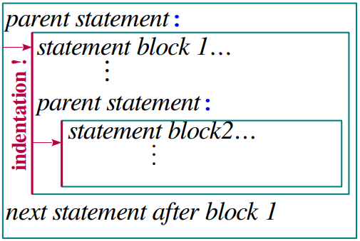
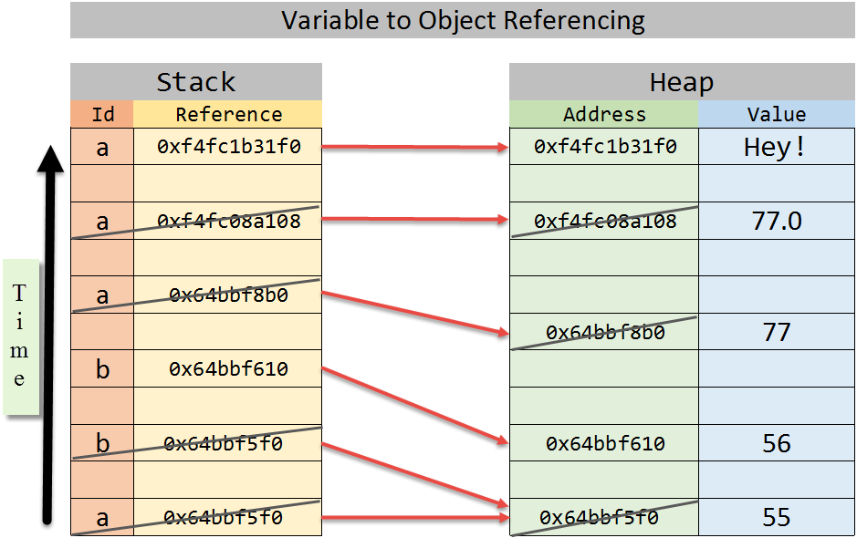
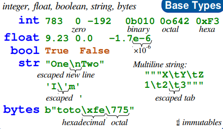

Python Basics
==============

Syntax
--------

Statement Blocks
~~~~~~~~~~~~~~~~~~~

Python 用缩进表示代码块

代码从新行的第一列开始

Comments
~~~~~~~~~~

单行注释使用 "#"

多行注释可以使用 `'''...'''` 或 `"""..."""`

.. code-block:: python

    # single-line comment

    '''
    multi-
    line
    comment
    '''

Identifiers
~~~~~~~~~~~~~~~

标识符用于变量, 函数, 类, 模块等的命名

规则:

1. 区分大小写
2. 可以使用数字, 字母, 下划线; 第一个字符必须是字母, 下划线
3. 不能使用 Python 关键字
4. 以双下划线开头和结尾的名称通常有特殊含义, 应尽量避免

**常用命名规则**

.. list-table::
    :widths: auto
    :header-rows: 1
    :stub-columns: 1

    * - 类型
      - 规则
      - 例
    * - 模块和包名
      - 全小写字母, 尽量简单; 多个单词之间使用下划线隔开
      - `math`, `os`, `sys`
    * - 函数名
      - 全小写字母, 多个单词之间使用下划线隔开
      - `phone`, `my_name`
    * - 类名
      - 首字母大写, 使用驼峰命名法
      - `MyPhone`, `MyClass`
    * - 常量名
      - 全大写字母, 多个单词之间使用下划线隔开
      - `SPEED`, `MAX_SPEED`

对象 (Object)
--------------------

Python 中, 一切皆对象; 每个对象由标识 (identity), 类型 (type), 值 (value) 组成

- 标识用于唯一标识对象, 通常对应于对象在内存中的地址; 使用函数 `id(obj)` 即可返回 `obj` 的标识
- 类型用于表示对象存储的数据类型; 类型可以限制对象的取值范围以及可执行的操作; 使用函数 `type(obj)` 即可返回 `obj` 的类型
- 值表示对象所存储的数据信息; 使用 `print(obj)` 即可打印出值

**对象的本质就是一个内存块, 拥有特定的值, 支持特定类型的x相关操作**

对象的引用
^^^^^^^^^^^^^

.. code-block:: python

    a = 55
    b = 55
    b = 56
    a = 77
    a = 77.0
    a = 'Hey!'

Python 中的变量 (variable) 也称为 **对象的引用**

- 变量位于 **栈内存**
- 对象位于 **堆内存**

将对象赋值给变量, 即是变量通过对象的内存地址引用了对象

Dynamically-typed Language
^^^^^^^^^^^^^^^^^^^^^^^^^^^

变量不需要显示声明类型; 根据变量引用的对象, Python 解释器自动确定数据类型

Strongly-typed Language
^^^^^^^^^^^^^^^^^^^^^^^^

每个对象都有数据类型, 只支持该类型支持的操作

Variables
-----------

变量的声明
~~~~~~~~~~~~~~~~~~~

变量的 **声明** 和 **赋值** 用于将一个变量绑定到一个对象上:

变量名 = 表达式

变量在使用前必须声明, 否则会报错

.. code-block:: console

    >>> test
    Traceback (most recent call last):
    File "<stdin>", line 1, in <module>
    NameError: name 'test' is not defined

Variables assignment
~~~~~~~~~~~~~~~~~~~~~~~~

.. code-block:: python

    #### 链式赋值 assignment to same value
    x = y = 123
    # 等价于
    x = 123
    y = 123

    #### multiple assignments
    a, b, c = 1, 2, 3
    # 等价于
    a = 1
    b = 2
    c = 3

    #### 也可以用于变量交换值 values swap
    a, b = 1, 2
    a, b = b, a
    # 此时 a = 2, b = 1

    #### 解包赋值 unpacking of sequence in item and list
    a, *b = [1, 2, 3]
    # 此时 a = 1, b = [2, 3]

    #### 其他
    x += 3 # increment ⇔ x = x+3
    x -= 2 # decrement ⇔ x = x-2
    # *=, /=, %= 等同理

    # 删除变量
    del x
    # 严格来说, 应该是解除变量与对象之间的关系, 删除变量, 然后将对象的引用数字减一
    # 当引用计数为 0 时, 将对象所占用的内存还给 Python 解释器

常量
~~~~~~~~~~~

Python 不支持常量, 即没有语法规则限制常量值的改变, 只能在逻辑上不去改变

数据类型 Types
-----------------

基础类型
~~~~~~~~~~~~

类型转换
~~~~~~~~~~~

数字
~~~~~~~~~

运算
^^^^^^^

.. list-table::
    :widths: auto
    :header-rows: 1
    :stub-columns: 1

    * - 运算符
      - 说明
      - 例
      - 结果
    * - `+`
      - 加法
      - 3 + 2
      - 5
    * - `-`
      - 减法
      - 3 - 2
      - 1
    * - `*`
      - 乘法
      - 3 * 2
      - 6
    * - `/`
      - 浮点数除法
      - 3 / 2
      - 1.5
    * - `//`
      - 整除
      - 3 // 2
      - 1
    * - `%`
      - 模 (取余)
      - 3 % 2
      - 1
    * - `**`
      - 幂
      - 3 ** 2
      - 9

进制
^^^^^^^^^

.. code-block:: python

    # 二进制 0b / 0B
    # 八进制 0o / 0O
    # 十六进制 0x / 0X

    >>> 42
    42
    >>> 0b101010
    42
    >>> 0o52
    42
    >>> 0x2a
    42

科学计数法
^^^^^^^^^^^^^^^^

浮点数由科学计数法表示: :math:`a \times 10 ^ b`

Boolean Logic
~~~~~~~~~~~~~~~~~~

Python 3 开始新加了 `True`, `False` 关键字; 其本质还是 `1` 和 `0`

- 比较运算符: (设 `a=5`, `b=10`)

    .. list-table::
        :widths: auto
        :header-rows: 1
        :stub-columns: 1

        * - 运算符
          - 说明
          - 例
        * - `==`
          - 等于
          - `a == b` => `False`
        * - `!=`
          - 不等于
          - `a != b` => `True`
        * - `>`
          - 大于
          - `a > b` => `False`
        * - `<`
          - 小于
          - `a < b` => `True`
        * - `>=`
          - 大于等于
          - `a >= b` => `False`
        * - `<=`
          - 小于等于
          - `a <= b` => `True`

- 逻辑运算符

    .. list-table::
        :widths: auto
        :header-rows: 1
        :stub-columns: 1

        * - 运算符
          - 说明
          - 例
        * - `and`
          - 与 (短路逻辑)

            从左到右计算, 遇到 `False` 直接返回
          - `True and True` => `True`

            `True and False` => `False`

            `False and False` => `False`
        * - `or`
          - 或 (短路逻辑)

            从左到右计算, 遇到 `True` 直接返回
          - `True or True` => `True`

            `True or False` => `True`

            `False or False` => `False`
        * - `not`
          - 非
          - `not True` => `False`

            `not False` => `True`

- 同一运算符

    .. list-table::
        :widths: auto
        :header-rows: 1
        :stub-columns: 1

        * - 运算符
          - 说明
        * - `is`
          - 通过比较对象的地址, 判断两个标识符是否为同一个对象
        * - `is not`
          - 通过比较对象的地址, 判断两个标识符是否不是同一个对象

    `==` 判断的是值是否相等

    **整数缓存问题**:
        命令行中 Python 会对 -5 ~ 256 之间的整数进行缓存, 范围外的整数会保存为不同的对象;

        而执行保存后的代码时, Python 解释器会进一步优化, 所有大于 -5 的整数都会被缓存

字符串
~~~~~~~~~~~

字符串不可变

编码
^^^^^^^

Python 3 默认 16 位 Unicode 编码

.. code-block:: python

    # ord() 返回单个字符的 Unicode 码
    ord('A') # returns 65

    # chr()返回单个 Unicode 码所对应的字符
    chr(66) # returns 'B'

创建字符串
^^^^^^^^^^^^^^

