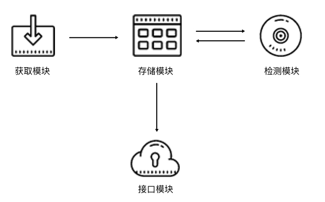

Proxy Pool
==========

Why
----

利用爬虫爬取网站时, 为了避免由于过于频繁的访问导致的本机 IP 被封, 使用代理来伪造本机 IP

Prerequisite
-------------

- redis 数据库: 存储, 管理代理
- aiohttp 库: // TODO //???
- requests 库: 发送 HTTP 请求, 获取 response
- redis-py 库: 连接操作 redis
- lxml 库: 解析 HTML
- Flask 库: 实现 RESTful API 接口

Structure
---------

- **存储模块**

    负责存储抓取下来的代理; 需要:

    - 保证代理不重复
    - 标识代理的可用情况
    - 动态实时处理每个代理

    因此一种比较高效和方便的存储方式就是使用 Redis 的 `Sorted Set`, 即有序集合

- **获取模块**

    定时在各大代理网站抓取代理

    代理可以是免费公开代理也可以是付费代理, 代理的形式都是 "IP:port"

    此模块尽量从不同来源获取, 尽量抓取高匿代理, 抓取成功之后将可用代理保存到数据库中

- **检测模块**

    定时检测数据库中的代理, 需要:

    - 设置一个检测链接, 最好是爬取哪个网站就检测哪个网站, 这样更加有针对性
    - 标识每一个代理的状态, 如设置分数标识, 100 分代表可用, 分数越少代表越不可用; 检测一次, 如果代理可用, 则可以将分数标识立即设置为 100 满分, 也可以在原基础上加 1 分; 如果代理不可用, 可以将分数标识减 1 分, 当分数减到一定阈值后, 代理就直接从数据库移除. 通过这样标识分数, 就可以辨别代理的可用情况, 选用的时候会更有针对性

- **接口模块**

    用 API 来提供对外服务的接口

    可以直接连接数据库来取对应的数据, 但是这样就需要知道数据库的连接信息, 并且要配置连接, 而比较安全和方便的方式就是提供一个 Web API 接口, 然后通过访问接口即可拿到可用代理

    另外, 由于可用代理可能有多个, 那么可以设置一个随机返回某个可用代理的接口, 这样就能保证每个可用代理都可以取到, 实现负载均衡

Implement
---------

存储模块
~~~~~~~~~~~

使用 Redis 的 **有序集合**, 集合的每一个元素都是不重复的, 元素的形式为 "IP:port"

有序集合的每一个元素都有一个分数字段, 分数是可以重复的, 可以是浮点数类型, 也可以是整数类型; 该集合会根据每一个元素的分数对集合进行排序, 数值小的排在前面, 数值大的排在后面, 这样就可以实现集合元素的排序

使用此分数可以作为判断一个代理是否可用的标志, 100 为最高分, 代表最可用, 0 为最低分, 代表最不可用. 如果要获取可用代理, 可以从代理池中随机获取分数最高的代理

**分数规则**:

- 分数 100 为可用, 检测器会定时循环检测每个代理可用情况, 一旦检测到有可用的代理就立即置为 100, 检测到不可用就将分数减 1, 分数减至 0 后代理移除
- 新获取的代理的分数为 10, 如果测试可行, 分数立即置为 100, 不可行则分数减 1, 分数减至 0 后代理移除

获取模块
~~~~~~~~~~~~

获取模块由 2 部分组成:

1. 爬取代理网站的爬虫类
2. 用于调用爬虫的 `Getter` 类

检测模块
~~~~~~~~~~~~

批量检测代理是否可用; 由于代理数量非常多, 为了提高代理的检测效率, 使用异步请求库 aiohttp 来进行检测

接口模块
~~~~~~~~~~~~~~

调度模块
~~~~~~~~~~~~~~

通过多进程调用获取, 检测, 接口模块