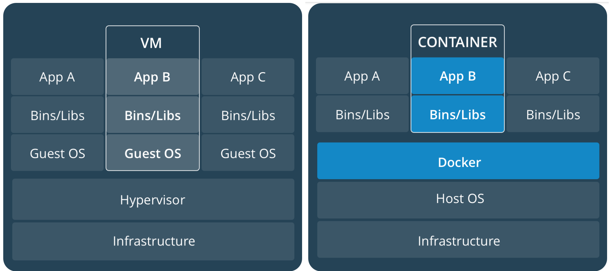
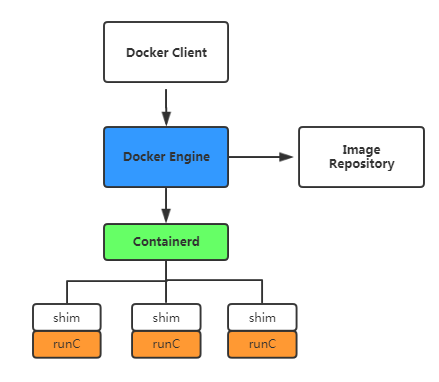
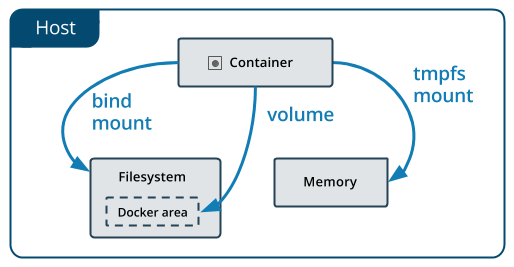

Docker
=======

.. figure:: imgs/docker.png
    :align: right

Intro
------

为什么需要 Docker
~~~~~~~~~~~~~~~~~~~~~~~~

环境配置的难题
^^^^^^^^^^^^^^^^^^

软件运行需要正确的环境配置:

1. 操作系统的设置
2. 各种库和组件的安装

解决方法: 带环境安装; 即安装的时候, 把原始环境一模一样地复制过来

    虚拟机和容器比较

虚拟机
^^^^^^^^^

虚拟机 (virtual machine) 就是带环境安装的一种解决方案

它可以在一种操作系统里面运行另一种操作系统, 比如在 Windows 系统里面运行 Linux 系统

应用程序对此毫无感知, 因为虚拟机看上去跟真实系统一模一样, 而对于底层系统来说, 虚拟机就是一个普通文件, 不需要了就删掉, 对其他部分毫无影响

缺点:

1. 资源占用多

    虚拟机会独占一部分内存和硬盘空间

    它运行的时候, 其他程序就不能使用这些资源了

    哪怕虚拟机里面的应用程序真正使用的内存只有 1MB, 虚拟机依然需要几百 MB 的内存才能运行

2. 冗余步骤多

    虚拟机是完整的操作系统, 一些系统级别的操作步骤往往无法跳过, 比如用户登录

3. 启动慢

    启动操作系统需要多久, 启动虚拟机就需要多久

    可能要等几分钟, 应用程序才能真正运行

Linux 容器
^^^^^^^^^^^^^^^^^

由于虚拟机存在这些缺点, Linux 发展出了另一种虚拟化技术: Linux 容器 (Linux Containers, 缩写为 LXC)

Linux 容器不是模拟一个完整的操作系统, 而是对进程进行隔离; 或者说在正常进程的外面套了一个保护层; 对于容器里面的进程来说, 它接触到的各种资源都是虚拟的, 从而实现与底层系统的隔离

容器有点像轻量级的虚拟机, 能够提供虚拟化的环境, 但是成本开销小得多

优势:

1. 启动快

    容器里面的应用, 直接就是底层系统的一个进程, 而不是虚拟机内部的进程

    所以, 启动容器相当于启动本机的一个进程, 而不是启动一个操作系统, 速度就快很多

2. 资源占用少

    容器只占用需要的资源, 不占用那些没有用到的资源; 虚拟机由于是完整的操作系统, 不可避免要占用所有资源

    另外, 多个容器可以共享资源, 虚拟机都是独享资源

3. 体积小

    容器只要包含用到的组件即可, 而虚拟机是整个操作系统的打包, 所以容器文件比虚拟机文件要小很多

Docker
~~~~~~~

Docker 属于 Linux 容器的一种封装, 提供简单易用的容器使用接口; 它是目前最流行的 Linux 容器解决方案

- Docker 将应用程序与该程序的依赖, 打包在一个文件里面
- 运行这个文件, 就会生成一个虚拟容器
- 程序在这个虚拟容器里运行, 就好像在真实的物理机上运行一样

有了 Docker, 就不用担心环境问题

Docker 的接口相当简单, 用户可以方便地创建和使用容器, 把自己的应用放入容器; 容器还可以进行版本管理, 复制, 分享, 修改, 就像管理普通的代码一样

Docker 架构
^^^^^^^^^^^^^^^^

.. figure:: imgs/docker_service.png
    :scale: 50%
    :align: right

Docker 是 C/S 架构, 命令行运行 `docker` 命令的时候, 需要本机有 Docker 服务

Docker 客户端与 Docker 服务器进行交互, Docker服务端负责构建, 运行和分发 Docker 镜像; Docker 客户端和服务端可以运行在一台机器上, 也可以通过 RESTful, stock 或网络接口与远程 Docker 服务端进行通信

.. code-block:: console

    # service 命令的用法
    $ sudo service docker start

    # systemctl 命令的用法
    $ sudo systemctl start docker

用途
^^^^^^^

1. 提供一次性的环境
2. 提供弹性的云服务
3. 组建微服务架构

Detailed
----------

Docker 是一个开源的应用容器引擎, 使用 Go 语言开发, 基于 Linux 内核的 cgroup, namespace, Union FS 等技术, 对应用进程进行封装隔离, 并且独立于宿主机与其他进程, 这种运行时封装的状态称为容器

Docker 理念是将应用及依赖包打包到一个可移植的容器中, 可发布到任意 Docker 引擎上

使用沙箱机制运行程序, 程序之间相互隔离

Docker 体系结构
~~~~~~~~~~~~~~~~~

- Containerd: 是一个简单的守护进程, 使用runC管理容器; 向 Docker Engine 提供接口
- Shim: 只负责管理一个容器
- runC: 是一个轻量级的工具, 只用来运行容器

内部组件
~~~~~~~~~~~~~~

- Namespaces

    命名空间, Linux 内核提供的一种对进程资源隔离的机制; 例如进程, 网络, 挂载点等资源

- CGroups

    控制组, Linux内核提供的一种限制进程资源的机制; 例如CPU, 内存等资源

- UnionFS

    联合文件系统, 支持将不同位置的目录挂载到同一虚拟文件系统, 形成一种分层的模型

.. figure:: imgs/docker_command_diagram.jpg
    :scale: 60%
    :align: right

Docker 核心组件
~~~~~~~~~~~~~~~~~~

Docker Client
^^^^^^^^^^^^^^^^^^

Docker 客户端, 即 Docker 提供命令行界面 (CLI) 工具

客户端可以构建, 运行和停止应用程序, 还可以远程与 Docker_Host 进行交互

Docker Daemon
^^^^^^^^^^^^^^^^^

Docker daemon 是服务器组件, 以 Linux 后台服务的方式运行, 是 Docker 最核心的后台进程

负责响应来自 Docker Client 的请求, 然后将这些请求翻译成系统调用完成容器管理操作

该进程会在后台启动一个 API Server, 负责接收由 Docker Client 发送的请求; 接收到的请求将通过 Docker daemon 内部的一个路由分发调度, 由具体的函数来执行请求

默认配置下, Docker daemon 只能响应来自本地 Host 的客户端请求; 如果要允许远程客户端请求, 需要在配置文件中打开 TCP 监听

image 文件
^^^^^^^^^^^^^^

Docker 把应用程序及其依赖打包在 image 文件 (二进制文件) 里面, 只有通过这个文件, 才能生成 Docker 容器; image 文件提供了容器运行时所需的程序, 库, 资源, 配置等文件, 还包含了一些为运行时准备的一些配置参数 (如匿名卷, 环境变量, 用户等)

image 文件可以看作是容器的模板, Docker 根据 image 文件生成容器的实例; 同一个 image 文件可以生成多个同时运行的容器实例

实际开发中, 一个 image 文件往往通过继承另一个 image 文件, 加上一些个性化设置而生成

.. code-block:: console

    # 列出本机的所有 image 文件。
    $ docker image ls

    # 删除 image 文件
    $ docker image rm [imageName]

image 仓库:

- `Docker Hub <https://hub.docker.com/>`_

.. code-block:: console

    # 从 Docker Hub 下载 image
    $ docker image pull path/to/image-file

    # 运行下载的 image, 新建容器
    # `docker container run` 会从 image 文件生成一个正在运行的容器实例
    # 在 image 文件不存在时, `docker container run` 会自动抓取
    $ docker container run image-file

Container 容器文件
^^^^^^^^^^^^^^^^^^^^^

Docker 容器就是 Docker 镜像的运行实例, 是真正运行项目程序, 消耗系统资源, 提供服务的地方

image 文件生成的容器实例本身也是一个文件, 称为容器文件; 即一旦容器生成, 就会同时存在 image 文件和容器文件

关闭容器并不会删除容器文件, 只是容器停止运行而已

.. code-block:: console

    # 列出本机正在运行的容器
    $ docker container ls

    # 列出本机所有容器, 包括终止运行的容器
    $ docker container ls --all

    # 删除容器文件
    $ docker container rm [containerID]

    # 启动已经生成但停止运行的容器
    $ docker container start [containerID]

    # 对于不会自动终止的容器, 需要手动终止
    # 发出 SIGKILL 信号; 强行立即终止, 那些正在进行中的操作会全部丢失
    $ docker container kill [containID]

    # 发出 SIGTERM 信号, 过一段时间再发出 SIGKILL 信号
    # 自行进行收尾清理工作, 但也可以不理会这个信号
    $ bash container stop [containerID]

    # 查看容器输出
    $ docker container logs [containerID]

    # 进入正在运行的容器
    $ docker container exec -it [containerID] /bin/bash

    # 从正在运行的容器中复制文件
    $ docker container cp [containID]:[/path/to/file] path/to/copy

Repository 仓库
^^^^^^^^^^^^^^^^^^^

Docker 仓库是集中存放镜像文件的场所, 用于集中地存储和分发镜像

Docker Registry (仓库注册服务器) 提供了这些服务

用户创建了自己的镜像之后就可以使用 `push` 命令将它上传到公有或者私有仓库, 这样下次在另外一台机器上使用这个镜像时候, 只需要从仓库上 `pull` 下来就可以了

.. image:: imgs/docker2.png

默认情况下 Docker 会在 Docker 中央仓库寻找镜像文件, 这个仓库可以通过修改配置来指定, 也可以创建私有仓库

Dockerfile 文件
~~~~~~~~~~~~~~~~~

一个用来配置 image 的文本文件; Docker 根据该文件生成二进制的 image 文件

Dockerfile 是由一行行命令语句组成, 并且支持以 "#" 开头的注释行

大致可分为 4 个部分:

1. FROM:

    基础镜像 (父镜像) 信息指令

2. LABEL:

    镜像信息指令

3. RUN, EVN, ADD, WORKDIR, .etc:

    镜像操作指令

4. CMD, ENTRYPOINT, USER, .etc:

    容器启动指令

.. admonition:: 例

    .. code-block:: console

        # 启动 python flask app

        # 从 Docker Hub 上 pull 下 python 3.6 的基础镜像
        FROM python:3.6
        # 显示维护者的信息
        LABEL maintainer "test <test@gmail.com>"
        # copy 当前目录到容器中的 /app 目录下
        COPY . /app
        # 指定工作路径为 /app
        WORKDIR /app
        # 安装依赖包
        RUN pip install -r requirements.txt
        # 暴露 5000 端口
        EXPOSE 5000
        # 让容器表现得像一个可执行程序一样
        ENTRYPOINT ["python"]
        # 启动 app
        CMD ["app.py"]

应用程序数据
~~~~~~~~~~~~~~

Docker 提供三种不同的方式将数据从宿主机挂载到容器中:

- volumes: Docker 管理宿主机文件系统的一部分 (/var/lib/docker/volumes)
- bind mounts: 可以存储在宿主机系统的任意位置
- tmpfs: 挂载存储在宿主机系统的内存中, 而不会写入宿主机的文件系统

Docker Compose
~~~~~~~~~~~~~~~~~

管理多个 Docker 容器组成一个应用

1. 定义一个 YAML 格式的配置文件 docker-compose.yml, 写好多个容器之间的调用关系
2. 只要一个命令, 就能同时启动/关闭这些容器

    .. code-block:: console

        # 启动所有服务
        $ docker-compose up
        # 关闭所有服务
        $ docker-compose stop

        # 删除停止运行的容器文件
        $ docker-compose rm

Docker 命令
---------------

容器生命周期管理
~~~~~~~~~~~~~~~~~~

.. raw:: html
    
    

      
<b>run</b>

.. code-block:: console

    docker run [OPTIONS] IMAGE [COMMAND] [ARG...]

创建一个新的容器并运行一个命令

.. list-table:: **OPTIONS**

    * - **--name="nginx-lb"**
      - 为容器指定一个名称
    * - **-h "mars"**
      - 指定容器的 hostname
    * - **-d**
      - 后台运行容器, 并返回容器ID
    * - **-i**
      - 以交互模式运行容器, 通常与 `-t` 同时使用
    * - **-t**
      - 为容器重新分配一个伪输入终端, 通常与 `-i` 同时使用
    * - **-P**
      - 随机端口映射, 容器内部端口随机映射到主机的端口
    * - **-p**
      - 指定端口映射, 格式为: `主机(宿主)端口:容器端口`
    * - **--expose=[]**
      - 开放一个端口或一组端口
    * - **-e username="toshinaki"**
      - 设置环境变量
    * - **--env-file=[]**
      - 从指定文件读入环境变量
    * - **--volume**, **-v**
      - 绑定一个卷
    * - **-a stdin**
      - 指定标准输入输出内容类型, 可选 `STDIN`/`STDOUT`/`STDERR` 三项
    * - **--link=[]**
      - 添加链接到另一个容器
    * - **--dns 8.8.8.8**
      - 指定容器使用的 DNS 服务器, 默认和宿主一致
    * - **--dns-search example.com**
      - 指定容器 DNS 搜索域名, 默认和宿主一致
    * - **--cpuset="0-2"** or **--cpuset="0,1,2"**
      - 绑定容器到指定 CPU 运行
    * - **-m**
      - 设置容器使用内存最大值
    * - **--net="bridge"**
      - 指定容器的网络连接类型, 支持 `bridge`/`host`/`none`/`container`: 四种类型

.. raw:: html

   

start/stop/restart
kill
rm
pause/unpause
create
exec

容器操作
~~~~~~~~~~~

ps
inspect
top
attach
events
logs
wait
export
port

容器 rootfs 命令
~~~~~~~~~~~~~~~~~~~~

commit
cp
diff

镜像仓库
~~~~~~~~~~~~~~

login

.. raw:: html
    
    

      
<b>pull</b>

.. code-block:: console
    
    docker pull [OPTIONS] NAME[:TAG|@DIGEST]

从镜像仓库中拉取或者更新指定镜像 (当不指定 `TAG` 时默认下载 `latest`)

.. list-table:: **OPTIONS**

    * - `--all-tags`, `-a`
      - 拉取所有 tagged 镜像
    * - `--disable-content-trust`
      - 忽略镜像的校验, 默认开启
    * - `--quiet`, `-q`
      - 关闭详细输出

.. raw:: html
    
    

      
例

.. raw:: html
    
    

      
下载 repository 中的所有 tagged 镜像

.. code-block:: console

    $ docker pull --all-tags fedora
    Pulling repository fedora
    ad57ef8d78d7: Download complete
    105182bb5e8b: Download complete
    511136ea3c5a: Download complete
    73bd853d2ea5: Download complete
    ....

    Status: Downloaded newer image for fedora

.. raw:: html

   

.. raw:: html

   

.. raw:: html

   

push

.. raw:: html
    
    

      
<b>search</b>

      
.. code-block:: console
    
    docker search [OPTIONS] TERM

从 Docker Hub 查找镜像

.. list-table:: **OPTIONS**
    
    * - `--filter`, `-f`
      - 根据条件过滤输出
    * - `--format`
      - 指定返回值的模板; 可以指定的值为: `.Name`, `.Description`, `.StarCount`, `.IsOfficial`, `.IsAutomated`
    * - `--limit`
      - 限制搜索结果数; 默认 25
    * - `--no-trunc`
      - 显示完整的镜像描述
      
.. raw:: html
    
    

      
例

      
.. raw:: html
    
    

      
过滤镜像

当前支持的过滤为:

- stars: int; number of stars the image has
- is-automated: boolean - true or false; is the image automated or not
- is-official: boolean - true or false; is the image official or not

.. raw:: html

   

   
.. code-block:: console

    $ docker search --filter stars=500 --filter is-official=true --format "table {{.Name}}\t{{.IsAutomated}}\t{{.IsOfficial}}" python
    NAME                AUTOMATED           OFFICIAL
    python                                  [OK]
    django                                  [OK]

   
.. raw:: html

   

.. raw:: html

   

本地镜像管理
~~~~~~~~~~~~~~~

.. raw:: html
    
    

      
<b>images</b>

      
.. code-block:: console

    docker images [OPTIONS] [REPOSITORY[:TAG]]
   
列出本地镜像

.. list-table:: **OPTIONS**

    * - **--all**, **-a**
      - 列出本地所有的镜像 (含中间映像层; 默认过滤掉中间映像层)
    * - **--digests**
      - 显示镜像的摘要信息
    * - **--filter**, **-f**
      - 显示满足条件的镜像
    * - **--format**
      - 指定返回值的模板; 可以指定的值为: `.ID`, `.Repository`, `.Tag`, `.Digest`, `.CreatedSince`, `.CreatedAt`, `.Size`
    * - **--no-trunc**
      - 显示完整的镜像信息
    * - **--quiet**, **-q**
      - 只显示镜像 ID

.. raw:: html
    
    

      
例

.. raw:: html
    
    

      
查看本地镜像列表

.. code-block:: console

    $ docker images
    REPOSITORY              TAG                 IMAGE ID            CREATED             SIZE
    mymysql                 v1                  37af1236adef        5 minutes ago       329 MB
    runoob/ubuntu           v4                  1c06aa18edee        2 days ago          142.1 MB
    <none>                  <none>              5c6e1090e771        2 days ago          165.9 MB

.. raw:: html

   

   
.. raw:: html
    
    

      
列出本地镜像中 REPOSITORY 为 ubuntu 的镜像列表

.. code-block:: console

    $ docker images ubuntu
    REPOSITORY          TAG                 IMAGE ID            CREATED             SIZE
    ubuntu              14.04               90d5884b1ee0        9 weeks ago         188 MB
    ubuntu              15.10               4e3b13c8a266        3 months ago        136.3 MB

.. raw:: html

   

   
.. raw:: html
    
    

      
过滤镜像

当前支持的过滤为:

- dangling: boolean - true or false
- label: `label=<key>` or `label=<key>=<value>`
- before: `<image-name>[:<tag>]`, `<image id>` or `<image@digest>`; filter images created before given id or references
- since: `<image-name>[:<tag>]`, `<image id>` or `<image@digest>`; filter images created since given id or references
- reference: pattern of an image reference; filter images whose reference matches the specified pattern

删除没有 tag 的镜像:

.. code-block:: console
    
    $ docker rmi $(docker images -f "dangling=true" -q)

    8abc22fbb042
    48e5f45168b9
    bf747efa0e2f
    980fe10e5736
    dea752e4e117
    511136ea3c5a

根据时间过滤镜像:

.. code-block:: console

    $ docker images

    REPOSITORY          TAG                 IMAGE ID            CREATED              SIZE
    image1              latest              eeae25ada2aa        4 minutes ago        188.3 MB
    image2              latest              dea752e4e117        9 minutes ago        188.3 MB
    image3              latest              511136ea3c5a        25 minutes ago       188.3 MB

    $ docker images --filter "before=image1"

    REPOSITORY          TAG                 IMAGE ID            CREATED              SIZE
    image2              latest              dea752e4e117        9 minutes ago        188.3 MB
    image3              latest              511136ea3c5a        25 minutes ago       188.3 MB

    $ docker images --filter "since=image3"
    REPOSITORY          TAG                 IMAGE ID            CREATED              SIZE
    image1              latest              eeae25ada2aa        4 minutes ago        188.3 MB
    image2              latest              dea752e4e117        9 minutes ago        188.3 MB

.. raw:: html

   

   
.. raw:: html
    
    

      
设置结果的格式

      
.. code-block:: console

    $ docker images --format "table {{.ID}}\t{{.Repository}}\t{{.Tag}}"
    IMAGE ID            REPOSITORY                TAG
    77af4d6b9913        <none>                    <none>
    b6fa739cedf5        committ                   latest
    78a85c484f71        <none>                    <none>
      
.. raw:: html

   

      
.. raw:: html

   

   
.. raw:: html

   

   
   
.. raw:: html
    
    

      
<b>rmi</b>

      
.. code-block:: console

    docker rmi [OPTIONS] IMAGE [IMAGE...]

删除本地一个或多少镜像

.. list-table:: **OPTIONS**

    * - `--force`, `-f`
      - 强制删除
    * - `--no-prune`
      - 不移除该镜像的过程镜像, 默认移除

.. raw:: html
    
    

      
例

.. raw:: html
    
    

      
删除全部镜像

.. code-block:: console
    
    $ docker rmi -f $(docker images -ap)
      
.. raw:: html

   

   
.. raw:: html

   

   
.. raw:: html

   

   
tag
build
history
save
load
import
info|version
info
version
