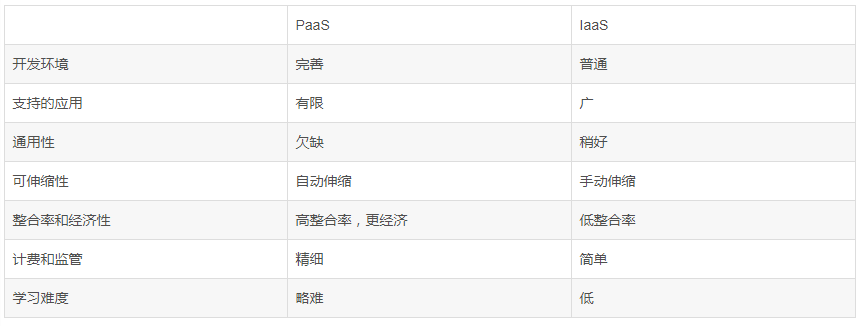

Google Cloud Platform
=======================

Introduction
-------------

Overview of Google's infrastructure
~~~~~~~~~~~~~~~~~~~~~~~~~~~~~~~~~~~~

Physical Level
^^^^^^^^^^^^^^^^

- Data Centers 数据中心

    Extensive deployment of high-efficiency backend data centers

- Backbone Network 骨干网

    Global, meshed redundant backbone network

    用来连接多个区域或地区的高速网络; 每个骨干网中至少有一个和其他骨干网进行互联互通的连接点

- Points of Presence (PoP) 入网点

    110+ edge points of presence in 33 countries

    PoP 位于网络企业的边缘外侧, 是访问企业网络内部的进入点, 外界提供的服务通过 PoP 进入

- Edge Caching

    cache data for faster interaction

Abstract Level
^^^^^^^^^^^^^^^^^

- zone

    ≈ a data center; 包含了硬盘, compute power 等

    可能出现失败的一个最小单位 (a single point of failure); 因此应当将 compute power 分布至多个 zones, 并平衡它们所接收的请求

    有的资源在单一的 zone 上运行, 当 zone 失效时, 所有的资源也跟着失效; 如 compute engine 就是一个 zone 级资源 (zonal resource)

- region

    一个 region 是一个地理区域, 可能包含了多个 zones

    region 级资源 (regioanl resource) 在 region 中冗余地部署 (deployed with redundancy), 使其获得了更多的可用性; 如 newwork load balancer (将请求发往各个 zones, 并监视所有计算机的健康程度; 若一个 zone 失败了, 则将原本发往这个 zone 的请求发到别的 zones)

- global

    global 资源覆盖了所有 regions; 如 app 的一个固定的 IP 地址 

4 ways for pricing reducing
~~~~~~~~~~~~~~~~~~~~~~~~~~~~~

1. Sub-hour billing
2. Sustained-use discount
3. Compute Engine custom machine types
4. Pre-emptible instances for cost saving

Terms
~~~~~

3 waves of Cloud Computing
^^^^^^^^^^^^^^^^^^^^^^^^^^^^^^

1. Colocation 
    
    主机托管, 属于数据中心的一种, 其中的设备, 空间和带宽都可出租; 主机管理者可从远程连线入服务器做管理

2. Virtualized data centers

    将一台运行在互联网上的物理服务器划分成多个"虚拟"服务器

3. A global, elastic cloud (future)

IaaS & PaaS
^^^^^^^^^^^^

.. figure:: imgs/gcp_iaas_paas.png
    :scale: 60%
   
Infrastructure as a Service
    基础设施即服务, 提供虚拟机或者其他资源

Platform as a Service
    平台即服务, 提供开发和运行平台

Main Categories of products and services
^^^^^^^^^^^^^^^^^^^^^^^^^^^^^^^^^^^^^^^^^^

- Compute

    - App Engine
    - Container Engine
    - Compute Engine

    .. figure:: imgs/gcp_compute.png
        :scale: 70%       

- Storage

    - Bigtable
    - Cloud Storage
    - Cloud SQL
    - Cloud Datastore

- Big Data

    - BigQuery
    - Pub/Sub
    - Dataflow
    - Dataproc
    - Datalab

    .. figure:: imgs/gcp_bigdata.png
        :scale: 70%

- Machine Learning

    - Vision API
    - Machine Learning
    - Speech API
    - Translate API

    .. figure:: imgs/gcp_ml.png
        :scale: 70%   
