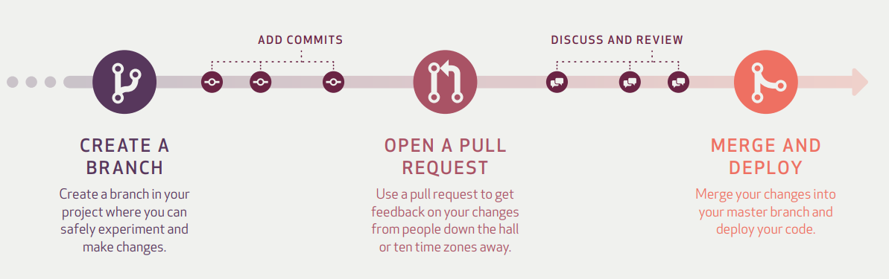

Git & Github
============

基本概念
-----------

Github
    GitHub is a code hosting platform for **version control** and **collaboration**

Repository
    存放项目代码; 一个Repository对应一个项目

Branch
    Branching is the way to work on different versions of a repository at one time

    experiment and make edits before committing them to `master`

    .. image:: imgs/branch.png

commits
    saved changes

    Each commit has an associated *commit message*, which is a description explaining why a particular change was made

Pull Request
    proposing your changes and requesting that someone review and pull in your contribution and merge them into their branch

Merge
    merge branch into `master` branch, and delete the branch

Star
    收藏

Fork
    克隆项目以便于独立开发
    
Watch
    关注; 有更新时会受到通知

Issue
    问题

Version Control System (VCS)
----------------------------

project history:
- Which changes were made?
- Who made the changes?
- When were the changes made?
- Why were changes needed?

Distributed version control system (DVCS)
~~~~~~~~~~~~~~~~~~~~~~~~~~~~~~~~~~~~~~~~~

Unlike once popular centralized version control systems, DVCSs like Git don’t need a constant connection to a central repository. Developers can work anywhere and collaborate asynchronously from any time zone

Git commands
------------

- `git init` 

    initializes a brand new Git repository and begins tracking an existing directory. It adds a hidden subfolder within the existing directory that houses the internal data structure required for version control.
- `git clone`

    creates a local copy of a project that already exists remotely. The clone includes all the project’s files, history, and branches.
- `git add`

    stages a change. Git tracks changes to a developer’s codebase, but it’s necessary to stage and take a snapshot of the changes to include them in the project’s history. This command performs staging, the first part of that two-step process. Any changes that are staged will become a part of the next snapshot and a part of the project’s history. Staging and committing separately gives developers complete control over the history of their project without changing how they code and work.
- `git commit`

    saves the snapshot to the project history and completes the change-tracking process. In short, a commit functions like taking a photo. Anything that’s been staged with git add will become a part of the snapshot with git commit.
- `git status`

    shows the status of changes as untracked, modified, or staged.
- `git branch`

    shows the branches being worked on locally.
- `git merge`

    merges lines of development together. This command is typically used to combine changes made on two distinct branches. For example, a developer would merge when they want to combine changes from a feature branch into the master branch for deployment.
- `git pull`

    updates the local line of development with updates from its remote counterpart. Developers use this command if a teammate has made commits to a branch on a remote, and they would like to reflect those changes in their local environment.
- `git push`

    updates the remote repository with any commits made locally to a branch.

For more details: https://git-scm.com/docs

The GitHub flow
---------------

1. **Create a branch**: Topic branches created from the canonical deployment branch (usually master) allow teams to contribute to many parallel efforts. Short-lived topic branches, in particular, keep teams focused and results in quick ships.
2. **Add commits**: Snapshots of development efforts within a branch create safe, revertible points in the project’s history.
3. **Open a pull request**: Pull requests publicize a project’s ongoing efforts and set the tone for a transparent development process.
4. **Discuss and review code**: Teams participate in code reviews by commenting, testing, and reviewing open pull requests. Code review is at the core of an open and participatory culture.
5. **Merge**: Upon clicking merge, GitHub automatically performs the equivalent of a local ‘git merge’ operation. GitHub also keeps the entire branch development history on the merged pull request.
6. **Deploy**: Teams can choose the best release cycles or incorporate continuous integration tools and operate with the assurance that code on the deployment branch has gone through a robust workflow.

Models for collaborative development
------------------------------------

1. Shared repository (适合个人或团队)
2. Fork and pull (适合开源项目, 难以控制权限时)